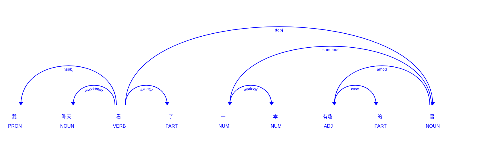

# 【自然語言處理 - 概念篇】 拆解語句組成的規則, 何謂依存句法分析(Dependency Parsing)?

我們有想過嗎？ 一句簡單的話語, 竟然隱含著豐富的句法結構與規則, 而句法就是依著這樣的規則組合而成, 形成一個完整的句子, 隨著資料量越大, 透過規則與關聯性, 機器就能夠根據我們的話語進行拆解, 並試圖理解我們的意圖進行更貼心的服務, 隨著Chatgpt的興起, 我們也見證到AI的新里程碑, 資訊領域的我們也不得不跟上潮流學習這些AI相關的技術才不至於成為被取代的對象。

一個句子最基本的組成單位是「詞」這在我們之前幾個篇章都有談過，如果還不熟悉的朋友可以複習一下：

* [【自然語言處理 — 概念篇】最基礎的Bag-of-Words模型是什麼呢?](https://vocus.cc/article/646b60adfd89780001aae7f4)
* [【自然語言處理 - 概念篇】 來認識一下詞向量(Word Embedding or Word Vector)吧](https://vocus.cc/article/6471799dfd89780001604a5b)
* [【自然語言處理 - 概念篇】 探索TF-IDF, 關於詞的統計與索引隱含著什麼奧秘呢？](https://www.potatomedia.co/s/bVIUUxZD)

而這些「詞」除了距離以外還可以組成詞組(Phrase), 例如動詞、名詞、形容詞..., 這些詞組又可以再組成一句話, 非常神奇吧！ 看到這邊應該非常困惑, 沒關係, 等等會實際以案例來加以說明, 並搭配程式碼進行實作。

我們只要大概記得一個「樹」是由不同的「節點」所組成, 而這些節點我們就想像為詞組(Phrase), 這些詞組之間具有著上下層關係, 從根結點開始透過樹狀結構的分叉更能夠追蹤片語的組成過程, 我們可以更好的理解句子組成的角色與關係。

在進入主題之前, 我們必須先來了解一下「【自然語言處理 - spaCy】 詞性標注POS在NLP的世界扮演什麼樣的角色呢?」每個詞都被賦予一個詞性, 而這些詞性也奠定了「語法分析」、「語意理解」、「文本分類」、「上下文分析」...的基礎, 讓機器更理解我們人類的語言。

```python
!pip install spacy

# 下載Transfromer技術的中文語言模型
!python -m spacy download zh_core_web_trf
```

### 載入模型

```python
import spacy

# 載入模型
nlp_zh = spacy.load('zh_core_web_trf')
```

### 定義片語解析函式並進行解析

```python
text = '我昨天看了一本有趣的書'

doc = nlp_zh(text)
```

### 以視覺化進行語法結構分析

```
我 昨天 看 了 一 本 有趣 的 書

「我」是名詞，代表主語, 並與「看」之間依賴。
「昨天」是時間副詞，修飾「看」，表示動作發生的時間點。
「看」是動詞，表示動作。
「了」是助動詞，用於表示動作的完成, 因此與「看」依賴。
「一」是數詞，修飾「本」，表示書的數量。
「本」是量詞，用於量詞和名詞之間，表示書的量詞。
「有趣」是形容詞，修飾「書」，表示書的特性。
「的」是助詞，用於連接形容詞和名詞之間，表示形容詞修飾的對象。
```

```python
from spacy import displacy

options = {
    'color': 'blue',
    'bg': 'white'
}

displacy.render(doc, style="dep", jupyter=True, options=options)
```

<figure><figcaption></figcaption></figure>

「看」是整個句子的根節點, 「我」 是它的主語，「書」 是它的賓語，「昨天」 是它的修飾詞，「有趣」 是 「書」 的修飾詞，觀察句法樹讓我們可以理解詞彙之間的關係, 。

這張圖時有幾個關聯標籤需要知道一下, 這邊使用的是「[universaldependencies(用於對句子的語法結構進行標註)](https://universaldependencies.org/zh/index.html)」, 由左到右逐一解析：

* `nsubj`: 用來表示主語, 通常標記在動詞的依存邊上。
  * 「我」是名詞, 而「看」是動詞, 被標記在連接動詞「看」和主語「我」的邊上。
  * 我 `<nsubj>` 看。
* `nmod:tmod`: 通常是動詞或名詞, 標示在時間的修飾語之間,
  * 「看」是動詞, 而「昨天」是時間修飾語, 因此他們之間的關係為`nmod:tmod`。
* `aux:asp`: `輔助動詞:體裁`。
  * 「體裁(aspect)」是一個用於描述動詞的語法特徵的術語。
  * 「看(動詞)」、「了(體裁)」。
* `dboj`: direct object, 表示動詞的直接賓語。
  * 看 `<dobj>` 書, 「看」的直接賓語為「書」。
* `mark:clf`: 冠詞通常用於限定名詞，並在句子中起到指示數量、確定性或泛指性質的作用。
  * 一 `<mark:clf>` 本
  * 「一」是數量詞，修飾「本」, 表示書的數量。
* `case`: 詞彙的格標記(case marking),
  * 有趣 `<case>` 的
  * 表示形容詞「有趣」修飾名詞「的」，形成一個形容詞詞組
* `unmmod`: 數詞修飾名詞的關係
  * 書 `<nummod>` 一。
* `amod`: 表示形容詞修飾名詞的關係。
  * 書 `<amod>` 有趣。
  * 表示這本書是有趣的。

透過分析圖的繪製, 我們可以分析一個句子的組成可能包含動詞、名詞..., 而這些詞類之間又有相斥相吸的特性, 最終組成一句話。
