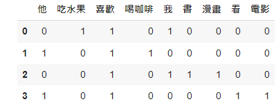
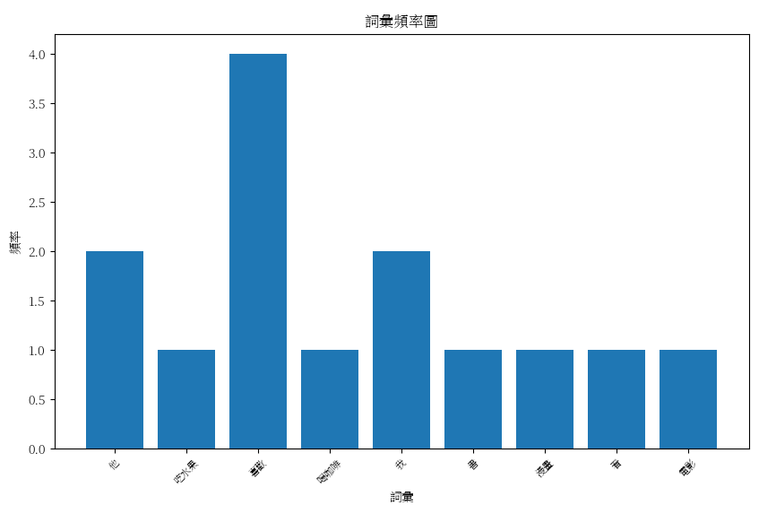

# 【自然語言處理 - 概念篇】最基礎的Bag-of-Words模型是什麼呢？

常常我們在進行NLP討論時，不管哪一種NLP任務都會偶爾聽到BOW這個詞，原來全名就是「Bag-of-words」由名稱就可以知道這是在處理NLP任務之前的基礎工事，將一整篇文章切碎成一段語句，甚至是最小單位的「詞」，而這些詞又如何表述關係或者進一步的使用，試圖讓機器可以理解我們人類的詞語，就是基於BOW發展而來的。


既然是進入NLP世界的基礎，那我們就不得不來仔細了解一番，為什麼會有此命名呢？ 轉譯成中文又可以稱為「詞袋」，就想像成專門裝各類糖果的袋子，每一種糖果可能會重複出現幾次，那麼在袋中的糖果，將各種不同種類統計之後，就能夠得出哪些糖果甚至進一步分這些糖果的種類(軟、硬糖...)，而詞也是同樣的道理，統計出詞頻、詞的特徵，進一步分析出這段語句中可能帶有哪些情緒(正向、負向...)，基本上就是透過一套演算法或資料結構幫我們進行前處理，以利後續的NLP任務進行。

<figure><figcaption></figcaption></figure>

### BOW的處理過程

1. 建構詞彙表： 將袋中的詞整理成一張表，這張表涵蓋了所有的詞。
2. 標示特徵向量：&#x20;

### 不如動手做做看吧

#### 安裝套件

* scikit-learn:用於機器學習的Python套件, 擅長分類、回歸、聚類、降維、模型選擇和預處理等機器學習任務的工具和算法。
* pandas: 對矩陣進行表格的處理。
* jieba: 斷詞, 對中文進行分詞。

```python
!pip install scikit-learn

!pip install pandas

!pip install jieba
```

#### 下載中文字型讓圖表可以顯示中文

請參考「[🖋 【Google Colab Python系列】 視覺化資料Matplotlib 如何繪製出中文？](https://www.potatomedia.co/s/PDf86nk)」

```notebook-python
import matplotlib as mpl
import matplotlib.font_manager as fm
import matplotlib.pyplot as plt

# 下載繁體中文字型
!wget -O SourceHanSerifTW-VF.ttf https://github.com/adobe-fonts/source-han-serif/raw/release/Variable/TTF/Subset/SourceHanSerifTW-VF.ttf

# 加入字型檔
fm.fontManager.addfont('SourceHanSerifTW-VF.ttf')

# 設定字型
# 
mpl.rc('font', family='Source Han Serif TW VF')
```

#### 定義文本數據集以及對應的標籤

這個步驟主要將我們需要進行處理的文本進行一維陣列的儲存，並且假設我們已經斷詞完畢。

```python
corpus = [
    "我喜歡吃水果",
    "他喜歡喝咖啡",
    "我喜歡漫畫書",
    "他喜歡看電影"
]
```

### 自訂分詞器

以jieba進行

```python
import jieba
def tokenizer(text):
    return list(jieba.cut(text))th
```

#### 轉換成特徵向量

指定自訂的斷詞器

```python
from sklearn.feature_extraction.text import CountVectorizer

# 創建 BOW 特徵提取器
vectorizer = CountVectorizer(tokenizer=tokenizer)

# 通過 BOW 特徵提取器將文本轉換為特徵向量
features = vectorizer.fit_transform(corpus)
```

### 檢視詞彙表

```notebook-python
feature_names = vectorizer.get_feature_names_out()
feature_names

# array(['他', '吃水果', '喜歡', '喝咖啡', '我', '書', '漫畫', '看', '電影'], dtype=object)
```

### 檢視特徵向量

```python
print(features.toarray())

[[0 1 1 0 1 0 0 0 0]
 [1 0 1 1 0 0 0 0 0]
 [0 0 1 0 1 1 1 0 0]
 [1 0 1 0 0 0 0 1 1]]
```

### 藉由pandas進行表格呈現

```notebook-python
import pandas as pd
df = pd.DataFrame(features.toarray(), columns=feature_names)
df
```

<figure><figcaption></figcaption></figure>

### 繪製詞頻圖

```python
import matplotlib.pyplot as plt
# 計算每個詞彙在所有句子中的總頻率
word_frequencies = features.sum(axis=0).A1

# 建立圖形
plt.figure(figsize=(10, 6))
plt.bar(range(len(feature_names)), word_frequencies)
plt.xticks(range(len(feature_names)), feature_names, rotation=45, fontsize=8)
plt.xlabel('詞彙')
plt.ylabel('頻率')
plt.title('詞彙頻率圖')

# 顯示圖形
plt.show()
```

<figure><figcaption></figcaption></figure>

今天的範例都在這裡「[📦 bow.ipynb](https://github.com/weihanchen/google-colab-python-learn/blob/main/jupyter-examples/nlp/bow.ipynb)」歡迎自行取用。

如何使用請參閱「[【Google Colab系列】台股分析預備式： Colab平台與Python如何擦出火花？](https://www.potatomedia.co/s/aNLHZe3S)」。

### 結語

原來BOW的概念如此簡單，我們常常被華麗的名詞給阻礙了前進的動力，仔細拆解每一個步驟之後才知道原來我們日常生活中的詞語，要讓機器讀懂也是不容易的，但動手實作之後，將每一步記錄起來，並重複學習就不是那麼困難了，讓我們持續學習NLP的技術吧！ 下一章我們將來談談詞的向量與嵌入。


\------------------------------------------------------------------------------------------------

喜歡撰寫文章的你，不妨來了解一下：

[Web3.0時代下為創作者、閱讀者打造的專屬共贏平台 - 為什麼要加入？](https://www.potatomedia.co/s/2PmFxsq)

歡迎加入一起練習寫作，賺取知識！
