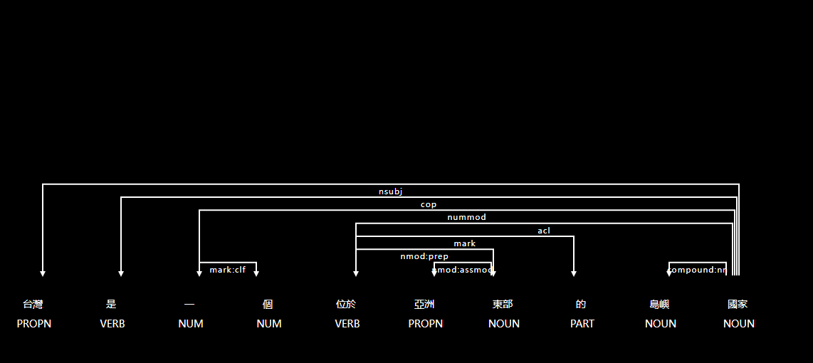

# 【自然語言處理NLP】初探強大的工具庫spaCy， 讓機器讀懂我們的語言

上一篇章我們有提到「[【AI幫幫忙】機器如何識別我們的特徵？關鍵的Named Entity Recognition（NER）技術](https://vocus.cc/article/644860c9fd897800017b4177)」， 而NER是NLP自然語言處理的一部分， 而這一個篇章我們會以實作的形式來介紹自然語言處理中非常好用的一套工具「[spaCy](https://spacy.io/)」，spaCy被廣泛用於各種NLP任務，包括自然語言理解、信息提取、文本分類和語言生成等。


會選擇這一套來進行使用主要是觀察到除了文檔完備豐富之外， 使用起來也非常易用， 對於非資料科學本科的使用者來說非常友善， 而今天的範例除了介紹基本的NLP常見任務之外，最後也會使用Named Entity Recognition來對一段文章提取實體特徵， 讓透過這些特徵更加了解一篇文章到底講了哪些關鍵。


### 目錄

* 安裝相關套件及下載模型。
* 載入模型。
* Parser解析。
* 分析相依關係。
* Named Entity Recognition (NER)。


### 下載模型

接著我們就直接進入正題吧！ 首先進行安裝套件， 並載入模型， 這邊我們載入的是中文模型「`zh_core_web_trf`」， 而模型有以下四種:

* `zh_core_web_sm`: 這是最小的中文語言模型，用於基本的語言處理任務(分詞和詞性標註)， 它的下載大小比較小，速度比較快，但是在處理複雜的語言問題時可能表現較差。
* `zh_core_web_md`: 這是中等大小的中文語言模型，比 `zh_core_web_sm` 包含更多的詞彙、語言特徵和上下文信息，可以用於更多的語言處理任務，它的下載大小比較大，速度比較慢，但是在處理複雜的語言問題時表現較好。
* `zh_core_web_lg`: 這是最大的中文語言模型，比 `zh_core_web_md` 包含更多的語言特徵和上下文信息，可以用於更複雜和高級的語言處理任務，例如自然語言生成和語言理解，它的下載大小非常大，速度非常慢，但是在處理最複雜的語言問題時表現最佳。
* `zh_core_web_trf`: 這是基於 Transformer 技術的中文語言模型，是最先進和最強大的中文語言模型之一。它比 `zh_core_web_lg` 包含更多的語言特徵和上下文信息，同時使用 Transformer 技術可以更好地處理長文本和上下文相關性，但是它的下載大小更大，速度更慢，需要更多的計算資源。

### 安裝套件

* spaCy: NLP處理。
* pandas: 進行表格呈現、矩陣計算...。

```python
# 安裝spacy
%pip install spacy

# 安裝pandas
%pip install pandas

# 下載Transfromer技術的中文語言模型
!python -m spacy download zh_core_web_trf

```

### 載入模型

#### 模型會進行什麼處理？

當模型被應用於一段文本時，會通過預處理管道， 而預處理管道就是所謂的`Pipeline`，過程大抵如下:

`語句 --> Tokenizer --> 標記化 --> 停用詞去除 --> 詞形還原 --> 特徵提取`


其中「Tokenizer」是管道中最先被執行的，也是最重要的一步，將文本切割成一個個的Token，也就是「詞」，後續才能進行詞性標注、停用詞移除、特徵擷取...等。


```python
import spacy

# 載入模型
nlp_zh = spacy.load('zh_core_web_trf')

# 對中文語句進行解析
doc = nlp_zh('台灣是一個位於亞洲東部的島嶼國家。')
```

### Parser解析

以下我們將解析過後的Token印出， 可以發現資訊非常的完整， 除了詞的文字以外也將其特型進行解析。

* 其中POS tags可以參考這裡：[https://universaldependencies.org/u/pos/](https://universaldependencies.org/u/pos/)

P.S 這邊以pandas來印出表格對於排版較為整齊

```python
import pandas as pd

columns=['詞', '詞類', '詞性標注', '單詞依存關係', '是否為純字母組成', '是否為停用詞']

dim = list(map(lambda x: [x.text, x.pos_, x.tag_, x.dep_, x.is_alpha, x.is_stop], doc))

pd.DataFrame(dim, columns=columns)

```

<figure><figcaption><p><a href="https://vocus.cc/article/644a799afd8978000134863c">圖片來源</a></p></figcaption></figure>

### 分析相依關係

這邊我們會使用`spacy`套件中的`displacy`來呈現詞之間的關係。

Displacy是一個Python庫，用於在Jupyter Notebook或瀏覽器中顯示自然語言處理（NLP）模型的分析結果，它可以使用spaCy庫生成的分析結果，提供視覺化效果，以幫助開發人員更好地理解分析結果，通常與spaCy庫一起使用，可以用於許多NLP任務，例如詞性標注、依存關係分析、命名實體識別等。

透過視覺化可以觀察一下那些詞應該具有依賴性，哪些詞需要拆開，這裡可以稍微記錄一下，後續會說明如何調適，或者重新訓練。

```python
from spacy import displacy

options = {
    "compact": True,
    "bg": "black",
    "color": "white",
    "font": "",
    "distance": 110
}

# 台灣是一個位於亞洲東部的島嶼國家。
displacy.render(doc, style="dep", options=options)
```

<figure><figcaption><p><a href="https://vocus.cc/article/644a799afd8978000134863c">圖片來源</a></p></figcaption></figure>

### Named Entity Recognition (NER)

我們藉由`spacy`來識別實體吧！

這邊識別出來的有「台灣」跟「亞洲」， 分別代表的意義為「GPE: 地理政治」跟「LOC: 地點」。

至於有哪些實體呢？ 請參考「[https://spacy.io/models/zh#zh\_core\_web\_sm-labels](https://spacy.io/models/zh#zh\_core\_web\_sm-labels)」。

這邊有沒有發現， 國家似乎沒有被識別出來， 如何讓「國家」可以被識別出來呢？ 下一章將說明如何進行訓練， 讓「國家」這個實體可以順利被識別。

```python
# 台灣是一個位於亞洲東部的島嶼國家。
for e in doc.ents:
    print(e.text, e.label_)

displacy.render(doc, style="ent", jupyter=True)
```

<figure><figcaption><p><a href="https://vocus.cc/article/644a799afd8978000134863c">圖片來源</a></p></figcaption></figure>

今天的範例都在這裡「[📦 ](../jupyter-examples/goodinfo\_yield.ipynb)[scapy\_0.ipynb](https://github.com/weihanchen/google-colab-python-learn/blob/main/jupyter-examples/scapy\_0.ipynb)」歡迎自行取用。

如何使用請參閱「[【Google Colab系列】台股分析預備式： Colab平台與Python如何擦出火花？](https://www.potatomedia.co/s/aNLHZe3S)」。

### 結語

實際操作過一遍真的不困難，我們常常害怕一些艱澀難懂的名詞，導致駐足不前無法嘗試，這樣對於我們的學習是會大打折扣的，因此應該嘗試著動手做過一遍，了解整體流程之後，才能夠融會貫通，AI其實並不難，我們應該要懂得AI的原理，未來才有機會讓AI變成我們的強力助手。


總結來說，這次的NLP學到了整個處理流程大方向，透過\`spaCy\`解析成什麼樣的格式與內容，甚至分析詞與詞之間的關係，最後也學到了實體(Entity)，實體(Entity)是一個很重要的資訊，讓機器能夠識別並統計出可能的意圖，進行後續的處理流程，設計出更便利於人們的應用。


\------------------------------------------------------------------------------------------------

喜歡撰寫文章的你，不妨來了解一下：

[Web3.0時代下為創作者、閱讀者打造的專屬共贏平台 - 為什麼要加入？](https://www.potatomedia.co/s/2PmFxsq)

歡迎加入一起練習寫作，賺取知識，累積財富！
