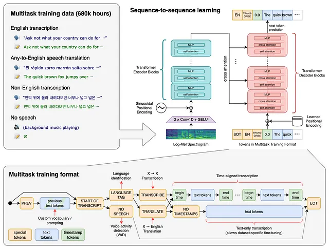
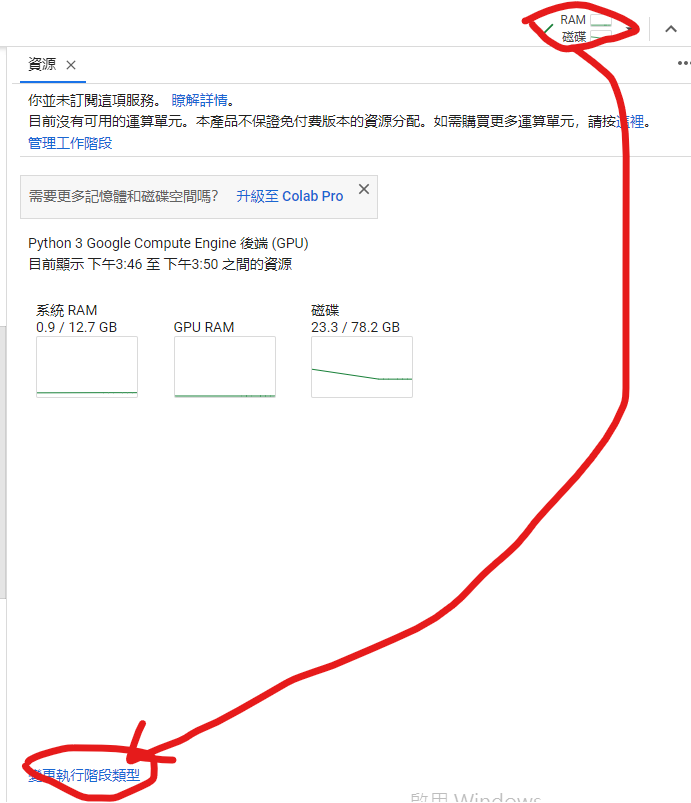
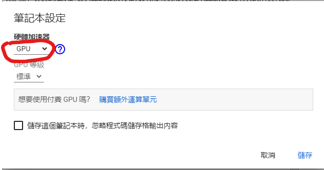
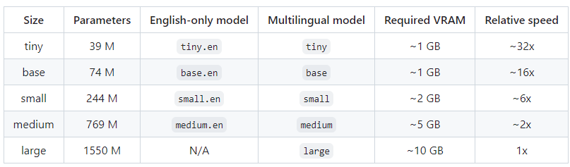
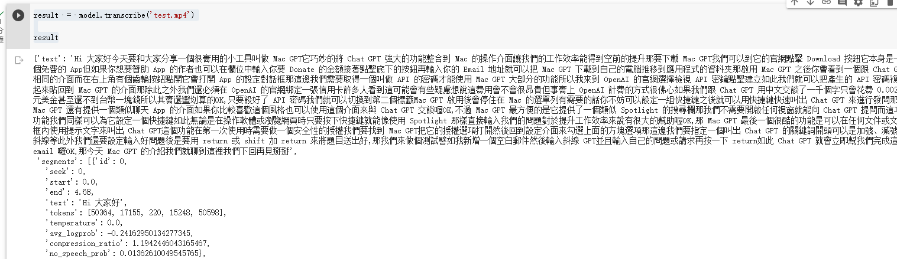

# 【語音辨識 - Whisper】 初探Whisper: 來對一段Youtube影片進行辨識吧！

這個篇章主要是讓我們能夠熟悉Whisper的安裝與使用方式，並簡單的對Youtube影片進行線上翻譯的工作，主軸在於了解一下整個Whisper使用方式到底是簡單還是複雜，就讓我們一起來玩玩看吧！ 在這之前我們還是說一下Whisper它是什麼樣的一個工具，能夠做什麼？


## Whisper簡介

Whisper 是OpenAI 提供的一種最先進自動語音辨識( Automatic Speech Recognition，ASR )模型，用來執行語音辨識與翻譯的功能。

能夠將各種語言的語音轉錄成文字，甚至可以處理較差的音頻品質或過多的背景雜訊。

P.S 聽起來就很威，別著急，讓我們實際試試看才知道...


## 觀看 Whisper 官方文件 <a href="#6369" id="6369"></a>

使用Whisper過程中難免會遇到各式各樣的問題，最簡單的方式就是查看原廠的官方文件囉！

這是一個opensource的專案，因此放置於Github： [https://github.com/openai/whisper](https://github.com/openai/whisper)

<figure><figcaption><p><a href="https://github.com/openai/whisper">圖片來源</a></p></figcaption></figure>

### 安裝Whisper

這邊我們會直接使用Google Colab Python環境來進行安裝。

```python
# 安裝whisper語音辨識工具
!pip install -U openai-whisper

# 安裝youtube套件，這工具主要幫我們下載youtube影片進行後續的語音辨識demo，算是一個語音前處理工具
!pip install pytube
```

### 在這之前記得切換成GPU模式

語音辨識在解碼的時候採用GPU模式一定比CPU模式來的快，而Google Colab也提供一些GPU資源給我們，記得進行切換，否則後面的作業會等待的非常久...


首先我們在右上角點選資源的圖示，並且點擊下方的「變更執行階段類型」。

<figure><figcaption><p><a href="https://vocus.cc/article/644526c8fd89780001ffdd9f">圖片來源</a></p></figcaption></figure>

接著我們就切換成「GPU」吧

<figure><figcaption><p><a href="https://vocus.cc/article/644526c8fd89780001ffdd9f">圖片來源</a></p></figcaption></figure>

### 試著找一段Youtube影音，嘗試在Google Colab播放測試

這裡我們找了一段長約「3分30秒」的影片，https://www.youtube.com/watch?v=EYhlGV9AZHI

我們接著就來Google Colab播放試試看吧

```python
from IPython.display import YouTubeVideo

YouTubeVideo('EYhlGV9AZHI')
```

### 接著我們使用pytube來抓取影片資訊

這邊我們就取得`title`屬性並印出試試看

```python
from pytube import YouTube

url = 'https://www.youtube.com/watch?v=EYhlGV9AZHI'

yt = YouTube(url)

# 抓取標題試試看
yt.title
```

### 下載純音檔

```python
streams = yt.streams
audio = streams.get_audio_only()
obj = audio.download(filename='test.mp4')
```

### 載入辨識模型

要載入什麼樣的模型呢？可以看看官方網站的「[Available models and languages](https://github.com/openai/whisper#available-models-and-languages)」

<figure><figcaption><p><a href="https://github.com/openai/whisper#available-models-and-languages">圖片來源</a></p></figcaption></figure>

這邊我們就選擇大型的模型\`large\`試試看最佳可以辨識的如何？

```python
import whisper

model = whisper.load_model('large')
```

### 對下載的音檔進行辨識

這邊我們就直接載入剛下載完成的`test.mp4`， 執行時間會有一些等待，這邊環境下大約等待1分鐘左右。

```python
result = model.transcribe('test.mp4')

result
```

我們可以看到回傳結果不只有整段文字，也將每一段的時間邊界切割出來，並精準的辨識出文字，看到這邊聰明的我們應該聯想到什麼了吧！ 沒錯，就是字幕檔，很多影片早期上字幕檔是非常繁雜的，透過whisper的精準辨識讓我們可以加快效率，來看看結果吧！

<figure><figcaption><p><a href="https://vocus.cc/article/644526c8fd89780001ffdd9f">圖片來源</a></p></figcaption></figure>

### 結語

使用了Whisper之後，突然感覺到時代的演變真的超快，早期的kaldi專案也曾經玩過，但複雜的腳本與架構令人退卻，現如今的Whisper除了文檔完備豐富之外，使用起來也非常的簡易，而且結果也非常的人性化，下一個篇章我們就要來玩玩它的產生字幕檔、如何調整參數，讓我們也能夠簡易的使用門檻高的語音辨識吧。


今天的範例都在這裡「[📦 ](../jupyter-examples/goodinfo\_yield.ipynb)[**whisper\_0\_yt.ipynb**](https://github.com/weihanchen/google-colab-python-learn/blob/main/jupyter-examples/whisper\_0\_yt.ipynb)」歡迎自行取用。

如何使用請參閱「[【Google Colab Python系列】Colab平台與Python如何擦出火花？](https://www.potatomedia.co/s/aNLHZe3S)」。


\------------------------------------------------------------------------------------------------

喜歡撰寫文章的你，不妨來了解一下：

[Web3.0時代下為創作者、閱讀者打造的專屬共贏平台 - 為什麼要加入？](https://www.potatomedia.co/s/2PmFxsq)

歡迎加入一起練習寫作，賺取知識，累積財富！


#### 更多關於【語音辨識 - Whisper 系列】…

* [【語音辨識 - Whisper】 初探Whisper: 來對一段Youtube影片進行辨識吧！](https://vocus.cc/article/644526c8fd89780001ffdd9f)
* [【語音辨識 - Whisper】OpenAI Whisper: 語音辨識產生字幕檔](https://vocus.cc/article/64468d92fd8978000115c6e1)
* [【語音辨識 - Whisper】 雙聲道音訊處理與辨識](https://vocus.cc/article/64733d7efd89780001781326)
* [【語音辨識 - Whisper】 準確與否需要有一把 📏尺來衡量](https://vocus.cc/article/64b3a209fd89780001481152)


