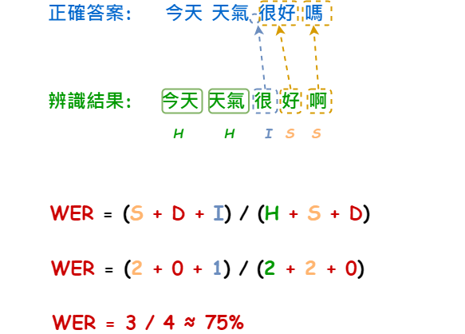

# 【語音辨識 - Whisper】 究竟如何衡量辨識率的高低呢？

前面我們介紹了幾個關於Whisper的基本概念，這裡附上 [🚀傳送門](https://vocus.cc/article/644526c8fd89780001ffdd9f) ，歡迎好好閱讀一番，但我們除了學會如何用語音辨識的工具之外，「準確率」對我們來說也是一個非常重要的一環，但我們究竟應該要如何評估所謂的準確率呢？ 不知道沒關係，當您看完這個篇章就能夠學會如何計算文字的「字元錯誤率」、「字詞錯誤率」...，非常值得您細細品嘗與學習，就讓我們往下一步步的完成評估準確率的程序吧！

這次的評估工具我們會使用[jiwer](https://github.com/jitsi/jiwer)這一套來進行說明，它支援了多種的計算方式，包括： WER、CER、MER...等，那這些計算方式各有什麼不同呢？ 就讓我們繼續看下去吧！

### 計算前必須知道的幾個評估資訊

在進入到各種計算方式之前，我們需要先了解到這三個名詞「substitutions、deletions、insertions」，這很重要，會牽涉到不同方式的計算過程。

什麼是`substitutions`呢？&#x20;

簡單來說就是字詞被替換成不同的字了...

<figure><figcaption></figcaption></figure>

#### 什麼是`deletions`呢？

簡單的來說就是某個字詞應被辨識出來，但卻漏了...

<figure><figcaption></figcaption></figure>

#### 什麼是insertions呢？

簡單的來說就是明明沒有的字詞卻被多辨識了出來

<figure><figcaption></figcaption></figure>

### 有哪些不同的計算方式呢？

#### Word Error Rate(WER)

WER是以「詞」為單位進行計算，底下的例子以詞為單位會發現有1個insertion與兩個substitution，因此總共4個詞錯了3個等於3/4 = 75%。

<figure><figcaption></figcaption></figure>

### 讓我們動動手來計算一下正確率吧！

### 結語
