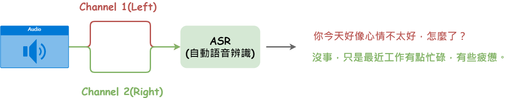

# 【語音辨識 - Whisper】 雙聲道音訊處理與辨識

假設我們有一段雙聲道的音檔, 正常來說透過[whisper](https://github.com/openai/whisper)進行語音辨識時都是以整段音檔進行辨識,但我們若想將左右聲道分離進行辨識的話就得對音檔進行音訊處理了。

怎麼做呢？ 比較簡單的方式就是透過音訊處理工具將音檔進行左右聲道的分離，再獨立的進行辨識即可。

這次會將雙聲道音檔透過[pydub](https://github.com/jiaaro/pydub)這套音訊處理工具進行分離，再分別以`numpy.ndarray`的格式傳遞給whisper進行辨識。


<figure><figcaption></figcaption></figure>

### 工具安裝

* [pytube](https://pytube.io/en/latest/): 下載yt影片並轉成音檔。
* [pydub](https://github.com/jiaaro/pydub): 將雙聲道切成左、右聲道。
* [openai-whisper](https://github.com/openai/whisper): 語音辨識。

```python
# 下載yt影片並轉成音檔。
!pip install pytube

# 將雙聲道切成左、右聲道。
!pip install pydub

# 安裝whisper語音辨識工具
!pip install -U openai-whisper
```


### 將YT影片以Stream方式載到Memory

這邊會需要開啟google驗證網頁並將認證碼輸入才能順利下載音檔(主要也是避免無限制的下載導致負擔吧)。

1. 遵照指示打開裝置驗證網頁。
2. 輸入提示的驗證碼。
3. 登入驗證完畢後，在以下輸入框填上驗證碼即完成驗證。

```python
import io
from pytube import YouTube
from pydub import AudioSegment


# yt音訊流
yt = YouTube('https://www.youtube.com/watch?v=pF2GgX2xYVw', use_oauth=True, allow_oauth_cache=True)
stream = yt.streams.filter(only_audio=True).first()

buffer = io.BytesIO()
audio_stream = stream.stream_to_buffer(buffer)
buffer.seek(0)
```

#### 設計音訊解碼函式

* 預設為雙聲道layout。
* 重設取樣率,whisper預設以16000進行辨識。

```python
import io
from typing import BinaryIO, Tuple, Union

import numpy as np
from pydub.utils import get_array_type


def decode_audio(
    input_file: Union[str, BinaryIO],
    sampling_rate: int = 16000,
) -> Tuple[np.ndarray, np.ndarray]:
    """Decodes the audio.

    Args:
      input_file: Path to the input file or a file-like object.
      sampling_rate: Resample the audio to this sample rate.

    Returns:
      A float32 Numpy array.

      returns a 2-tuple with the separated left and right channels.
    """
    raw_audio = AudioSegment.from_file(input_file)

    # 16-bit (2 bytes)
    raw_audio = raw_audio.set_sample_width(2)

    # 預設轉為雙聲道layout
    raw_audio = raw_audio.set_channels(2)

    # resampling
    raw_audio = raw_audio.set_frame_rate(sampling_rate)

    raw_data = raw_audio.raw_data

    dtype = get_array_type(raw_audio.sample_width * 8)
    audio = np.frombuffer(raw_data, dtype=dtype)

    # Convert s16 back to f32.
    audio = audio.astype(np.float32) / 32768.0
        
    left_channel = audio[0::2]
    right_channel = audio[1::2]
    return left_channel, right_channel
```

### 載入模型

有哪些模型可以使用呢? 請參考這裡:

[https://github.com/openai/whisper#available-models-and-languages](https://github.com/openai/whisper#available-models-and-languages)

```python
import whisper
model = whisper.load_model("medium")
```

### 左聲道進行辨識

```python
import numpy as np

# np.frombuffer(out, np.int16).flatten().astype(np.float32) / 32768.0
left, right = decode_audio(buffer)

result = model.transcribe(left, language='zh', verbose=True, initial_prompt='請給我繁體中文的語音辨識。', no_speech_threshold=1.2)

print(result)
```

### 對右聲道進行辨識

```python
result = model.transcribe(right, language='zh', verbose=True, initial_prompt='請給我繁體中文的語音辨識。')

print(result)
```

### 結語

這個範例主要是介紹如何使用音訊工具\`pydub\`將音檔進行channel的分離，分開進行辨識，讓時間資訊能夠區隔，但仍有一些缺陷，兩者若對話來往緊湊時，時間資訊相信也會頻繁重疊，究竟要如何將每句話獨立的切割呢？ 這就要使用到VAD工具了，主要將語音訊號切成較小的時間片段，而這些語音片段再進行語音辨識即可，下一章節我們將會說明如何使用VAD工具讓每句話獨立進行語音辨識，讓辨識結果更為精確。


今天的範例都在這裡「[📦 ](../jupyter-examples/goodinfo\_yield.ipynb)[whisper\_2\_channel.ipynb](https://github.com/weihanchen/google-colab-python-learn/blob/main/jupyter-examples/whisper\_2\_channel.ipynb)」歡迎自行取用。

如何使用請參閱「[【Google Colab系列】台股分析預備式： Colab平台與Python如何擦出火花？](https://www.potatomedia.co/s/aNLHZe3S)」。


\------------------------------------------------------------------------------------------------

喜歡撰寫文章的你，不妨來了解一下：

[Web3.0時代下為創作者、閱讀者打造的專屬共贏平台 - 為什麼要加入？](https://www.potatomedia.co/s/2PmFxsq)

歡迎加入一起練習寫作，賺取知識，累積財富！


#### 更多關於【語音辨識 - Whisper 系列】…

* [【語音辨識 - Whisper】 初探Whisper: 來對一段Youtube影片進行辨識吧！](https://vocus.cc/article/644526c8fd89780001ffdd9f)
* [【語音辨識 - Whisper】OpenAI Whisper: 語音辨識產生字幕檔](https://vocus.cc/article/64468d92fd8978000115c6e1)
* [【語音辨識 - Whisper】 雙聲道音訊處理與辨識](https://vocus.cc/article/64733d7efd89780001781326)
* [【語音辨識 - Whisper】 準確與否需要有一把 📏尺來衡量](https://vocus.cc/article/64b3a209fd89780001481152)
