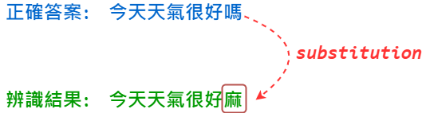
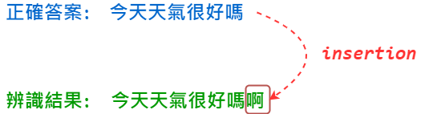
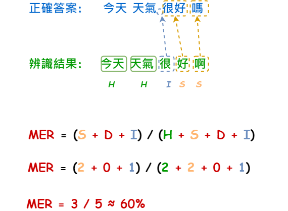
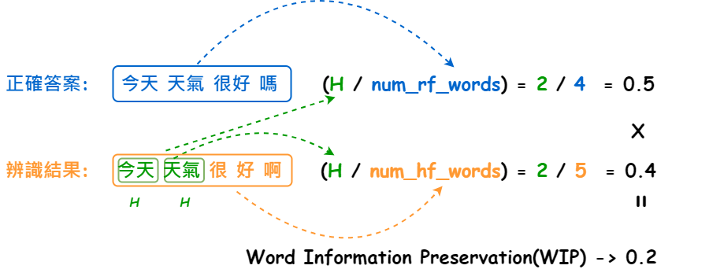
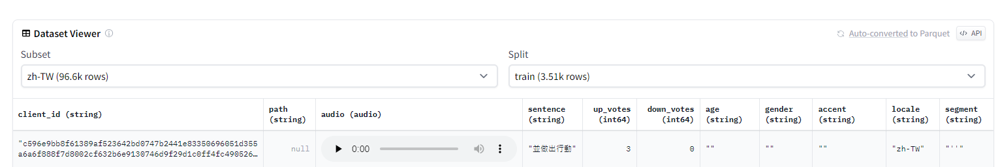
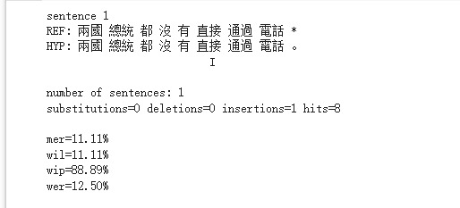

# 【語音辨識 - Whisper】 準確與否需要有一把 📏尺來衡量辨識率

前面我們介紹了幾個關於Whisper的基本概念，這裡附上 [🚀傳送門](https://vocus.cc/article/644526c8fd89780001ffdd9f) ，歡迎好好閱讀一番，但我們除了學會如何用語音辨識的工具之外，「準確率」對我們來說也是一個非常重要的一環，但我們究竟應該要如何評估所謂的準確率呢？ 不知道沒關係，當您看完這個篇章就能夠學會如何計算文字的「字元錯誤率」、「字詞錯誤率」...，非常值得您細細品嘗與學習，就讓我們往下一步步的完成評估準確率的程序吧！


這次的評估正確率的那把 📏尺我們會使用[jiwer](https://github.com/jitsi/jiwer)這一套來進行說明，它支援了多種的計算方式，包括： WER、CER、MER...等，那這些計算方式各有什麼不同呢？ 就讓我們繼續看下去吧！

### 計算前必須知道的幾個錯誤指標

在進入到各種計算方式之前，我們需要先了解到這三個名詞「substitutions、deletions、insertions」，這很重要，會牽涉到不同方式的計算過程。


什麼是`substitutions`呢？&#x20;

簡單來說就是字詞被替換成不同的字了...


<figure><figcaption><p><a href="https://www.potatomedia.co/s/q2qnKxz">圖片來源</a></p></figcaption></figure>


#### 什麼是`deletions`呢？

簡單的來說就是某個字詞應被辨識出來，但卻漏了...


<figure><figcaption><p><a href="https://www.potatomedia.co/s/q2qnKxz">圖片來源</a></p></figcaption></figure>

#### 什麼是insertions呢？

簡單的來說就是明明沒有的字詞卻被多辨識了出來


<figure><figcaption><p><a href="https://www.potatomedia.co/s/q2qnKxz">圖片來源</a></p></figcaption></figure>


### 有哪些不同的計算方式呢？

#### 以「詞」為單位進行計算

**詞錯誤率 Word Error Rate(WER)**

WER是以「詞」為單位進行計算，它用來衡量句子中有多少詞彙需要進行修改才能和正確答案一樣。

```bash
公式: (S + D + I) / (H + S + D)
計算過程: (2 + 0 + 1) / (2 + 2 + 0)
3 / 4 ≈ 75%。
```

💡 既然是以`詞`為單位的話，那麼我們的答案與辨識結果請先進行斷詞(通常用空白隔開)， 標點符號也是考量的因素之一喔。


<figure><figcaption><p><a href="https://www.potatomedia.co/s/q2qnKxz">圖片來源</a></p></figcaption></figure>

**平均錯誤率 Mean Error Rate(MER)**

這項指標與WER主要差別在於分母的部分尚未將`Insertion`給考量進來計算，因為它衡量的不僅是詞彙層級，而是句子層級，因此會更加全面。

```bash
公式： (S + D + I) / (H + S + D + I)
計算過程： (2 + 0 + 1) / (2 + 2 + 0 + 1)

3 / 5 ≈ 60%
```


<figure><figcaption><p><a href="https://www.potatomedia.co/s/q2qnKxz">圖片來源</a></p></figcaption></figure>

**詞保留率 Word Information Preservation(WIP)**

這項指標主要在評估我們的辨識結果究竟有多少比例的字詞是一模一樣完全正確的。

```bash
num_rf_words = 正確答案字詞數 = 4
num_hp_words = 辨識結果字詞數 = 5
公式： (H / num_rf_words) * (H / num_hp_words)
計算過程: (2 / 4) * (2 / 5)
0.5 * 0.4 ≈ 20%
```


<figure><figcaption><p><a href="https://www.potatomedia.co/s/q2qnKxz">圖片來源</a></p></figcaption></figure>

#### 詞漏失率 Word Information Lost(WIL)

既然有詞的保留率，那麼相反的就是漏失率，因此上述的結果得出之後，用1減去保留率就是漏失率。

```bash
公式: 1 - wip
1 - 0.2 ≈ 0.8
```


#### 字元錯誤率 Character Error Rate(CER)

CER是以「字元」為單位進行計算，底下的例子以「字元」為單位會發現有1個substitution，因此總共7個字元錯了1個等於：

```
1 / 7 ≈ 14.29%。
```

###

<figure><figcaption><p><a href="https://www.potatomedia.co/s/q2qnKxz">圖片來源</a></p></figcaption></figure>

### 動動手使用Whisper語音辨識來計算一下正確率吧

#### 安裝套件

```bash
# 錯誤率計算工具
!pip install jiwer

# 語音辨識ASR
!pip install -U openai-whisper

# Hugging Face資料集函式庫
!pip install datasets

# 斷詞器
!pip install jiaba
```


首先我們先從Hugging Face找尋Common Voice的音檔：

[https://huggingface.co/datasets/common\_voice/viewer/zh-TW/train](https://huggingface.co/datasets/common\_voice/viewer/zh-TW/train)


<figure><figcaption><p><a href="https://www.potatomedia.co/s/q2qnKxz">圖片來源</a></p></figcaption></figure>

#### 接著我們使用Hugging Face的Datasets函式庫來進行操作

關於Datasets是什麼？ 歡迎參考：「[【Hugging Face】Ep.3 前往Datasets掏金趣](https://vocus.cc/article/64a2c62afd897800018a8185)」。

這邊會取測試集的第一筆做為我們的參考答案製作來源。

```python
from datasets import load_dataset

# 載入中文的資料集
ds = load_dataset("common_voice", name='zh-TW', split='test')

# 取第一筆做為本次的參考答案資料集
ref_data = ds[0]

ref_data
```

透過上述的操作我們可以得到幾個資訊：

* 語句: 並做出行動
* 音檔路徑: [`/root/.cache/huggingface/datasets/downloads/extracted/0cd3800424a383996b39a64547fd7ea9852d200cc41113eebeb6f790cf74e9ca/cv-corpus-6.1-2020-12-11/zh-TW/clips/common_voice_zh-TW_17370757.mp3`](https://colab.research.google.com/drive/1SoGMV7bjawQ\_MIJ9gLZjgxki0BfQ3Iig?hl=zh-tw)

#### 製作參考答案文字

首先我們對語句的部分進行斷詞，來製作參考答案的文字：

```python
import jieba
_reference = ref_data['sentence']

reference = ' '.join(jieba.cut(_reference, cut_all=False, HMM=True))

reference
```

#### 接著來進行語音辨識

```python
import whisper

model = whisper.load_model("base")

audio = ref_data['path']

result = model.transcribe(audio)

result
```

#### 最終我們透過jiwer計算一下錯誤率

正確率怎麼計算呢？ 1 - 錯誤率(WER、WIP、MER...)

P.S 看起來幾乎都沒有錯誤，猜測可能是common voice的語料已涵蓋在whisper的模型之中了...。

```python
hypothesis = result['text']

out = jiwer.process_words(reference, hypothesis)
print(jiwer.visualize_alignment(out))
```


<figure><figcaption></figcaption></figure>


今天的範例都在這裡「[📦 ](../jupyter-examples/goodinfo\_yield.ipynb)[whisper/whisper\_acc.ipynb](https://github.com/weihanchen/google-colab-python-learn/blob/main/jupyter-examples/whisper/whisper\_acc.ipynb)」歡迎自行取用。

如何使用請參閱「[【Google Colab系列】台股分析預備式： Colab平台與Python如何擦出火花？](https://www.potatomedia.co/s/aNLHZe3S)」。


### 結語

這個章節非常重要的原因是後續如果我們要對Whisper進行調優時，需要有一把尺來衡量我們調的好不好，而正確率這東西就是一張考卷的概念，確保我們每次的調整都不會考壞了，讓我們對於應用上來說能夠越來越準確，減少誤判的狀況出現。


\------------------------------------------------------------------------------------------------

喜歡撰寫文章的你，不妨來了解一下：

[Web3.0時代下為創作者、閱讀者打造的專屬共贏平台 - 為什麼要加入？](https://www.potatomedia.co/s/2PmFxsq)

歡迎加入一起練習寫作，賺取知識，累積財富！


#### 更多關於【語音辨識 - Whisper 系列】…

* [【語音辨識 - Whisper】 初探Whisper: 來對一段Youtube影片進行辨識吧！](https://vocus.cc/article/644526c8fd89780001ffdd9f)
* [【語音辨識 - Whisper】OpenAI Whisper: 語音辨識產生字幕檔](https://vocus.cc/article/64468d92fd8978000115c6e1)
* [【語音辨識 - Whisper】 雙聲道音訊處理與辨識](https://vocus.cc/article/64733d7efd89780001781326)
* [【語音辨識 - Whisper】 準確與否需要有一把 📏尺來衡量](https://vocus.cc/article/64b3a209fd89780001481152)

