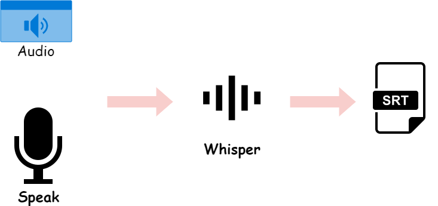
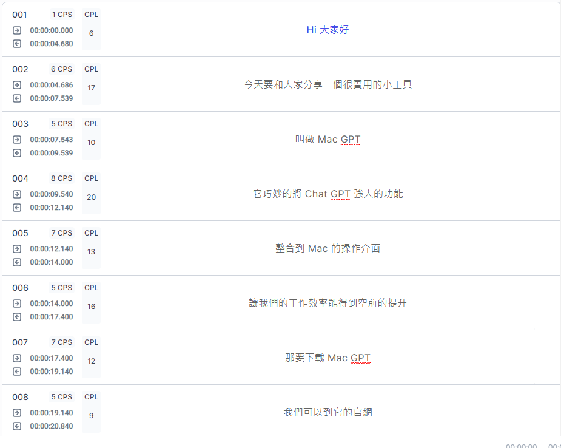

# 【語音辨識 - Whisper】OpenAI Whisper: 語音辨識產生字幕檔

上一篇「[【Google Colab Python系列】 初探Whisper: 來對一段Youtube影片進行辨識吧！](https://vocus.cc/article/644526c8fd89780001ffdd9f)」我們介紹了Whisper的基本用法及功能，這次我們除了語音辨識之外，還要下載辨識後的字幕檔，我想這對於我們常常看到沒有字幕的影片，若想要進行辨識與翻譯時非常有幫助。

<figure><figcaption></figcaption></figure>

### 這次的篇章主要做些什麼？

* 前置作業。
* 上傳影音檔。
* 自動語音辨識文字。
* 下載字幕檔(.srt)。

### 前置作業

#### 安裝相關套件

* [x] &#x20;openai-whisper

#### 檢查是否開啟GPU

```python
# 安裝whisper語音辨識工具
!pip install -U openai-whisper

# 檢查是否開啟GPU
!nvidia-smi
```

### 上傳影音檔

在Google Colab環境中如果要上傳音檔是沒問題的，貼心的Colab提供了API讓我們可以設計上傳音檔的功能，那就讓我們來實際玩玩吧。

P.S 上傳的時間會比下載的時間久很多，可以喝杯咖啡後再回來。

```python
from google.colab import files

uploaded = files.upload()


todo = []
for fn in uploaded.keys():
  print('{name} with length {length} bytes'.format(name=fn, length=len(uploaded[fn])))
  todo.append(fn)

todo
```

### 載入辨識模型

要載入什麼樣的模型呢？可以看看官方網站的「[Available models and languages](https://github.com/openai/whisper#available-models-and-languages)」

```python
import whisper

model = whisper.load_model('large')
```

### 對上傳檔案進行辨識

```python
import os
from whisper.utils import get_writer

# 輸出格式為srt
# 輸出路徑為目前位置
w = get_writer('srt', '.')

for f in todo:
  name = os.path.basename(f)

  result = model.transcribe(name)

  srt_file_name = '{name}.srt'.format(name=name)
  w(result, srt_file_name)

  files.download(srt_file_name)

```

<figure><figcaption></figcaption></figure>

### 結語

有了Whisper之後，我們就能夠本地開發一隻Python小程式來對影片進行辨識自動產生字幕了，如此一來就不用每次都上傳到雲端才開始進行，甚至人工產生字幕，基本上Whisper的辨識就目前使用上來說已經算是不錯了，句子的切點都還算精確，標點符號也都幫我們自動標上，真是貼心啊。


今天的範例都在這裡「[📦 ](../jupyter-examples/goodinfo\_yield.ipynb)[**whisper\_1\_srt.ipynb**](https://github.com/weihanchen/google-colab-python-learn/blob/main/jupyter-examples/whisper\_1\_srt.ipynb)」歡迎自行取用。

如何使用請參閱「[【Google Colab系列】台股分析預備式： Colab平台與Python如何擦出火花？](https://www.potatomedia.co/s/aNLHZe3S)」。


\------------------------------------------------------------------------------------------------

喜歡撰寫文章的你，不妨來了解一下：

[Web3.0時代下為創作者、閱讀者打造的專屬共贏平台 - 為什麼要加入？](https://www.potatomedia.co/s/2PmFxsq)

歡迎加入一起練習寫作，賺取知識，累積財富！


#### 更多關於【語音辨識 - Whisper 系列】…

* [【語音辨識 - Whisper】 初探Whisper: 來對一段Youtube影片進行辨識吧！](https://vocus.cc/article/644526c8fd89780001ffdd9f)
* [【語音辨識 - Whisper】OpenAI Whisper: 語音辨識產生字幕檔](https://vocus.cc/article/64468d92fd8978000115c6e1)
* [【語音辨識 - Whisper】 雙聲道音訊處理與辨識](https://vocus.cc/article/64733d7efd89780001781326)
* [【語音辨識 - Whisper】 準確與否需要有一把 📏尺來衡量](https://vocus.cc/article/64b3a209fd89780001481152)
