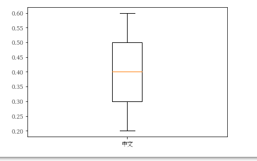

# 🖋 【Google Colab Python系列】 視覺化資料Matplotlib 如何繪製出中文？

<figure><figcaption><p><a href="https://www.potatomedia.co/s/PDf86nk">圖片來源</a></p></figcaption></figure>

我們前篇有介紹到如何讓資料視覺化「[📈【Google Colab Python系列】以Goodinfo為例，將資料視覺化吧！](https://www.potatomedia.co/s/zX7EIT7)」，過程中雖然我們的報表呈現皆使用英文字眼，但假若欲繪製中文進行呈現時就會發生以下狀況：

```python
import matplotlib.pyplot as plt

data = [lYield, cYield, hYield]

# 這裡繪製出中文
labels = ['中文']

plt.boxplot(data, labels=labels)
plt.show()
```

```
/usr/local/lib/python3.8/dist-packages/matplotlib/backends/backend_agg.py:214: RuntimeWarning: Glyph 20013 missing from current font.
  font.set_text(s, 0.0, flags=flags)
/usr/local/lib/python3.8/dist-packages/matplotlib/backends/backend_agg.py:214: RuntimeWarning: Glyph 25991 missing from current font.
  font.set_text(s, 0.0, flags=flags)
/usr/local/lib/python3.8/dist-packages/matplotlib/backends/backend_agg.py:183: RuntimeWarning: Glyph 20013 missing from current font.
  font.set_text(s, 0, flags=flags)
/usr/local/lib/python3.8/dist-packages/matplotlib/backends/backend_agg.py:183: RuntimeWarning: Glyph 25991 missing from current font.
  font.set_text(s, 0, flags=flags)
```

由上述的訊息可以推估可能是某些字型缺失，因此無法正常顯現，這時候我們就需要下載字型並補足，以下會逐步說明步驟。


### 下載字型並加掛

字型的下載可以到「[思源宋體](https://github.com/adobe-fonts/source-han-serif)」抓取唷！裡面涵蓋了中、日、韓的字型，那這邊的範例我們就隨便選一個中文字型來進行示範。

這邊我們會下載繁體中文的ttf檔，並將該檔掛入matplotlib的字型資料庫中，以便進行中文的繪製。

```python
import matplotlib as mpl
import matplotlib.font_manager as fm
import matplotlib.pyplot as plt

# 下載繁體中文字型
!wget -O SourceHanSerifTW-VF.ttf https://github.com/adobe-fonts/source-han-serif/raw/release/Variable/TTF/Subset/SourceHanSerifTW-VF.ttf

# 加入字型檔
fm.fontManager.addfont('SourceHanSerifTW-VF.ttf')

# 設定字型
# 
mpl.rc('font', family='Source Han Serif TW VF')
```

至於要設定哪種family請參閱「[official font readme file](https://github.com/adobe-fonts/source-han-serif/raw/release/SourceHanSerifReadMe.pdf).」。


#### 繪製中文標籤

```python
data = [0.2, 0.4, 0.6]

# 這裡繪製出中文
labels = ['中文']

plt.boxplot(data, labels=labels)
plt.show()
```

<figure><figcaption></figcaption></figure>


### 結語

這次就能夠成功繪製並且沒有錯誤訊息囉！ 其實在初學Python的時候最常遇到的就是中文亂碼的問體，沒想到套件也是稍微複雜，不過套件的問題與Python中文問題又不太相似，僅是缺少一些字型而已，補足即可，只是Matplotlib的官方文件真的蠻詳細的需要好好的研讀才能解決遇到的問題，過程中也學習到別人的設計模式，可以當成下一次的功能設計養分。


字型問題真的非常惱人啊，有otf、ttf、woff2...等字型格式，以及各種標準方法(family)，關於字型更多的知識請參考「[https://zh.wikipedia.org/zh-tw/%E5%AD%97%E5%9E%8B](https://zh.wikipedia.org/zh-tw/%E5%AD%97%E5%9E%8B)」


今天的範例都在這裡「[📦 ](../jupyter-examples/goodinfo\_yield.ipynb)[**matplotlib\_chinese\_font.ipynb**](../jupyter-examples/matplotlib\_chinese\_font.ipynb)」歡迎自行取用。

如何使用請參閱「[【Google Colab系列】台股分析預備式： Colab平台與Python如何擦出火花？](https://www.potatomedia.co/s/aNLHZe3S')」。

### 資源參考

* [https://ithelp.ithome.com.tw/articles/10202385](https://ithelp.ithome.com.tw/articles/10202385)
* [https://sujingjhong.com/posts/how-to-show-matplotlib-visual-packages-in-chinese-on-colab/](https://sujingjhong.com/posts/how-to-show-matplotlib-visual-packages-in-chinese-on-colab/)
