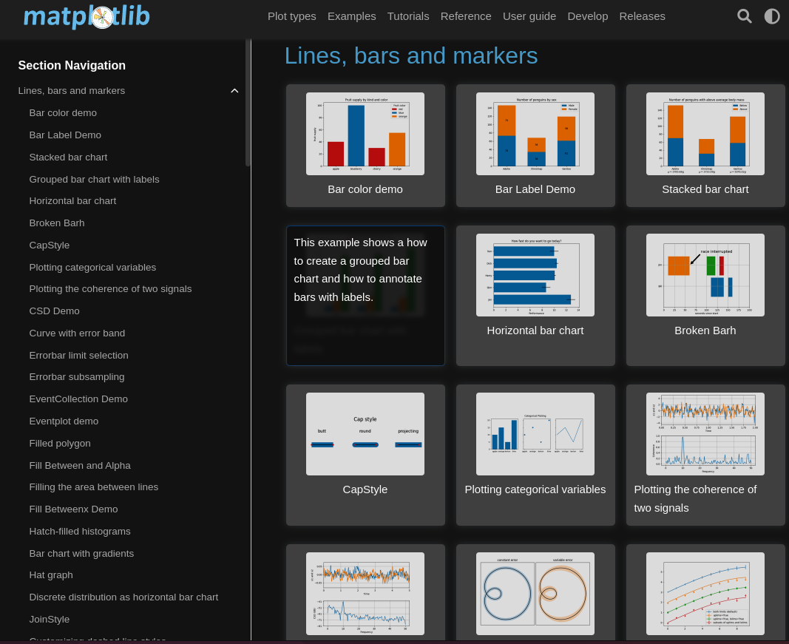
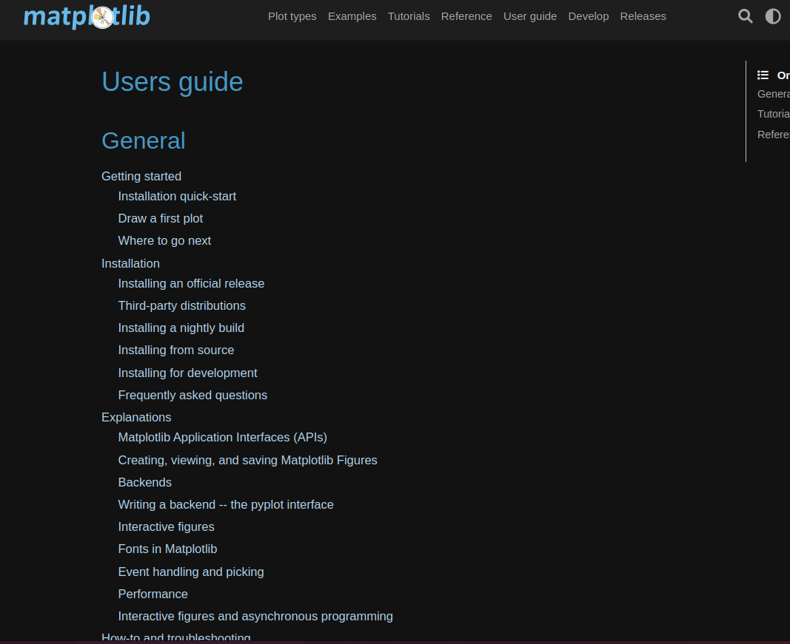
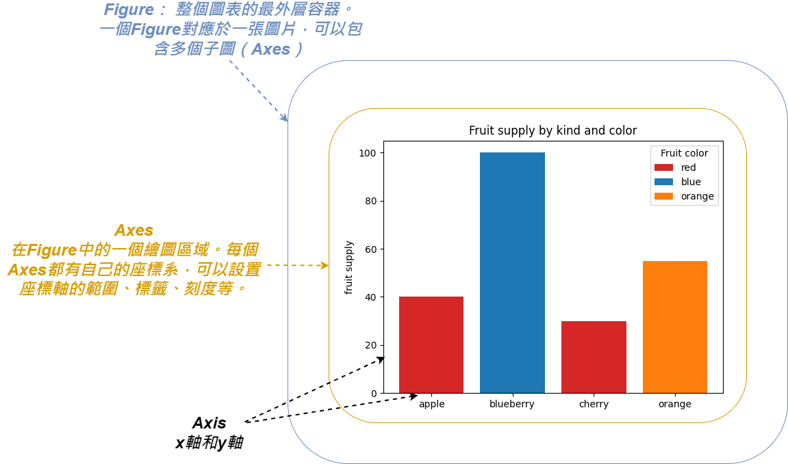

# 【Google Colab Python系列】 視覺化資料Matplotlib 新手村


<figure><figcaption><p><a href="https://stablediffusionweb.com/">圖片來源</a></p></figcaption></figure>

相信視覺化報表對於資料科學來說是非常重要的一環， 透過圖表來呈現資料的樣態， 過程中分析模型訓練時， 觀察訓練的收斂趨勢是否如我們預期， 視覺化加速我們的判斷時間， 節省找問題的成本。

數據就如同鐵證一般， 當我們常常苦於為什麼訓練出來的A模型這麼差勁，但B模型卻非常好， 這中間發生了什麼事情， 通常沒有一個數據的話， 我們只能憑感覺， 但感覺這東西很微妙也很主觀， 常常因為我們當時看到的視角太狹隘而得出錯誤的結論， 因此最好的方式就是讓「數據」來說明一切， 呈現「數據」最好的幫手就是「視覺化圖表」了。

而在Python的世界裡， 常拿來被使用的視覺化套件是「[Matplotlib](https://matplotlib.org/)」， 也是這個篇章即將介紹的一個利器， 功能非常豐富， 常見的線圖、散點圖、直方圖、長條圖、餅圖…都難不倒它， 難的是我們會不會使用它， 因此非常值得我們好好的學習一番。


### 導覽

我們可以看到官網的範例圖表非常的豐富， 涵蓋各式各樣的統計分析圖。

[https://matplotlib.org/stable/gallery/index.html](https://matplotlib.org/stable/gallery/index.html)

<figure><figcaption><p><a href="https://matplotlib.org/stable/gallery/index">圖片來源</a></p></figcaption></figure>


<figure><figcaption><p><a href="https://matplotlib.org/stable/gallery/index">圖片來源</a></p></figcaption></figure>

在龐大的範例池裡挖呀挖呀挖， 一篇接著一篇有點挖不完的感覺…， 但不要害怕， 我們將一步步的進行教學。

當然官方網站也提供了使用者指南， 如果需要更詳細的資訊也歡迎直接上官網:


[https://matplotlib.org/stable/users/index.html](https://matplotlib.org/stable/users/index.html)

<figure><figcaption><p><a href="https://matplotlib.org/stable/users/index.html">圖片來源</a></p></figcaption></figure>

### 知己知彼，百戰百勝： 認識架構

* Figure（圖片）：整個圖表的最外層容器。一個Figure對應於一張圖片，可以包含多個子圖（Axes）。
* Axes（座標軸）：即子圖，是在Figure中的一個繪圖區域。每個Axes都有自己的座標系，可以設置座標軸的範圍、標籤、刻度等。
* Axis（坐標軸）：Axes上的x軸和y軸，用於顯示數據的範圍和刻度。
* Artist（圖形元素）：包括線條、文本、圖片等用於繪製圖表的元素。


<figure><figcaption></figcaption></figure>

### 啟航： 快速安裝

以下是使用Python pip套件管理程式進行安裝， 如果是使用conda的朋友可以這樣安裝: `conda install -c conda-forge matplotlib`

```python
pip install matplotlib
```

### 練功：一步一腳印

簡單的五個步驟，讓我們親手繪製出長條圖。

#### 引入模組

```python
import matplotlib.pyplot as plt
```

#### 創建Figure和Axes

plt.subplots()函數會返回一個包含Figure和Axes對象的元組，可以通過fig設置圖片屬性，通過ax繪製圖表元素。

```python
# 這邊預設給予一個子圖
fig, ax = plt.subplots()

## 假設想要多張子圖時可以這麼做..., 創建一個2x2的子圖佈局，總共有4個子圖
# fig, ax = plt.subplots(2, 2)
## 第一張
# ax[0, 0].plot([1, 2, 3, 4], [1, 4, 2, 3])
## 第二張
# ax[0, 1].scatter([1, 2, 3, 4], [1, 4, 2, 3], color='r')
```

#### 繪製圖表

```python
fruits = ['apple', 'blueberry', 'cherry', 'orange']
counts = [40, 100, 30, 55]
bar_labels = ['red', 'blue', '_red', 'orange']
bar_colors = ['tab:red', 'tab:blue', 'tab:red', 'tab:orange']
ax.bar(fruits, counts, label=bar_labels, color=bar_colors)
```

#### 添加標籤、標題、圖例等

```python
ax.set_ylabel('fruit supply')
ax.set_title('Fruit supply by kind and color')
ax.legend(title='Fruit color')
```

#### 顯示圖表

儲存並呈現

```python
from IPython.display import Image

fig.savefig('tmp.png')

Image('tmp.png')
```


今天的範例都在這裡「[📦 matplotlib/matplotlib\_quickstart.ipynb](https://github.com/weihanchen/google-colab-python-learn/blob/main/jupyter-examples/matplotlib/matplotlib\_quickstart.ipynb)」歡迎自行取用。

如何使用請參閱「[【Google Colab Python系列】Colab平台與Python如何擦出火花？](https://www.potatomedia.co/s/aNLHZe3S)」。


### 結語

這次透過簡單的幾個步驟就可以輕鬆使用[Matplotlib](https://matplotlib.org/)來繪製圖表，其實基本架構弄懂之後，照著SOP就能購繪製出各種不同的圖表，最難的就在於如何將金礦中的「資料」轉化為可繪製的「數據」，各種圖表各有不同的資料結構，難就難在怎麼做好使用者端與套件端的資料介接者，這也是價值之所在，亦是軟體工程師重要的一環。

AI時代的來臨，總會需要數據來導正AI，而輔助我們決策的神兵利器就是「視覺化圖表」，因此身處浪潮的我們不得不好好學習這些技能才不至於被時代給淘汰，其實技術一點都不難，只要我們能夠理解設計理念及原理，那麼相信只要隨著時間的遞移就能夠熟能生巧，讓AI成為我們的最佳夥伴。


喜歡撰寫文章的你，不妨來了解一下：

[Web3.0時代下為創作者、閱讀者打造的專屬共贏平台 — 為什麼要加入？](https://www.potatomedia.co/s/2PmFxsq)

歡迎加入一起練習寫作，賺取知識！
