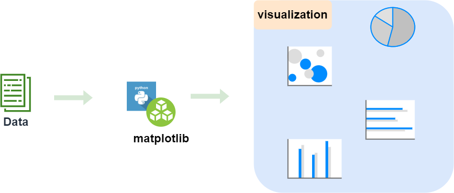

# 📈【Google Colab Python系列】以Goodinfo為例，將資料視覺化吧！

<figure><figcaption></figcaption></figure>

上一篇我們有介紹如何爬取Goodinfo的資訊並統計分析，還沒閱讀的朋友建議先行閱讀，再進入此篇章會比較容易上手唷，傳送門如下：

[🚪【Google Colab系列】以Goodinfo!為例，統計一段時間內的最高、最低殖利率](https://www.potatomedia.co/s/ah0EuUhd)

### 為什麼要做資料視覺化？

相信圖文甚至影音箱對於文字來說更為吸引我們進行知識的汲取，一張好的圖表讓我們一眼就能看出資料的趨勢、分布，提升整體效率，因此當資料、統計都準備好之後，下一步就是以圖表來進行分析並決策。

那這次的主題會使用到的套件為「[Matplotlib](https://matplotlib.org/)提供了靜態、動態與互動式圖表，是python語言中資料視覺化的強大利器。

### 我們應該選用哪一種圖表呢？

不同的情境下選用不同的圖表，就像戰場上根據戰況選用不同的武器甚至策略，因此並沒有一個標準答案，不論是時序、量化...都有其擅長與短處，看看這篇今周刊的文章就有提到「[不同圖表不同使用時機，我的報表適合什麼圖形？你用對了嗎？](https://www.businesstoday.com.tw/article/category/80407/post/201903260012/)」。

而我們的情境是要分析目前股價屬於偏貴還是便宜，因此會有最高、最低以及目前錨定位置，那以這樣的情境我們可以選用了箱型圖來做表述：

<figure><figcaption></figcaption></figure>

因為我們並沒有時序上的需求，因此也不適用於折線圖、長條圖這種常見的圖表，反而是箱型圖可以表述目前的價格偏高還是低。

### 開始實作的旅程

上一篇」我們已經統計出最高/最低殖利率了，這次我們進行延伸，以最新成交價搭配圖表來評估目前股價的位階，因此會抓取最新成交價、計算目前殖利率、繪製圖表這幾個步驟，以下將逐步說明。

#### 抓取最新成交價

#### 計算目前殖利率

請參閱「[🚪【Google Colab系列】以Goodinfo!為例，統計一段時間內的最高、最低殖利率](https://www.potatomedia.co/s/ah0EuUhd)」，並搭配上述最新成交價的資訊進行公式的替換即可。

#### 繪製圖表

### 結語

今天的範例都在這裡「[📦 **goodinfo\_yield.ipynb**](../jupyter-examples/goodinfo\_yield.ipynb)」歡迎自行取用。

如何使用請參閱「[【Google Colab系列】台股分析預備式： Colab平台與Python如何擦出火花？](https://www.potatomedia.co/s/aNLHZe3S')」。

\------------------------------------------------------------------------------------------------

喜歡撰寫文章的你，不妨來了解一下：

[Web3.0時代下為創作者、閱讀者打造的專屬共贏平台 - 為什麼要加入？](https://www.potatomedia.co/s/2PmFxsq)&#x20;

歡迎加入一起練習寫作，賺取知識，累積財富！
