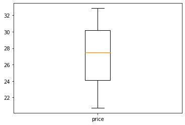

# 📈【Google Colab Python系列】以Goodinfo為例，將資料視覺化吧！

<figure><figcaption></figcaption></figure>

上一篇我們有介紹如何爬取Goodinfo的資訊並統計分析，還沒閱讀的朋友建議先行閱讀，再進入此篇章會比較容易上手唷，傳送門如下：

[🚪【Google Colab系列】以Goodinfo!為例，統計一段時間內的最高、最低殖利率](https://www.potatomedia.co/s/ah0EuUhd)

### 為什麼要做資料視覺化？

相信圖文甚至影音箱對於文字來說更為吸引我們進行知識的汲取，一張好的圖表讓我們一眼就能看出資料的趨勢、分布，提升整體效率，因此當資料、統計都準備好之後，下一步就是以圖表來進行分析並決策。

那這次的主題會使用到的套件為「[Matplotlib](https://matplotlib.org/)提供了靜態、動態與互動式圖表，是python語言中資料視覺化的強大利器。

### 我們應該選用哪一種圖表呢？

不同的情境下選用不同的圖表，就像戰場上根據戰況選用不同的武器甚至策略，因此並沒有一個標準答案，不論是時序、量化...都有其擅長與短處，看看這篇今周刊的文章就有提到「[不同圖表不同使用時機，我的報表適合什麼圖形？你用對了嗎？](https://www.businesstoday.com.tw/article/category/80407/post/201903260012/)」。

而我們的情境是要分析目前股價屬於偏貴還是便宜，因此會有最高、最低以及目前錨定位置，那以這樣的情境我們可以選用了箱型圖來做表述：

<figure><figcaption></figcaption></figure>

因為我們並沒有時序上的需求，因此也不適用於折線圖、長條圖這種常見的圖表，反而是箱型圖可以表述目前的價格偏高還是低。

### 開始實作的旅程

上一篇」我們已經統計出最高/最低殖利率了，這次我們進行延伸，以最新成交價搭配圖表來評估目前股價的位階，因此會抓取最新成交價、計算目前殖利率、繪製圖表這幾個步驟，以下將逐步說明。

#### 抓取最新成交價

我們一樣使用dom分析的工具來抓取指定表格，如何抓？ 請參閱「[🚪【Google Colab系列】以Goodinfo!為例，統計一段時間內的最高、最低殖利率](https://www.potatomedia.co/s/ah0EuUhd)」，以下是主要抓取的部分：

```python
# 這一段是「成交價」區塊
price_data = bs.find(class_ = 'b1 p4_2 r10')
```

接著我們試著取得成交價，並進行轉型為float以利後續計算。

```python
import pandas

dfs = pandas.read_html(price_data.prettify())

node = dfs[0]

# 僅留下第一列
node.columns = node.columns.get_level_values(1)

# 印出Columns輔助以下抓取重要資訊
# node.columns

# 取得第一列的成交價
x = node['成交價'].iloc[0]
price = float(x)
```

#### 計算目前殖利率

請參閱「[🚪【Google Colab系列】以Goodinfo!為例，統計一段時間內的最高、最低殖利率](https://www.potatomedia.co/s/ah0EuUhd)」，並搭配上述最新成交價的資訊進行公式的替換即可。

#### 繪製圖表

重頭戲來了，具備資料之後，下一步就是將這些資料繪製成簡單易懂的圖表，以利進行分析，而這邊會使用到的是Python語言中較為知名的套件「[matplotlib](https://matplotlib.org/)」，提供種類豐富的圖表類型，而這次我們採用範例的是箱型圖，而箱型圖繪製的API如下：

```python
import matplotlib.pyplot as plt

plt.boxplot(<...資料集>, <x軸, ...更多配置>)

```

**繪製目前股價位階圖**

* 以N年平均最高股價與最低股價作為上下限。
* 對照目前股價位階。
* 股價越低代表價格越迷人。

```python
import matplotlib.pyplot as plt

# lowest 近N年平均最低價
# price 目前股價
# highest 近N年平均最高價
data = [lowest, price, highest]

# 標籤
labels = ['price']

plt.boxplot(data, labels=labels)
plt.show()
```

<figure><figcaption></figcaption></figure>

**繪製目前殖利率位階圖**

* 以N年平均最高與最低殖利率作為上下限。
* 對照目前的殖利率位階。
* 殖利率越高代表目前CP值越高。

```python
import matplotlib.pyplot as plt

# lYield 近N年平均最低殖利率
# cYield 目前殖利率
# hYield 近N年平均最高殖利率
data = [lYield, cYield, hYield]

labels = ['yield']

plt.boxplot(data, labels=labels)
plt.show()o
```

<figure><figcaption></figcaption></figure>

相信具有圖表的輔助更能夠快速的判斷及決策，而Matplotlib這套工具就能夠很好的薑我們的資料繪製成圖，非常便利。

### 結語

藉由上述的圖表呈現可以得知目前股價處於近N年的哪個位階，以價格來說有些偏高，以殖利率來說有些偏低，因此會暫時觀望，等待時機再行購入，當然這些都是過去資料並不代表未來，過去的數據不論怎麼推估都並非產生絕對的未來，我們僅能掌握更多數據來提升對未來的決策判斷。


不妨親自動動手來計算這些數據，相信會更加印象深刻，以後遇到各種資料我們都能夠較為準確的判斷，而不是僅憑感覺盲目的猜測，造成不精準的決策導致損失。


今天的範例都在這裡「[📦 **goodinfo\_yield.ipynb**](../jupyter-examples/goodinfo\_yield.ipynb)」歡迎自行取用。

如何使用請參閱「[【Google Colab系列】台股分析預備式： Colab平台與Python如何擦出火花？](https://www.potatomedia.co/s/aNLHZe3S')」。

\------------------------------------------------------------------------------------------------

喜歡撰寫文章的你，不妨來了解一下：

[Web3.0時代下為創作者、閱讀者打造的專屬共贏平台 - 為什麼要加入？](https://www.potatomedia.co/s/2PmFxsq)

歡迎加入一起練習寫作，賺取知識，累積財富！
