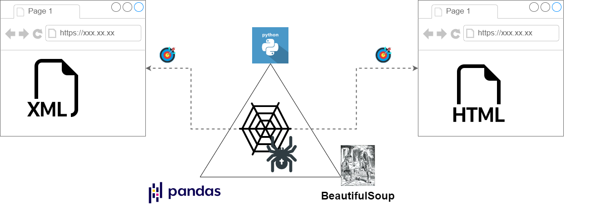
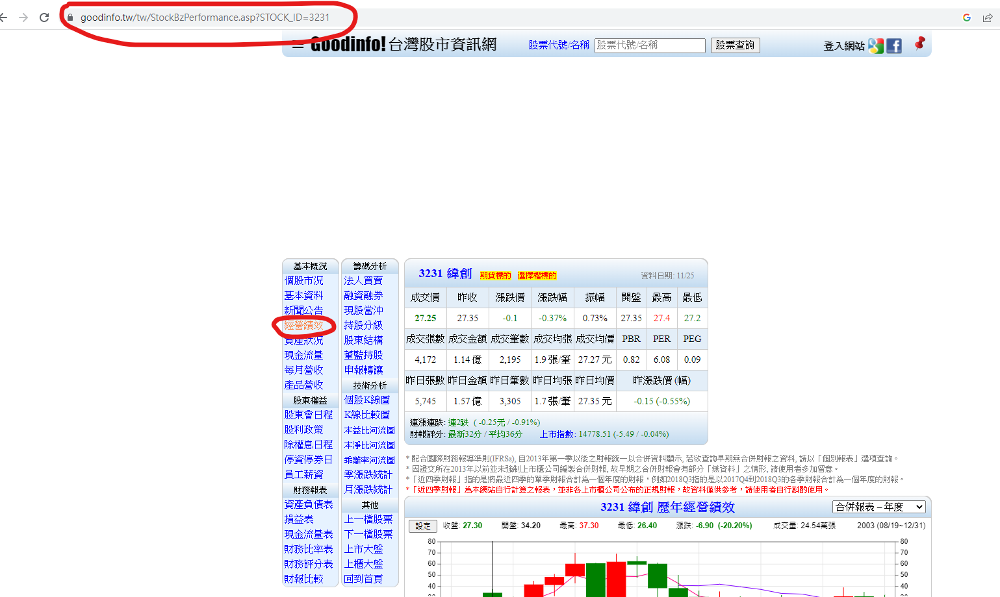
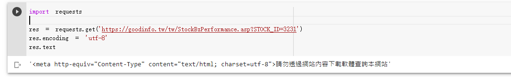
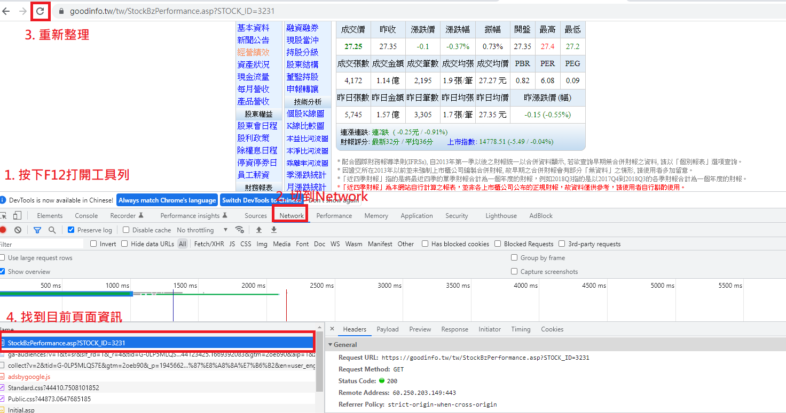
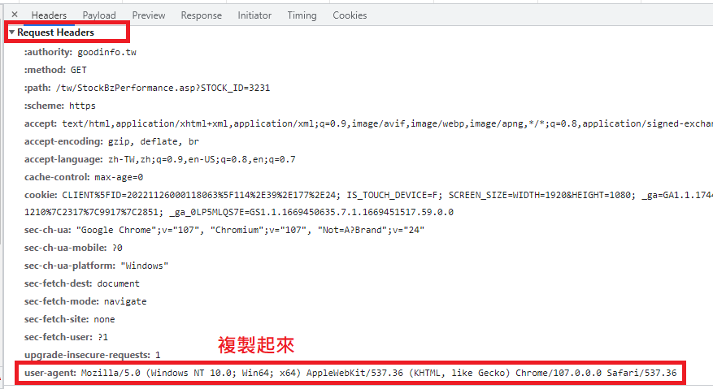
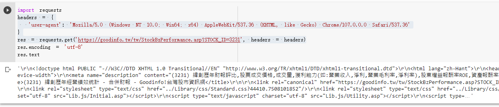
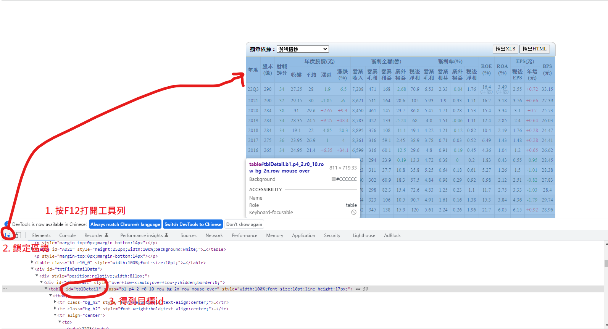
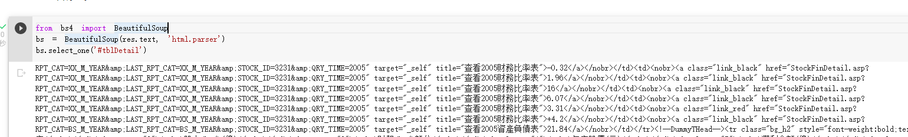
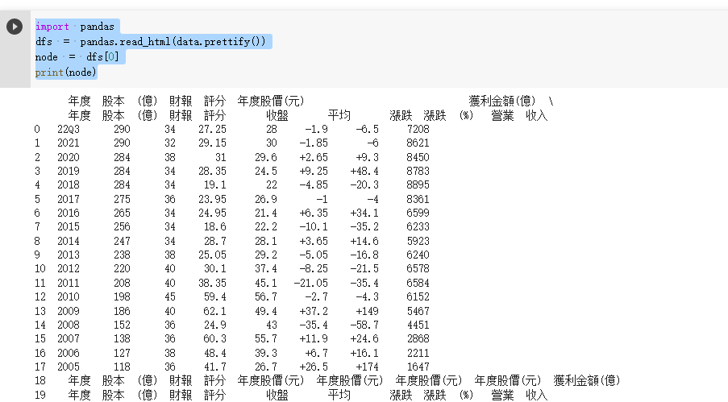

# 【Google Colab系列】該如何設計自己的爬蟲來抓取Html資料？

上一篇我們已經介紹過Google Colab的基本用法，建議可以先行閱讀「【Google Colab系列】台股分析預備式： Colab平台與Python如何擦出火花？」，進行基本概念與環境的建置再進行下一步會比較容易進行學習。

雖然網路上已經提供非常多的股市資訊，但各個網站可能都零零散散，難免我們得自行進行資訊整合來抓取網頁資料進行分析，而Python語言的特性就是早期具有非常多的資料科學家使用的一門語言，故統計、分析、資料解析的套件非常多，我們只要採用幾個重要的套件就能夠快速的抓取我們需要的資料進行分析。

這次主要介紹兩個重要的套件，分別是「BeautifulSoap」與「Pandas」，這兩個工具主要瞄準的目標不太相同，「BeautifulSoap」主要針對HTML、XML格式進行解析，讓我們可以更快的抓到我們需要的資料，等於是幫我們進行第一道關卡的過濾，而第二道關卡資料分析的過程就需要透過「Pandas」來幫我們進行了，就相當於資料 → 資訊 → 知識的轉化過程。

<figure><figcaption></figcaption></figure>

### 撒網目標： Goodinfo!

* [https://goodinfo.tw/tw/index.asp](https://goodinfo.tw/tw/index.asp)
* 某一檔個股的經營績效指標。

我們已經很確定要抓取的網頁資訊就是在「經營績效」這個頁面，因此第一步就是先進到這個畫面之後，將網址複製起來。

<figure><figcaption></figcaption></figure>

得到網址為：[https://goodinfo.tw/tw/StockBzPerformance.asp?STOCK\_ID=3231](https://goodinfo.tw/tw/StockBzPerformance.asp?STOCK\_ID=3231)

我們得到網址之後，首先就要先設法將網頁內容抓取，我們可以用Python內建的request套件去請求目標網址。

```jsx
import requests
res = requests.get('<https://goodinfo.tw/tw/StockBzPerformance.asp?STOCK_ID=3231>', headers = headers)
res.encoding = 'utf-8'
res.text
```

但非常不幸的第一步將遇到一個狀況就是我們被誤以為機器人，因此沒辦法請求任何資訊了！

<figure><figcaption></figcaption></figure>

怎麼辦呢？ 主要是許多網站都會檢查header是否為user-agent來判定為機器人或者瀏覽器行為，此時我們來觀察一下瀏覽器操作的行為，並試圖模擬一下。

回到頁面，我們按下F12打開瀏覽器開發者工具列，切到Network，接著按下頁面重新整理之後，蒐集目前頁面網路傳輸資訊。

<figure><figcaption></figcaption></figure>

接著在Headers裡面找到user-agent欄位並複製起來。

<figure><figcaption></figcaption></figure>

接著我們回到Colab進行程式開發，將headers帶入。

```jsx
headers = {
  'user-agent': 'Mozilla/5.0 (Windows NT 10.0; Win64; x64) AppleWebKit/537.36 (KHTML, like Gecko) Chrome/107.0.0.0 Safari/537.36'
}
res = requests.get('<https://goodinfo.tw/tw/StockBzPerformance.asp?STOCK_ID=3231>', headers = headers)
```

此時執行後我們就能夠成功抓到內容囉！

<figure><figcaption></figcaption></figure>

### 網頁解析的利器： BeautifulSoap

首先我們一樣開始F12開發者工具，並且點選左下角的「Select an element…」來獲取指定區塊，今天我們抓取的目標是獲利指標，因此就將滑鼠移到該區塊。

<figure><figcaption></figcaption></figure>

接著我們回到Colab撰寫程式抓取目標值。

```jsx
from bs4 import BeautifulSoup
bs = BeautifulSoup(res.text, 'html.parser')
data = bs.select_one('#tblDetail')
```

成功抓到區塊資料如下：

<figure><figcaption></figcaption></figure>

### 資料分析的利器: Pandas

成功抓取資料之後，由於我們的目標區塊是表格，而Pandas正好非常擅長處理表格資料，因此我們可以將目標資料丟給Pandas進行分析處理。

```jsx
import pandas
dfs = pandas.read_html(data.prettify())
node = dfs[0]
print(node)
```

成功抓取目標節點。

<figure><figcaption></figcaption></figure>

接著我們可以透過.head()的方式來瀏覽資料集。

<figure><figcaption></figcaption></figure>

下一個章節我們再來介紹如何取得我們要的EPS、殖利率…等關鍵指標進行程式運算，看到此篇文章的你不妨動手試試看，相信成功之後會非常有成就感，才能有信心往下一道關卡邁進。

### 結語

Python不愧是進行資料分析的最佳利器，簡單的透過幾個套件就能夠快取爬取我們要的網站資料，並且進一步進行資料統計與分析，難怪資料科學家們都喜愛這套程式語言，我們也要跟上趨勢學習如何抓取、過濾、分析資料，善用各式工具幫助我們提升效率。

為什麼會拿來分析股市資訊呢？ 起心動念主要源自於市面上太多各式各樣的APP，但這些APP都有一些共同點，就是進階功能皆需收費，對於小資族來說也是一筆不小的負擔啊！ 因此我們既然已經有工具及觀念，何不自行打造專屬的資料分析器呢？

\------------------------------------------------------------------------------------------------

喜歡撰寫文章的你，不妨來了解一下：

[Web3.0時代下為創作者、閱讀者打造的專屬共贏平台 - 為什麼要加入？](https://www.potatomedia.co/s/2PmFxsq)&#x20;

歡迎加入一起練習寫作，賺取知識，累積財富！
