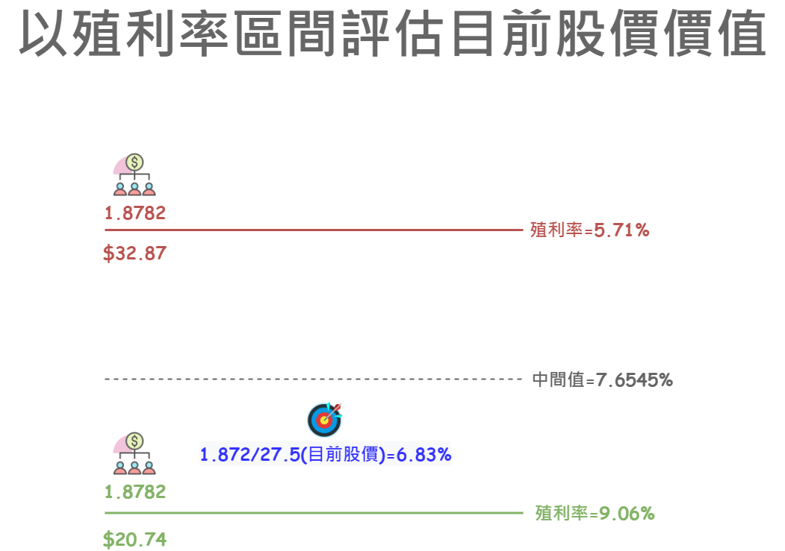
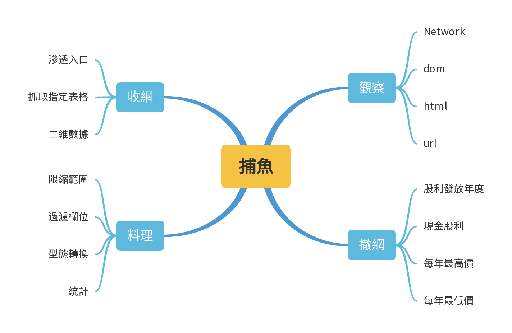
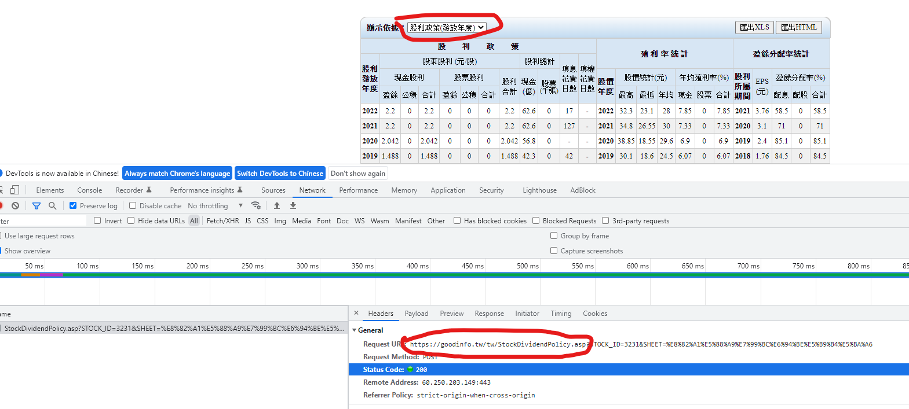
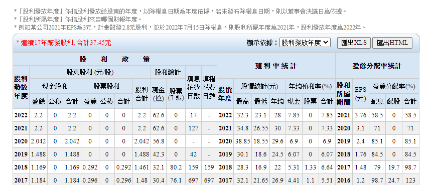
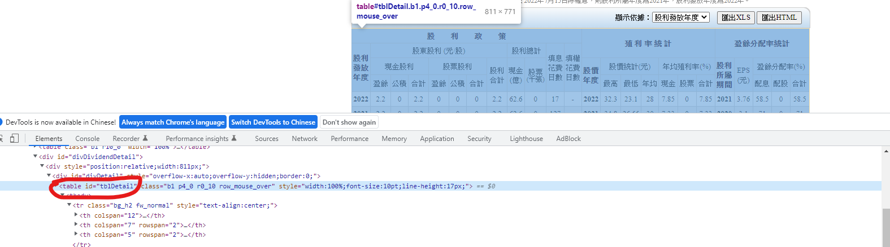
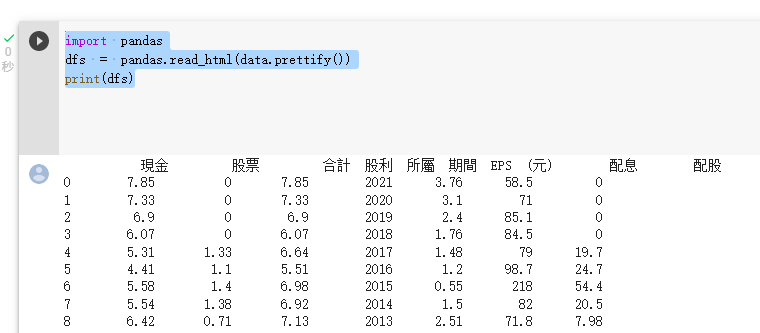
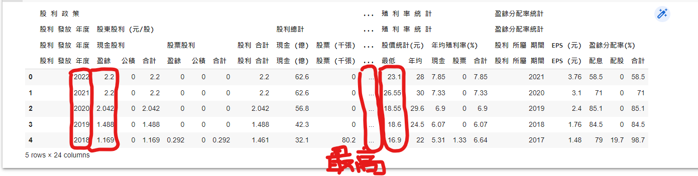
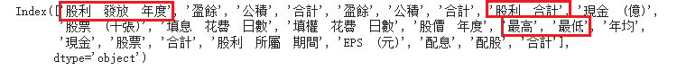
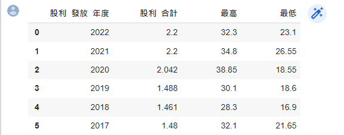

# 【Google Colab Python系列】以Goodinfo!為例，統計一段時間內的最高、最低殖利率

<figure><figcaption><p><a href="https://www.potatomedia.co/s/GYVH5uC">圖片來源</a></p></figcaption></figure>

上一篇我們有介紹Google Colab Python的爬蟲基礎概念與技巧，還沒閱讀的朋友可以先進行閱讀，並建立基礎概念之後再接著進行實戰演練會比較容易上手唷！ 這裡就附上連結「[【Google Colab系列】該如何設計自己的爬蟲來抓取Html資料？](google-colab-xi-lie-gai-ru-he-she-ji-zi-ji-de-pa-chong-lai-zhua-qu-html-zi-liao.md)」供各位參考囉！


這一篇章會以捕魚的四大步驟進行比喻，由淺入深，逐步完成屬於自己的統計程式，目標是能夠以生活化例子建立撰寫爬蟲的基礎概念，未來假若我們需要進一步蒐集資料進行統計分析時，就將這套心法搬出來舞弄，相信概念與技巧熟練之後，遇到任何奇耙的網站資料也都能夠迎刃而解。

<figure><figcaption><p><a href="https://www.potatomedia.co/s/GYVH5uC">圖片來源</a></p></figcaption></figure>


上一次我們已經示範如何抓取目標表格，這次的主軸會圍繞在如何切換表格內容並抓取某幾個cell的資料進行程式運算，因此這個篇章我們會學到以下幾個重要技能：

* 抓取某段範圍內的cell內容。
* 過濾標題。
* 使用pandas進行計算與統計。

### 觀察： 分析切換「顯示依據」的行為

我們先打開F12並切到Network來觀察操作行為過程中會發送哪些網路封包。

<figure><figcaption><p><a href="https://www.potatomedia.co/s/GYVH5uC">圖片來源</a></p></figcaption></figure>

這時候就得考驗我們的觀察能力了，有沒有發現圖片上請求的URL已經有點不太一樣了，我們拿這段URL去試著請求看看，果不其然，刷新後的頁面就是股利發放政策的相關資訊了。


```
https://goodinfo.tw/tw/StockDividendPolicy.asp?STOCK_ID=xxx
```

<figure><figcaption><p><a href="https://www.potatomedia.co/s/GYVH5uC">圖片來源</a></p></figcaption></figure>

### 撒網： 定義明確目標

首先我們成功抓到表格之後，下一步就是定義我們今天要統計的數值，以這次的目標為例，統計的為N段時間內的最高、最低殖利率。

因此我們需要抓取的元素有「股利發放年度」、「現金股利」、「年度股價」這些資訊輔助我們進行每一年殖利率的計算。


### 收網： 撰寫程式進行抓取重要區塊

這時候我們就可以大膽的將這串URL寫到程式碼中，進一步進行抓取。

```
import requests

STOCK_ID='3231'

headers = {
  'user-agent': 'Mozilla/5.0 (Windows NT 10.0; Win64; x64) AppleWebKit/537.36 (KHTML, like Gecko) Chrome/107.0.0.0 Safari/537.36'
}
res = requests.get('https://goodinfo.tw/tw/StockDividendPolicy.asp?STOCK_ID={0}'.format(STOCK_ID), headers = headers)
res.encoding = 'utf-8'
res.text
```

再來我們一樣藉由F12(Network)來錨定關注範圍的表格。

<figure><figcaption><p><a href="https://www.potatomedia.co/s/GYVH5uC">圖片來源</a></p></figcaption></figure>

接著我們運用「BeautifulSoup」來抓取該表格的標籤。

```
from bs4 import BeautifulSoup
bs = BeautifulSoup(res.text, 'html.parser')
data = bs.select_one('#tblDetail')
print(data)
```

再來使用pandas套件來檢驗我們抓取的表格是否正確。

```
import pandas
dfs = pandas.read_html(data.prettify())
print(dfs)
```

<figure><figcaption><p><a href="https://www.potatomedia.co/s/GYVH5uC">圖片來源</a></p></figcaption></figure>

看樣子是我們所需要的資訊沒有錯，接下來就要開始抓取最高與最低股利來計算這兩者的平均殖利率囉！

### 料理：統計的精華與心法

首先我們一樣用取節點的技巧，並印出前N筆的方式來縮減範圍，並且框出我們需要的欄位。

```python
import pandas
import datetime


dfs = pandas.read_html(data.prettify())
node = dfs[0]

node.head(5)
```

<figure><figcaption><p><a href="https://www.potatomedia.co/s/GYVH5uC">圖片來源</a></p></figcaption></figure>

這邊有幾篇關於Pandas的教學，建議可以先行閱讀，才比較容易知道如何使用這個強大的套件。

* [https://www.learncodewithmike.com/2020/11/python-pandas-dataframe-tutorial.html](https://www.learncodewithmike.com/2020/11/python-pandas-dataframe-tutorial.html)

接著我們直接進入重點，我們先試試看抓取重要的幾個欄位並留下即可，並且我們試著將columns印出，記錄我們需要的欄位名稱，下一步我們會使用這些資訊留下重要的欄位資訊。

```python
# 這邊我們將標題僅留下第3列即可
node.columns = node.columns.get_level_values(3)

# 印出標題名稱
node.columns
```

<figure><figcaption><p><a href="https://www.potatomedia.co/s/GYVH5uC">圖片來源</a></p></figcaption></figure>

接著我們試著讓資訊列僅留下指定欄位資訊。

```python
# 顯示Columns(列)為名稱的數據
# 這次抓取的目標有4個欄位，分別以下：
node = node[['股利  發放  年度', '股利  合計', '最高', '最低']] 

node = node.head()
```

<figure><figcaption><p><a href="https://www.potatomedia.co/s/GYVH5uC">圖片來源</a></p></figcaption></figure>

重頭戲來囉！ 加油，剩下最後一段路了，讓我們來統計一下這N年的最高與最低殖利率吧！ 如果不知道殖利率怎麼計算的朋友不妨試著閱讀以下文章：&#x20;

* [金融理財入門(股票篇) — 基本面名詞](https://www.potatomedia.co/s/bXdkrdvG)
* [【股市韭菜系列】明年股息推算，以「xx」為例](https://www.potatomedia.co/s/hlGfSzx)

讓我們動手來進行程式開發，統計屬於自己的分析庫，首先我們針對前N筆的股利合計、最高、最低進行平均的運算，但在平均之前值得注意的是表格內的值尚未轉換前仍為字串，因此我們要優先處理型態轉換如下：

```python
# 把 str 轉成 float 型態才能進行統計
node['最低'] = node['最低'].astype('float')
node['最高'] = node['最高'].astype('float') 
```

接著我們分別取合計股利、最高、最低的平均數。

```python
dividend = node['股利  合計'].mean()
highest = node['最高'].mean()
lowest = node['最低'].mean()
```

接下來就是重頭戲殖利率的計算囉！

```python
# 由於股價越低，殖利率越高的特性，因此會以股利除以最低價
hYield = dividend / lowest


# 由於股價越高，殖利率越低的特性， 因此會以股利除以最高價
lYield = dividend / highest

# 這邊已知的資訊有目前股價，而未知的資訊則是發放股利，因此我們可以設法由最近四季去推估未來可能的股利，進而得到目前殖利率的指標， 最終依據最高與最低殖利率決定買進時間點
# 注意： 以下並非真實資料，僅以示範為主
# 假設目前股價為27.5
# 平均股利: 1.8782
cYield = dividend / 27.5

print('最高殖利率={0:.2%}, 最低殖利率={1:.2%}, 目前殖利率={2:.2%}'.format(hYield, lYield, cYield))
```

得出最終結果為：

```
最高殖利率=9.06%, 最低殖利率=5.71%, 目前殖利率=6.83%
```

[❗](https://emojipedia.org/exclamation-mark/) 這邊的股價請使用今天的範例進行動態抓取，做為練習，加深印象，因此範例中特以固定的值進行統計，真實數據並非如此，需自行抓取目前股價才能推估。


📝 這次的實戰練習會用到一些基本的API筆記如下：

```
# 顯示有哪些欄位
node.columns

# 顯示Columns(列)為名稱的數據
node[['名稱']] 

# 取得指定「列」的標題
node.columns.get_level_values(3)

# 將指定欄資料集轉換型態以利統計
node['欄位名稱'].astype('float')

# 取平均
node['欄位名稱'].mean()
```


### 結語

過程中其實都在訓練我們的觀察能力，如何察覺到某些地方的微小差異就能夠透過這樣的差異抓到一些規則，藉由這些規則進行排除法，一步步的獲取我們重要的資訊，


下一篇章我們預計將殖利率區間渲染成報表，學習如何產生圖表，以視覺化來呈現推估數據，提升分析與評估的效益。


今天的範例都在這裡「[📦 **goodinfo\_yield.ipynb**](../jupyter-examples/goodinfo\_yield.ipynb)」歡迎自行取用。

如何使用請參閱「[【Google Colab Python系列】Colab平台與Python如何擦出火花？](https://www.potatomedia.co/s/aNLHZe3S)」。

\------------------------------------------------------------------------------------------------

喜歡撰寫文章的你，不妨來了解一下：

[Web3.0時代下為創作者、閱讀者打造的專屬共贏平台 - 為什麼要加入？](https://www.potatomedia.co/s/2PmFxsq)&#x20;

歡迎加入一起練習寫作，賺取知識，累積財富！


### 資源參考

* [https://minkuanchen.medium.com/python-pandas-goodinfo%E7%9A%84%E6%B3%95%E4%BA%BA%E8%B2%B7%E8%B3%A3%E8%B6%85-1a0d821db99d](https://minkuanchen.medium.com/python-pandas-goodinfo%E7%9A%84%E6%B3%95%E4%BA%BA%E8%B2%B7%E8%B3%A3%E8%B6%85-1a0d821db99d)
* [https://pandas.pydata.org/docs/getting\_started/intro\_tutorials/06\_calculate\_statistics.html](https://pandas.pydata.org/docs/getting\_started/intro\_tutorials/06\_calculate\_statistics.html)
