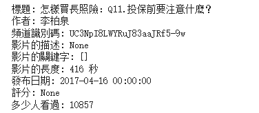

# 【資料處理神器區 - Pytube系列】 蒐集情報讓數據會說話


<figure><figcaption></figcaption></figure>

這次要來介紹「pytube」這套神器， 當我們需要對影音進行統計分析時就需要使用這把利器來破關， 尤其是AI時代的來臨， 我們會需要大量的資料來進行模型的訓練， 而我們總不可能海量的去撈取這些資料， 會非常沒有效率也浪費空間， 因此我們會先進行偵查的任務， 需要派出偵察隊來蒐集youtube的影音資訊再來決策下一步…。

而針對youtube影音平台的情境底下， 「pytube」就是偵查隊的最佳武器， 它不僅能夠蒐集基本資訊(長度、熱度、頻道數量、評分…)， 也能夠抓取影片或者音訊， 非常的方便好用。

那我們今天就來表演一下這套神器的使用方式， 預計抓取的資訊有音檔長度、發布日期、評分、多少人看過，這些資訊背後都隱藏著驚人的秘密...。

### 安裝

```python
!pip install pytube
```

### 引入套件庫並設定目標連結

ℹ️ 這裡的 `${影片網址}` 請貼上目標的影片連結。

這個步驟是基本使用上的第一步， 提供網址讓「pytube」去自動抓取相關資訊， 這一步並沒有實際進行下載， 因此網路傳輸的耗費並不大， 主要用來蒐集情資使用。

```python
from pytube import YouTube

yt = YouTube('${影片網址}')
```

### 哪些資訊可以偵查？

```python
# 標題
print(f'標題: {yt.title}')

# 作者
print(f'作者: {yt.author}')

# 頻道識別碼
print(f'頻道識別碼: {yt.channel_id}')

# 影片的描述
print(f'影片的描述: {yt.description}')

# 影片的關鍵字
print(f'影片的關鍵字: {yt.keywords}')

# 影片的長度(秒)
print(f'影片的長度: {yt.length} 秒')

# 發布日期
print(f'發布日期: {yt.publish_date}')

# 評分
print(f'評分: {yt.rating}')

# 多少個人瀏覽過
print(f'多少人看過: {yt.views}')py
```


<figure><figcaption></figcaption></figure>

有了這些資訊我們可以做什麼？ 就讓我列出幾個可能的方向供您思考：

* 長度介於多少範圍的影音檔分析。
* 瀏覽數量分析。
* 評分高低分析。
* 日期區間分析。

P.S 年份較舊的影片可能缺少關鍵字、評分...等資訊， 畢竟早期也還沒規劃大數據的應用...。

### 可以怎麼統計分析？

我們可以藉由另一套神器pandas來進行...， 底下提供幾個學習資源包， 可以建立基本概念後配合動手實作加深印象:

* [【Google Colab Python系列】 資料處理神器 Pandas 起手式](https://vocus.cc/article/64c90f67fd8978000138d9bc)
* [【Google Colab Python系列】 資料處理神器 Pandas 合併之術(join、concat)](https://vocus.cc/article/64ca3fb9fd897800018b230c)
* [【Google Colab Python系列】 資料處理神器 Pandas 分割與重組之術(Grouping/Reshaping)](https://vocus.cc/article/64ca6232fd897800018e734a)

上面的教學讀完了嗎？ 接下來會教您如何結合pytube + pandas來構建屬於自己的影音分析系統、高品質語料庫爬蟲系統...， 這些實戰我們也會放在會員專屬文章區， 歡迎支持一下付費專欄， 讓我們更有動力分享關於軟體科技的武功心法：

[🔥 阿Han的軟體心法實戰營](https://vocus.cc/weihanchen/introduce)


今天的範例都在這裡「[📦](https://github.com/weihanchen/google-colab-python-learn/blob/main/jupyter-examples/pandas/pandas\_quickstart.ipynb)[ pytube\_quickstart.ipynb](https://github.com/weihanchen/google-colab-python-learn/blob/main/jupyter-examples/pytube/pytube\_quickstart.ipynb)」歡迎自行取用。

如何使用請參閱「[【Google Colab Python系列】Colab平台與Python如何擦出火花？](https://www.potatomedia.co/s/aNLHZe3S)」。

### 結語

初步認識到pytube的功能之後， 我們就可以統計分析決定目標群， 甚至打造屬於AI訓練的爬蟲系統， 或者結合推薦系統建立個人 + 商業化的影音推播系統...， 非常的靈活， 重點在於我們會不會使用工具， 如何讓工具變成武器， 因此有個領路人可以讓您少走點彎路， 不妨花個銅板費購買一下實戰專欄， 讓您創造出各種創新的應用， 甚至能夠成立公司開發產品。


喜歡撰寫文章的你，不妨來了解一下：

[Web3.0時代下為創作者、閱讀者打造的專屬共贏平台 — 為什麼要加入？](https://www.potatomedia.co/s/2PmFxsq)

歡迎加入一起練習寫作，賺取知識
