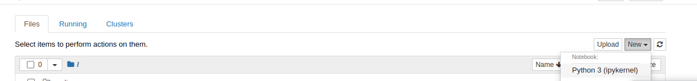
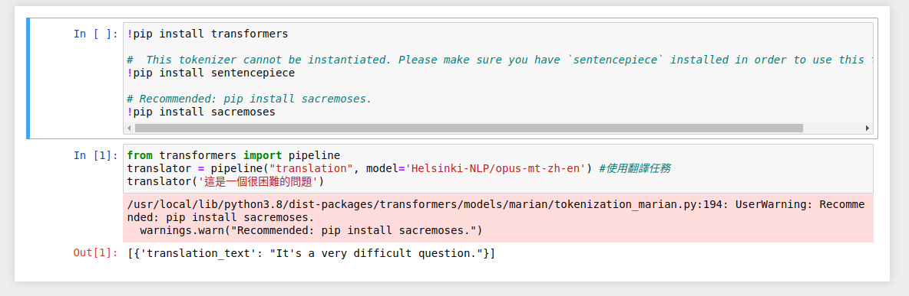

# 【Hugging Face】Ep.2 初探新手村, 打造專屬的翻譯官

<figure><figcaption></figcaption></figure>

我們已經介紹過關於Transformer模型的平台「[【Hugging Face】Ep.1 平凡人也能玩的起的AI平台](https://vocus.cc/article/649d7961fd89780001b63b0a)」，而這次就來實際動手進行開發，讓我們自己的AI自己做。


由於AI模型的訓練往往都會比較耗時， 因此建議需要有GPU環境會比較有效率一些， 否則訓練模行動輒好幾個小時才能看到結果， 一來一往之間， 當我們調好一版可用的模型時已經浪費了不少青春去了…。

基本上怎麼開始呢？ 其實有分為兩條路徑， 一條是全部自己擁有， 將環境架設於本地端， 另一種則是使用雲端服務， 例如學術研究的Google Colab， 我們都會分別示範如何開始。

### 主題

這次的任務是自行打造一個翻譯官， 幫我們將中文翻譯成英文， 預計使用的模型為「[Helsinki-NLP/opus-mt-zh-en](https://huggingface.co/Helsinki-NLP/opus-mt-zh-en)」， 就讓我們分別示範如何在本地端與Google Colab上使用吧！

### 本地端

當我們非常Care數據是應該私有的， 不流於雲上時， 這時候本地端架設會是較好的選擇， 但相對應的也要有足夠的硬體， 成本相對較高。

另外會建議基於Docker、Container這種容器化技術為基礎進行環境架設， 如此一來才能夠避免因為系統環境的因素導致訓練失敗或者辨識失敗…等狀況。

首先請安裝一下Docker， 請參考「[Install Docker Engine](https://docs.docker.com/engine/install/)」， 至於什麼是Docker， 我們之後會另外撰寫一篇來進行介紹， 並在此補充， 這邊假設您已經是Docker/Container專家為基礎進行說明。

安裝完畢後就是選用合適的image了， 所謂image就是所謂的映像檔(虛擬機時期常常聽到的)， 這邊會建議使用nvidia官方的image「[PyTorch Release Notes](https://docs.nvidia.com/deeplearning/frameworks/pytorch-release-notes/#abstract)」， 這邊我們會選用「[nvcr.io/nvidia/pytorch:22.12-py3」這個版本來進行示範。](http://nvcr.io/nvidia/pytorch:22.12-py3%E3%80%8D%E9%80%99%E5%80%8B%E7%89%88%E6%9C%AC%E4%BE%86%E9%80%B2%E8%A1%8C%E7%A4%BA%E7%AF%84%E3%80%82)

基本上Docker安裝完畢之後， 我們會用docker compose來管理配置的部份， 大致上如下:

```python
version: "3.8"
services:
  jupyter:
    image: nvcr.io/nvidia/pytorch:22.12-py3
    tmpfs:
      - /tmp
    ports:
      - "8888:8888"
    volumes:
      - ./:/workspace
    runtime: nvidia
    command: jupyter notebook --ip=0.0.0.0 --port=8888 --allow-root --NotebookApp.token='test'
```

接著啟動我們的環境

```python
docker compose up -d
```

再來開啟jupyter的網站:[http://127.0.0.1:8888/login](http://127.0.0.1:8888/login)， 然後將token=text輸入就可以進行登錄了。

<figure><figcaption></figcaption></figure>

登入成功之後， 我們就可以來創建一個筆記本。

<figure><figcaption></figcaption></figure>

安裝一下必要元件。

```python
!pip install transformers

#  This tokenizer cannot be instantiated. Please make sure you have `sentencepiece` installed in order to use this tokenizer.
!pip install sentencepiece

!pip install sacremoses
```

接著進行翻譯任務。

```python
from transformers import pipeline
translator = pipeline("translation", model='Helsinki-NLP/opus-mt-zh-en') #使用翻譯任務
translator('這是一個很困難的問題')
```

最終結果如下，成功幫我們進行翻譯。

<figure><figcaption></figcaption></figure>

### Google Colab

當我們不想維護硬體時， 雲端的Google Colab就是最好的選擇了， 因為它整合了完整的python環境， 讓我們可以透過類似Jupyter的方式進行開發， 並分享腳本， 基本上比較適合學生、數據資料學家或是 AI 研究人員， 可以快速驗證概念或者訓練方向是否正確， 支援CPU、GPU甚至TPU， 但要注意的是除了CPU以外其他的運算單元都是會有額度限制的， 超過額度可是得付費的。

怎麼開始使用Google Colab呢？ 請參考「[【Google Colab系列】台股分析預備式： Colab平台與Python如何擦出火花？](https://www.potatomedia.co/s/aNLHZe3S)」， 假設你已經學會如何開筆記本了， 那就讓我們開始吧！

首先安裝一下最重要的Transformers元件吧

```python
!pip install transformers

#  This tokenizer cannot be instantiated. Please make sure you have `sentencepiece` installed in order to use this tokenizer.
!pip install sentencepiece

!pip install sacremoses
```

接著進行翻譯任務。

```python
from transformers import pipeline
translator = pipeline("translation", model='Helsinki-NLP/opus-mt-zh-en') #使用翻譯任務
translator('這是一個很困難的問題')
```

最終得到翻譯結果。

<figure><figcaption></figcaption></figure>

今天的範例都在這裡「[📦](https://github.com/weihanchen/google-colab-python-learn/blob/main/jupyter-examples/spacy\_1.ipynb)[huggingface/opus\_mt\_zh\_en.ipynb](https://github.com/weihanchen/google-colab-python-learn/blob/main/jupyter-examples/huggingface/opus\_mt\_zh\_en.ipynb)」歡迎自行取用。

如何使用請參閱「[【Google Colab系列】台股分析預備式： Colab平台與Python如何擦出火花？](https://www.potatomedia.co/s/aNLHZe3S)」。

### 結語

整個過程非常的簡單， 幾行指令就讓我們完成翻譯的任務， 過往可能需要付費才能使用的API，如今都可以自行擁有了， HuggingFace上有很多模型及任務可以使用， 不妨親自動手玩看看， 會讓我們對於AI領域有更進一步的認識喔， 下一個篇章將會陸續介紹不同的任務與不同的模型， 甚至自己動手訓練模型， 就讓我們持續學習下去吧！

喜歡撰寫文章的你，不妨來了解一下：

[Web3.0時代下為創作者、閱讀者打造的專屬共贏平台 - 為什麼要加入？](https://www.potatomedia.co/s/2PmFxsq)

歡迎加入一起練習寫作，賺取知識！
