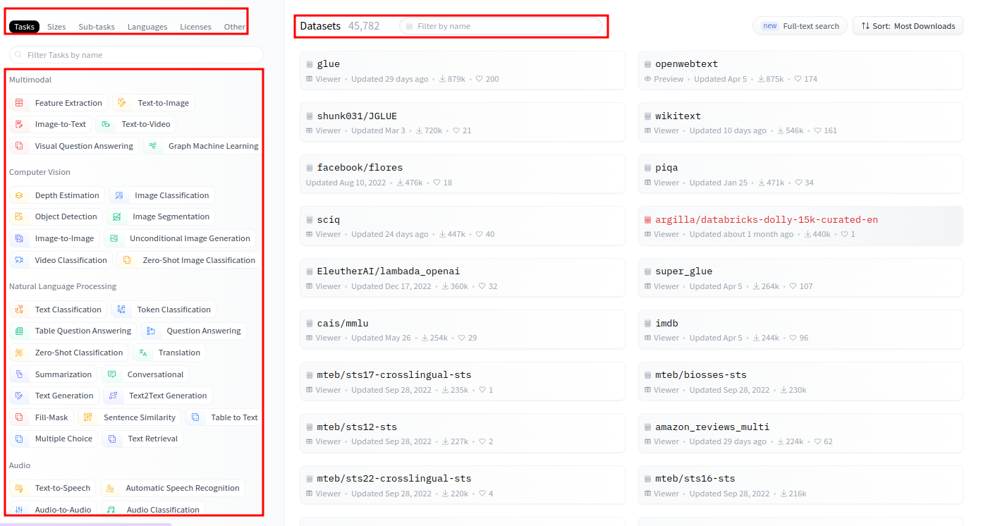
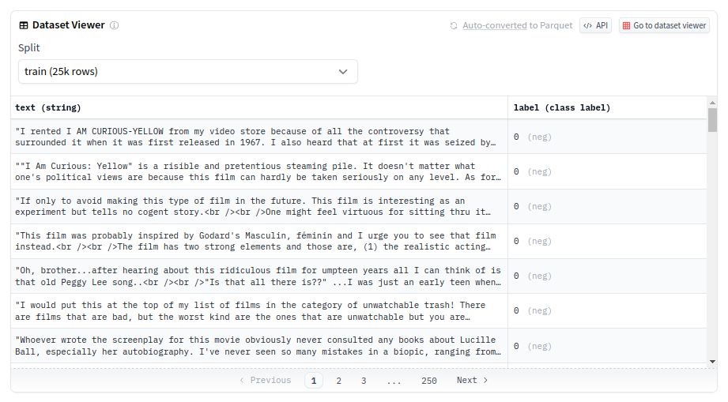

# 【Hugging Face】Ep.3 前往Datasets掏金趣

上一篇「【Hugging Face】Ep.2 初探新手村, 打造專屬的翻譯官」我們學習到如何架設起Hugging Face的環境了，接下來我們就介紹一下重要的Datasets吧！


AI模型訓練最重要的燃料就是「資料」了， 而HuggingFace的Dataset也公開了不少的資料集， 非常適合我們進行練功， 就讓我們先從dataset的部份開始吧！

### 鎖定目標，縮小範圍

掏金之前最重要的就是找到地點， 而如何快速的找到地點呢？ HuggingFace也提供了非常友善的搜尋功能， 總共分成三塊， 左上角依照任務、模型大小…等主題選定， 而每種主題下方包含著不同的子類別，最終搭配關鍵字搜尋出自己需要的資料集。

<figure><figcaption></figcaption></figure>

假設我們選了情緒分類的資料集， 那麼可以來看看資料集的內容長怎樣， 可以觀察到其實資料集很簡單， 只有「文字」與對應的「標籤」。

<figure><figcaption></figcaption></figure>

### 玩轉資料集

#### 安裝套件

```python
!pip install datasets
```

#### 載入資料集

使用[load\_dataset\_builder()](https://huggingface.co/docs/datasets/v2.13.1/en/package\_reference/loading\_methods#datasets.load\_dataset\_builder)來載入資料集， 這次載入的資料集為「[imdb](https://huggingface.co/datasets/imdb)」

```python
from datasets import load_dataset_builder
ds_builder = load_dataset_builder("imdb")
```

### 檢查資料集資訊

使用[load\_dataset\_builder()](https://huggingface.co/docs/datasets/v2.13.1/en/package\_reference/loading\_methods#datasets.load\_dataset\_builder)來檢查資料集， 這次檢查的資料集為「[imdb](https://huggingface.co/datasets/imdb)」

```python
from datasets import load_dataset_builder
ds_builder = load_dataset_builder("imdb")
```

#### 基本資訊

可以得知這是一個電影的資料集， 包含正向與負向的標籤。

```python
print(ds_builder.info.description)
# Large Movie Review Dataset.

print(ds_builder.info.features)
# This is a dataset for binary sentiment classification containing substantially more data than previous benchmark datasets. We provide a set of 25,000 highly polar movie reviews for training, and 25,000 for testing. There is additional unlabeled data for use as well.
{'text': Value(dtype='string', id=None), 'label': ClassLabel(names=['neg', 'pos'], id=None)}
```

### 索引值操作

```python
from datasets import load_dataset

# 載入訓練的資料集
ds = load_dataset("imdb", split='train')
```

```python
# 第一列
ds[0]
```

```python
# 最後一列
ds[-1]
```

### 過濾

資料集雖然猶如黃金， 但其實夾雜著許多的雜訊， 我們可以透過「過濾」的方式， 篩選出我們需要的特定數據， 例如: 文字包含「U.S」且長度不要太長的資料才要進行訓練， 因此我們可以這樣做。

```python
ds1 = ds.filter(lambda x: 'U.S' in x['text'] and len(x['text']) < 500)

ds1[:3]
```

```python
{
'text': [
  'It is not un-common to see U.S. re-makes of foreign movies that fall flat on their face, but here is the flip side!!! This is an awful re-make of the U.S. movie "Wide Awake" by the British!<br /><br />"Wide Awake" is strange but entertaining and funny! "Liam" on the other hand is just strange. I must give credit to "Liam" for one thing, and that is making it clear that I made the right choice in changing my religion!',
  'I saw this movie on Comedy Central a few times. This movie was pretty good. It\\'s an interesting adventure with the life of Sunny Davis, who is arranged to marry the king of Ohtar, so that the U.S. can get an army base there to balance power in the Middle East. Some good jokes, including "Sunnygate." I also just loved the ending theme. It gave me great political spirit. Ten out of ten was my rating for this movie.',
  '"Antwone Fisher" tells of a young black U.S. Navy enlisted man and product of childhood abuse and neglect (Luke) whose hostility toward others gets him a stint with the base shrink (Washington) leading to introspection, self appraisal, and a return to his roots. Pat, sanitized, and sentimental, "Antwone Fisher" is a solid feel-good flick about the reconciliation of past regrets and closure. Good old Hollywood style entertainment family values entertainment with just a hint of corn. (B)'],
'label': [0, 1, 1]
}
```

### 更多的操作方式

上面我們介紹了基本用法，需要更多資料集的操作方式請參考「[datasets/process](https://huggingface.co/docs/datasets/process)」。

### 結語

看起來HuggingFace除了很好的管控資料集之外， 也設計了非常強大的資料集處理API， 最重要的是非常有遠見， 一開始就制定好規範， 大家只要照著標準化的方式上傳資料集就能夠使用標準的API進行資料集處理。
