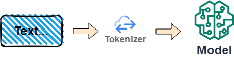

# 【Hugging Face】Ep.4 文字與模型的轉換器Tokenizer

<figure><figcaption><p><a href="https://vocus.cc/article/64a34d8dfd8978000190e556">圖片來源</a></p></figcaption></figure>

前面我們介紹了「[【Hugging Face】Ep.1 平凡人也能玩的起的AI平台](https://www.potatomedia.co/s/aHvvQP3M)」， 我們都知道「詞」是NLP世界中的最小單元， 關於詞的知識歡迎參考:

簡單來說，主要的目的是將文本轉換為模型可以處理的數據， But…， 他主要的任務並不是像jieba…等斷詞器一樣， 而是很單純的扮演文字與模型的橋接器。

經過上述知識的洗禮， 我們對於詞也具有一定的基礎認知， 在「Hugging Face」的平台裡， 處理詞也提供了非常好用的Tokenizer工具， 就讓我們好好的來認識一下唄！

### 兩種標記技巧

#### 詞(Word-based)

基於「詞」的標記方式會將一段文本進行斷詞， 假設一文本如下:

```python
Jim Henson was a puppeteer
```

可以被斷詞成:

```python
Jim
Henson
was
a
puppeteer
```

最基本的方法有「基於空格」、「基於標點符號」…， 目前處理斷詞的框架有「[NLTK](https://www.nltk.org/)」、「[SpaCy](https://spacy.io/)」、「[Gensim](https://github.com/RaRe-Technologies/gensim)」等， 不妨親自玩玩看斷詞， 未來Hugging Face的斷詞層若需要抽換成特定領域語言時也會較為容易。

#### 字元(Character-based)

基於「字元」的標記方式會將文字拆成單一的字符， 這種方式的詞彙量較小， 但帶來的資訊量價值大， 因為不同語言的詞與詞之間是具有語言學組合的關係，也會表達出不同的意義。

```python
Jim Henson was a puppeteer
```

```python
J
i
m
.
.
.
```

#### 有沒有更好的「斷詞」處理方式？

BPE、WordPiece、SentencePiece、Unigram分別適用於不同的語言模型， 後續也會獨立章節來介紹這部份。

### 標記化

我們就實際來使用Hugging Face的API來進行說明，這邊我們使用「[ckiplab/bert-tiny-chinese](https://huggingface.co/ckiplab/bert-tiny-chinese)」這個模型來進行。

```python
from transformers import AutoTokenizer

# Initialize tokenzier and model
tokenizer = AutoTokenizer.from_pretrained("ckiplab/bert-tiny-chinese")

# Input text
text = "今天的天氣很好。"
tokens = tokenizer.tokenize(text)
tokens

# ['今', '天', '的', '天', '氣', '很', '好', '。']
```

#### 轉換成ID編碼

當我們第一步將文字拆為單詞之後通常稱為標記(Token)， 第二步就是將這些標記(Token)轉為模型看得懂的數字(ID)。

```python
ids = tokenizer.convert_tokens_to_ids(tokens)
ids

# [791, 1921, 4638, 1921, 3706, 2523, 1962, 511]
```

#### 解碼

我們也可以透過解碼函式將ID解回文字。

```python
decoded_string = tokenizer.decode([791, 1921, 4638, 1921, 3706, 2523, 1962, 511])
decoded_string

# 今 天 的 天 氣 很 好 。
```

這就是Tokenizer的主要目的， 扮演著模型與文字之間的轉換器。

### 加載與儲存

加載的部份。

```python
from transformers import AutoTokenizer

# Initialize tokenzier and model
tokenizer = AutoTokenizer.from_pretrained("ckiplab/bert-tiny-chinese")
```

經過加工後儲存成自訂的斷詞器可以這樣。

```python
tokenizer.save_pretrained("custom")
```

關於更進階的的使用方式可以參考「[https://huggingface.co/learn/nlp-course/zh-TW/chapter6/3?fw=pt」。](https://huggingface.co/learn/nlp-course/zh-TW/chapter6/3?fw=pt%E3%80%8D%E3%80%82)


今天的範例都在這裡「[📦 huggingface/tokenizers.ipynb」](https://github.com/weihanchen/google-colab-python-learn/blob/main/jupyter-examples/huggingface/tokenizers.ipynb)歡迎自行取用。

如何使用請參閱「[【Google Colab系列】台股分析預備式： Colab平台與Python如何擦出火花？](https://www.potatomedia.co/s/aNLHZe3S)」。

### 結語

初步了解到Hugging Face架構之後深深感受到標準化的好處， 有點像是鴻海MIH平台一般， 賦能給各個開發者到這個平台共同發展AI模型， 雖說獲利模式是否足以支撐起一家公司仍待時間進行驗證， 但平台已經讓各種NLP技術的發展更快速， 也縮小著技術屏障的隔閡。

喜歡撰寫文章的你，不妨來了解一下：

[Web3.0時代下為創作者、閱讀者打造的專屬共贏平台 - 為什麼要加入？](https://www.potatomedia.co/s/2PmFxsq)

歡迎加入一起練習寫作，賺取知識！


#### 更多關於【Hugging Face 系列】…

* [【Hugging Face】Ep.1 平凡人也能玩的起的AI平台](https://vocus.cc/article/649d7961fd89780001b63b0a)
* [【Hugging Face】Ep.2 初探新手村, 打造專屬的翻譯官](https://vocus.cc/article/64a013ecfd89780001601391)
* [【Hugging Face】Ep.3 前往Datasets掏金趣](https://vocus.cc/article/64a2c62afd897800018a8185)
* [【Hugging Face】Ep.4 文字與模型的轉換器Tokenizer](https://vocus.cc/article/64a34d8dfd8978000190e556)
* [【Hugging Face】Ep.5 文字世界中的超能力語言英雄(Named Entity Recognition)](https://vocus.cc/article/64a42269fd89780001589eca)
* [【Hugging Face】Ep.6 解決問題的專業級破關知識家(Question Answering)](https://vocus.cc/article/64ad426cfd89780001f0f010)
* [【Hugging Face】Ep.7 以文生圖的魔幻製圖師(Text To Image)](https://vocus.cc/article/64aea57ffd89780001075213)
