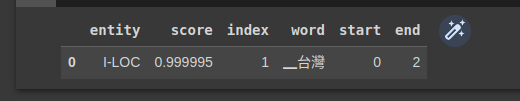

# 【Hugging Face】Ep.5 文字世界中的超能力語言英雄(Named Entity Recognition)

<figure><figcaption><p><a href="https://vocus.cc/article/64a42269fd89780001589eca">圖片來源</a></p></figcaption></figure>

這次來介紹一下NLP自然語言處理中重要的一個任務「命名實體識別(Named Entity Recognition)」， 這個任務主要識別出「人名」、「地名」、「公司」…等實體， 透過這些實體辨識結果， 可以近一步的理解意圖， 甚至判斷出該文章主要在講什麼重點…等。

關於更多NER的細節歡迎閱讀: 「[【自然語言處理 - spaCy】善用ChatGPT幫我們訓練出自訂的Name Entity Recognition實體](https://www.potatomedia.co/s/fTyoEZy)」

### 找看看有哪些可用模型

在「[【Hugging Face】Ep.3 前往Dataset掏金趣](https://vocus.cc/article/64a2c62afd897800018a8185)」我們有介紹過HuggingFace平台如何精準的找出我們需要的模型， 那這次我們要找的任務是「Token Classification」，語言為「Chinese」， 我們就來選用最多人使用的「[xlm-roberta-large-finetuned-conll03-english](https://huggingface.co/xlm-roberta-large-finetuned-conll03-english)」吧！

<figure><figcaption><p><a href="https://vocus.cc/article/64a42269fd89780001589eca">圖片來源</a></p></figcaption></figure>

### 準備文本

```python
text = '台灣是一個非常美麗的地區'
```

### 安裝套件

```python
!pip install transformers
!pip install pandas
```

### 進行NER任務

```python
from transformers import pipeline, AutoTokenizer, AutoModelForTokenClassification
import pandas as pd
tokenizer = AutoTokenizer.from_pretrained("xlm-roberta-large-finetuned-conll03-english")
model = AutoModelForTokenClassification.from_pretrained("xlm-roberta-large-finetuned-conll03-english")
ner = pipeline("ner", model=model, tokenizer=tokenizer)
results = ner("台灣是一個非常美麗的地區")

pd.DataFrame(results)
```

<figure><figcaption><p><a href="https://vocus.cc/article/64a42269fd89780001589eca">圖片來源</a></p></figcaption></figure>

上述的結果辨識出「台灣」是一個「I-LOC」的實體， 當然這個實體的標籤我們也可以自己去定義它。

今天的範例都在這裡「[📦 huggingface/huggingface\_ner.ipynb](https://github.com/weihanchen/google-colab-python-learn/blob/main/jupyter-examples/huggingface/huggingface\_ner.ipynb)」歡迎自行取用。

如何使用請參閱「[【Google Colab系列】台股分析預備式： Colab平台與Python如何擦出火花？](https://www.potatomedia.co/s/aNLHZe3S)」。

### 結語

初步了解到Hugging Face架構之後深深感受到標準化的好處， 有點像是鴻海MIH平台一般， 賦能給各個開發者到這個平台共同發展AI模型， 雖說獲利模式是否足以支撐起一家公司仍待時間進行驗證， 但平台已經讓各種NLP技術的發展更快速， 也縮小著技術屏障的隔閡。

喜歡撰寫文章的你，不妨來了解一下：

[Web3.0時代下為創作者、閱讀者打造的專屬共贏平台 - 為什麼要加入？](https://www.potatomedia.co/s/2PmFxsq)

歡迎加入一起練習寫作，賺取知識！


### 更多關於【Hugging Face 系列】…

* [【Hugging Face】Ep.1 平凡人也能玩的起的AI平台](https://vocus.cc/article/649d7961fd89780001b63b0a)
* [【Hugging Face】Ep.2 初探新手村, 打造專屬的翻譯官](https://vocus.cc/article/64a013ecfd89780001601391)
* [【Hugging Face】Ep.3 前往Datasets掏金趣](https://vocus.cc/article/64a2c62afd897800018a8185)
* [【Hugging Face】Ep.4 文字與模型的轉換器Tokenizer](https://vocus.cc/article/64a34d8dfd8978000190e556)
* [【Hugging Face】Ep.5 文字世界中的超能力語言英雄(Named Entity Recognition)](https://vocus.cc/article/64a42269fd89780001589eca)
