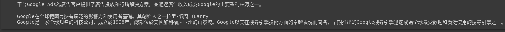

# 【Hugging Face】Ep.6 解決問題的專業級破關知識家(Question Answering)

<figure><figcaption><p><a href="https://vocus.cc/article/64ad426cfd89780001f0f010">圖片來源</a></p></figcaption></figure>

QA問答是自然語言處理NLP中蠻困難的一項任務， 必須從一段文本中識別出使用者的提問，像搜尋引擎就是一種QA的應用， 從眾多的問題中找答案， 那就讓我們親手來打造一下自己專屬的QA系統吧！

### 找看看有哪些可用模型

在「[【Hugging Face】Ep.3 前往Dataset掏金趣](https://vocus.cc/article/64a2c62afd897800018a8185)」我們有介紹過HuggingFace平台如何精準的找出我們需要的模型， 那這次我們要找的任務是「Question Answering」，語言為「Chinese」， 我們就來選用最多人使用的「[timpal0l/mdeberta-v3-base-squad2](https://huggingface.co/timpal0l/mdeberta-v3-base-squad2)」吧！

<figure><figcaption><p><a href="https://vocus.cc/article/64ad426cfd89780001f0f010">圖片來源</a></p></figcaption></figure>

### 安裝套件

```python
!pip install transformers
```

### 給予知識文章

這邊透過[Chatgpt](https://chat.openai.com/)幫我們產生Google的基礎知識並做為問答系統的基礎知識。

```python
context = """
Google是一家全球知名的科技公司，成立於1998年，總部位於美國加利福尼亞州的山景城。Google以其在搜尋引擎技術方面的卓越表現而聞名，早期推出的Google搜尋引擎迅速成為全球最受歡迎和廣泛使用的搜尋引擎之一。

除了搜尋引擎外，Google還開發和提供了許多其他互聯網產品和服務。其中包括谷歌地圖、谷歌郵箱（Gmail）、谷歌翻譯、谷歌雲端硬碟（Google Drive）等。此外，Google還擁有Android操作系統，該操作系統目前是全球最受歡迎的移動操作系統之一。

Google也涉足硬體領域，推出了自己的智慧型手機系列Pixel，以及Pixelbook筆記型電腦、Google Home智慧音箱等產品。此外，Google還在人工智慧（AI）和機器學習領域投入了大量資源，並推出了許多與AI相關的產品和服務，如Google Assistant智慧助理和Google Lens圖像識別技術。

除了互聯網產品和服務，Google還在廣告業務方面表現出色。其廣告平台Google Ads為廣告客戶提供了廣告投放和行銷解決方案，並通過廣告收入成為Google的主要盈利來源之一。

Google在全球範圍內擁有廣泛的影響力和使用者基礎。其創始人之一拉里·佩奇（Larry Page）和謝爾蓋·布林（Sergey Brin）一直是科技行業的知名人物，Google也是全球最具價值的品牌之一。公司在全球各地設有辦事處和數據中心，員工遍布世界各地。

Google一直秉持著使訊息普遍可用和受人們歡迎的使命，致力於提供高質量的產品和服務，並不斷推動科技的創新和發展。
"""
```

### 打造QA任務機器人

這邊我們選用[timpal0l/mdeberta-v3-base-squad2](https://huggingface.co/timpal0l/mdeberta-v3-base-squad2)這個模型進行任務。

```python
from transformers import pipeline, AutoTokenizer, AutoModelForQuestionAnswering
tokenizer = AutoTokenizer.from_pretrained("timpal0l/mdeberta-v3-base-squad2")
model = AutoModelForQuestionAnswering.from_pretrained("timpal0l/mdeberta-v3-base-squad2")
qa = pipeline("question-answering", model=model, tokenizer=tokenizer)
```

### 問與答

回答雖然不盡完美， 但已經能夠精確的理解我們的問題並給予接近正確的回答， 見到如此成效， 對於商業嗅覺敏感的朋友來說， 或許已經想到要如何打造一個知識庫問答機器人了吧！

後面的章節也會介紹如何自行訓練私有資料庫，並真正的打造私有的專屬問答知識家。

```python
questions = [
    '請問Google的主要產品是什麼?',
    '請問創始人是誰?',
    '請問什麼時候開始的?'
]

for question in questions:
  result = qa(question = question, context = context)
  print(result['answer'])
```

<figure><figcaption><p><a href="https://vocus.cc/article/64ad426cfd89780001f0f010">圖片來源</a></p></figcaption></figure>

今天的範例都在這裡「[📦huggingface/huggingface\_qa.ipynb](https://github.com/weihanchen/google-colab-python-learn/blob/main/jupyter-examples/huggingface/huggingface\_qa.ipynb)」歡迎自行取用。

如何使用請參閱「[【Google Colab系列】台股分析預備式： Colab平台與Python如何擦出火花？](https://www.potatomedia.co/s/aNLHZe3S)」。

### 結語

藉由Hugging Face平台， 我們可以親手打造各式各樣的AI機器人， 上面也已經有許多前輩分享的模型可供使用， 對於我們來說只要站在巨人的肩膀上即可， 也期望有朝一日我們也能訓練出對這世界更有幫助的AI模型。

喜歡撰寫文章的你，不妨來了解一下：

[Web3.0時代下為創作者、閱讀者打造的專屬共贏平台 - 為什麼要加入？](https://www.potatomedia.co/s/2PmFxsq)

歡迎加入一起練習寫作，賺取知識！


#### 更多關於【Hugging Face 系列】…

* [【Hugging Face】Ep.1 平凡人也能玩的起的AI平台](https://vocus.cc/article/649d7961fd89780001b63b0a)
* [【Hugging Face】Ep.2 初探新手村, 打造專屬的翻譯官](https://vocus.cc/article/64a013ecfd89780001601391)
* [【Hugging Face】Ep.3 前往Datasets掏金趣](https://vocus.cc/article/64a2c62afd897800018a8185)
* [【Hugging Face】Ep.4 文字與模型的轉換器Tokenizer](https://vocus.cc/article/64a34d8dfd8978000190e556)
* [【Hugging Face】Ep.5 文字世界中的超能力語言英雄(Named Entity Recognition)](https://vocus.cc/article/64a42269fd89780001589eca)
* [【Hugging Face】Ep.6 解決問題的專業級破關知識家(Question Answering)](https://vocus.cc/article/64ad426cfd89780001f0f010)
* [【Hugging Face】Ep.7 以文生圖的魔幻製圖師(Text To Image)](https://vocus.cc/article/64aea57ffd89780001075213)
