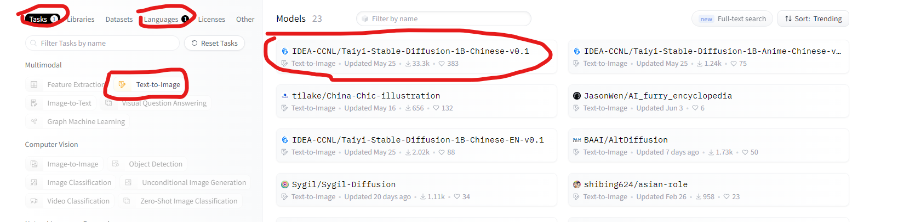

# 【Hugging Face】Ep.7 讓AI創造圖像的魔法師

我們過往介紹了幾個關於文字AI應用的篇章：

* [【Hugging Face】Ep.5 文字世界中的超能力語言英雄(Named Entity Recognition)](https://vocus.cc/article/64a42269fd89780001589eca)
* [【Hugging Face】Ep.6 解決問題的專業級破關知識家(Question Answering)](https://vocus.cc/article/64ad426cfd89780001f0f010)

但單獨的文字應用似乎不太能滿足千變萬化的應用時代，相信常常我們都有在Line、Facebook看到過梗圖吧！ 但這些梗圖都非常的陽春，通常在我們給予的背景圖上加註文字，就產生很多的問候圖，非常的呆板，那如果AI能夠理解我們的意圖並繪製出圖片不就更完美了嗎？ 很幸運的我們搭上了AI發展的時代列車，這樣的技術也越趨成熟，各式各樣的模型也都有高手經過微調放置在網路上開源共享，這個篇章我們就會實際以技術角度來進行使用，並測試看看效果如何。

### 找看看有哪些可用模型

在「[【Hugging Face】Ep.3 前往Dataset掏金趣](https://vocus.cc/article/64a2c62afd897800018a8185)」我們有介紹過HuggingFace平台如何精準的找出我們需要的模型， 那這次我們要找的任務是「Text-to-Image」，語言為「Chinese」， 我們就來試試這個中文的開源模型「[IDEA-CCNL/Taiyi-Stable-Diffusion-1B-Chinese-v0.1](https://huggingface.co/IDEA-CCNL/Taiyi-Stable-Diffusion-1B-Chinese-v0.1)」吧！

<figure><figcaption></figcaption></figure>

喜歡撰寫文章的你，不妨來了解一下：

[Web3.0時代下為創作者、閱讀者打造的專屬共贏平台 - 為什麼要加入？](https://www.potatomedia.co/s/2PmFxsq)

歡迎加入一起練習寫作，賺取知識！

### 更多關於【Hugging Face 系列】…

* [【Hugging Face】Ep.1 平凡人也能玩的起的AI平台](https://vocus.cc/article/649d7961fd89780001b63b0a)
* [【Hugging Face】Ep.2 初探新手村, 打造專屬的翻譯官](https://vocus.cc/article/64a013ecfd89780001601391)
* [【Hugging Face】Ep.3 前往Datasets掏金趣](https://vocus.cc/article/64a2c62afd897800018a8185)
* [【Hugging Face】Ep.4 文字與模型的轉換器Tokenizer](https://vocus.cc/article/64a34d8dfd8978000190e556)
* [【Hugging Face】Ep.5 文字世界中的超能力語言英雄(Named Entity Recognition)](https://vocus.cc/article/64a42269fd89780001589eca)
* [【Hugging Face】Ep.6 解決問題的專業級破關知識家(Question Answering)](https://vocus.cc/article/64ad426cfd89780001f0f010)
