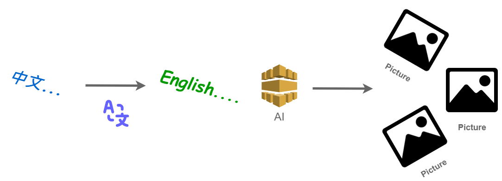

# 【Hugging Face】Ep.7 以文生圖的魔幻製圖師(Text To Image)

我們過往介紹了幾個關於文字AI應用的篇章：

* [【Hugging Face】Ep.5 文字世界中的超能力語言英雄(Named Entity Recognition)](https://vocus.cc/article/64a42269fd89780001589eca)
* [【Hugging Face】Ep.6 解決問題的專業級破關知識家(Question Answering)](https://vocus.cc/article/64ad426cfd89780001f0f010)

但單獨的文字應用似乎不太能滿足千變萬化的應用時代，相信常常我們都有在Line、Facebook看到過梗圖吧！ 但這些梗圖都非常的陽春，通常在我們給予的背景圖上加註文字，就產生很多的問候圖，非常的呆板，那如果AI能夠理解我們的意圖並繪製出圖片不就更完美了嗎？ 很幸運的我們搭上了AI發展的時代列車，這樣的技術也越趨成熟，各式各樣的模型也都有高手經過微調放置在網路上開源共享，這個篇章我們就會實際以技術角度來進行使用，並測試看看效果如何。

<div>


 

<figure><figcaption><p><a href="https://vocus.cc/article/64aea57ffd89780001075213">圖片來源</a></p></figcaption></figure>

</div>

### 我們需要哪些素材？

由於目前效果最好的莫過於「stable-diffusion」了，它是2022年發布的深度學習文字到圖像生成模型， 因此我們也會以它來進行任務，但此模型對於「中文」的識別來說並不友善 😔 ， 那我們能怎麼做呢？

當然可以對該模型進行Fine Tune， But…數據哪裡來？

除了自行Fine Tune之外還有別的思路嗎？ 當然有！ 我們在「[【Hugging Face】Ep.2 初探新手村, 打造專屬的翻譯官](https://vocus.cc/article/64a013ecfd89780001601391)」有介紹了如何搭建一個翻譯官， 那這位翻譯官不就能夠幫助我們將中文翻譯成中文了嗎？ 透過簡單的AI工具庫組合技巧就能夠幫我們完成中文語句產生圖像的任務了， 如此一來需要的素材大致如下：

* 翻譯AI: [Helsinki-NLP/opus-mt-zh-en](https://huggingface.co/Helsinki-NLP/opus-mt-zh-en)
* 文字生成圖片AI: [runwayml/stable-diffusion-v1-5](https://huggingface.co/runwayml/stable-diffusion-v1-5)

怎麼找這些模型呢？

在「[【Hugging Face】Ep.3 前往Dataset掏金趣](https://vocus.cc/article/64a2c62afd897800018a8185)」我們有介紹過HuggingFace平台如何精準的找出我們需要的模型。

### 安裝套件

```python
!pip install diffusers
!pip install transformers
```

### 我們先看看尚未翻譯過的成果

```python
from diffusers import StableDiffusionPipeline
import torch

t2i = StableDiffusionPipeline.from_pretrained('runwayml/stable-diffusion-v1-5')
t2i = t2i.to("cpu")

prompt = "一個在窗戶上的蘋果"
image = t2i(prompt).images[0]  
image
```

<figure><figcaption><p><a href="https://vocus.cc/article/64aea57ffd89780001075213">圖片來源</a></p></figcaption></figure>

我們期望有蘋果、有窗， But…怎麼會是這樣呢？ 這是什麼鬼?

仔細看了官方說明文件有指出: 「該模型主要使用英文字幕進行訓練，在其他語言中效果不佳。」

<figure><figcaption></figcaption></figure>

既然如此我們何不搭個翻譯官，幫我們將中文翻譯成英文再讓以文產圖機器人更容易理解呢？

### 透過翻譯讓AI更理解我們的需求

我們就在產生圖片之前加掛翻譯功能， 將我們的中文語句翻譯成英文， 再讓Text-to-Image AI理解我們真正的意圖。

#### 翻譯

透過翻譯， 讓我們將中文轉換成英文。

```python
from transformers import pipeline
# 使用翻譯任務
translator = pipeline("translation", model='Helsinki-NLP/opus-mt-zh-en') 

t = translator('一個在窗戶上的蘋果')
prompt = t[0]['translation_text']
```

#### 重新生成圖片

```python
image = t2i(prompt).images[0]  
image

```

<figure><figcaption><p><a href="https://vocus.cc/article/64aea57ffd89780001075213">圖片來源</a></p></figcaption></figure>

看起來正常多了， 有窗、有蘋果， 基本上都滿足我們提出的需求。

今天的範例都在這裡「[📦](https://github.com/weihanchen/google-colab-python-learn/blob/main/jupyter-examples/huggingface/huggingface\_qa.ipynb)[huggingface/huggingface\_text2image.ipynb](https://github.com/weihanchen/google-colab-python-learn/blob/main/jupyter-examples/huggingface/huggingface\_text2image.ipynb)」歡迎自行取用。

如何使用請參閱「[【Google Colab系列】台股分析預備式： Colab平台與Python如何擦出火花？](https://www.potatomedia.co/s/aNLHZe3S)」。

### 結語

藉由Hugging Face平台， 我們可以親手打造各式各樣的AI機器人， 上面也已經有許多前輩分享的模型可供使用， 對於我們來說只要站在巨人的肩膀上即可， 也期望有朝一日我們也能訓練出對這世界更有幫助的AI模型。

喜歡撰寫文章的你，不妨來了解一下：

[Web3.0時代下為創作者、閱讀者打造的專屬共贏平台 - 為什麼要加入？](https://www.potatomedia.co/s/2PmFxsq)

歡迎加入一起練習寫作，賺取知識！

#### 更多關於【Hugging Face 系列】…

* [【Hugging Face】Ep.1 平凡人也能玩的起的AI平台](https://vocus.cc/article/649d7961fd89780001b63b0a)
* [【Hugging Face】Ep.2 初探新手村, 打造專屬的翻譯官](https://vocus.cc/article/64a013ecfd89780001601391)
* [【Hugging Face】Ep.3 前往Datasets掏金趣](https://vocus.cc/article/64a2c62afd897800018a8185)
* [【Hugging Face】Ep.4 文字與模型的轉換器Tokenizer](https://vocus.cc/article/64a34d8dfd8978000190e556)
* [【Hugging Face】Ep.5 文字世界中的超能力語言英雄(Named Entity Recognition)](https://vocus.cc/article/64a42269fd89780001589eca)
* [【Hugging Face】Ep.6 解決問題的專業級破關知識家(Question Answering)](https://vocus.cc/article/64ad426cfd89780001f0f010)
* [【Hugging Face】Ep.7 以文生圖的魔幻製圖師(Text To Image)](https://vocus.cc/article/64aea57ffd89780001075213)
