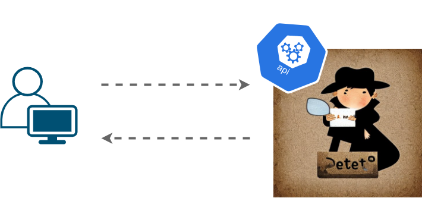
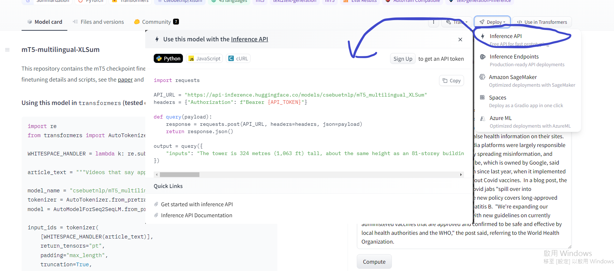
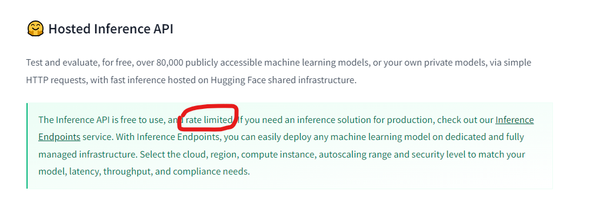

# 【Hugging Face】Ep.8 專業的標準化推理家(Inference API)

<figure><figcaption><p><a href="https://vocus.cc/article/64affcd6fd89780001437d39">圖片來源</a></p></figcaption></figure>

前面幾個篇章已經大致上介紹了Hugging Face這個平台的一些基本概念了，既然我們都能夠在平台上找到各式各樣的模型，而且也能夠照著教學一步步的來下載並使用，但有沒有更簡單的方式呢？

比如說，我們專注在應用端上的開發，AI的推理就藉由平台進行呢？ 答案肯定是有的，近期越來越多開源的平台也都開放這種便利的方式供給我們存取，一旦我們與它綁的越深它就越容易向我們收取部分的費用來進行獲利的商業模式，就是一種升級解鎖的概念，提供適度免費可用的使用方式，想要更加方便就是付費。

Hugging Face提供了Inference API，透過標準化的規則制定，讓模型的上傳者以標準的格式進行擺放，而使用者也能夠較簡易、少部分修改的存取這些API來完成AI的應用，那這些API怎麼用呢？ 收費狀況又是如何呢？ 我們將陸續的來進行介紹。

### 讓新手領航員帶你導覽API…

基本上許多的模型上傳者都已經有照著平台上的規範擺放正確的模型，並提供如何使用API，如果還不知道怎麼使用模型的話，歡迎參考「[【Hugging Face】Ep.1 平凡人也能玩的起的AI平台](https://vocus.cc/article/649d7961fd89780001b63b0a)」，接著我們實際找一個模型來看看它的API長怎樣吧！

首先來找個模型，這次找到「[csebuetnlp/mT5\_multilingual\_XLSum](https://huggingface.co/csebuetnlp/mT5\_multilingual\_XLSum)」

<figure><figcaption><p><a href="https://vocus.cc/article/64affcd6fd89780001437d39">圖片來源</a></p></figcaption></figure>

找到之後我們點選右上方的「Deploy」 → 「Inference API」就可以看到如何使用了。

<figure><figcaption><p><a href="https://vocus.cc/article/64affcd6fd89780001437d39">圖片來源</a></p></figcaption></figure>

### API架構說明

第一步我們需要透過\*\*[Model Hub](https://huggingface.co/models)\*\*來找尋模型，基本上API的入口URL結構為：

```python
# 以上述範例來說為： 
# <https://api-inference.huggingface.co/models/csebuetnlp/mT5_multilingual_XLSum>
ENDPOINT = <https://api-inference.huggingface.co/models/><MODEL_ID>
```

底下是一個針對於「summarization」類型任務的API樣版，已經附上註解，再請細細品嘗：

❗ API\_TOKEN記得填入， 請至：[https://huggingface.co/docs/hub/security-tokens，依照教學進行帳號的註冊與Token的申請。](https://huggingface.co/docs/hub/security-tokens%EF%BC%8C%E4%BE%9D%E7%85%A7%E6%95%99%E5%AD%B8%E9%80%B2%E8%A1%8C%E5%B8%B3%E8%99%9F%E7%9A%84%E8%A8%BB%E5%86%8A%E8%88%87Token%E7%9A%84%E7%94%B3%E8%AB%8B%E3%80%82)

[https://huggingface.co/settings/tokens](https://huggingface.co/settings/tokens)

除了python語言之外，也提供javascript與cURL，那這邊就先以python進行說明。

輸入的文章摘取自： [https://www.ithome.com.tw/news/157763](https://www.ithome.com.tw/news/157763)

```python
import requests

# 就是所謂的ENDPOINT 
API_URL = "<https://api-inference.huggingface.co/models/csebuetnlp/mT5_multilingual_XLSum>"

# API_TOKEN的部分請至： <https://huggingface.co/docs/hub/security-tokens>
headers = {"Authorization": f"Bearer {API_TOKEN}"}

# 包裝成一個query函式，並設計好請求的payload data
def query(payload):
	response = requests.post(API_URL, headers=headers, json=payload)
	return response.json()

# 呼叫query函式並帶入payload進行API請求，最終得到推理結果	
output = query({
	"inputs": "在接獲美國政府用戶通報下，微軟發現中國駭客組織利用所獲得的一個微軟帳號（MSA）消費者簽章金鑰來偽造身分認證權杖，以存取使用Outlook Web Access in Exchange Online（OWA）及Outlook.com的用戶，估計影響歐美地區的25個政府組織與相關個人",
})
```

並得到以下結果：

```python
[{'summary_text': '美國電腦巨頭微軟發現中國黑客組織利用個人簽章金鑰來偽造身分認證權杖,影響歐美地區的25個政府組織。'}]
```

其它不同的任務有不同的樣板，請參考「[Detailed parameters](https://huggingface.co/docs/api-inference/detailed\_parameters)」。

### 真有這麼佛心？

<figure><figcaption><p><a href="https://vocus.cc/article/64affcd6fd89780001437d39">圖片來源</a></p></figcaption></figure>

我們可以看到雖然免費使用，但卻有速率上的限制，但對於一般的小應用來說已經足夠使用，不過基本上推理的部分是由CPU運算，因此效能可能不是我們所滿意的結果，如果需要更強大的功能請參考「[Inference Endpoints](https://huggingface.co/docs/inference-endpoints/index)」後面的篇章我們再來針對這個部分進行詳解。

今天的範例都在這裡「[📦huggingface/huggingface\_ep8\_inference\_api.ipynb](https://github.com/weihanchen/google-colab-python-learn/blob/main/jupyter-examples/huggingface/huggingface\_ep8\_inference\_api.ipynb)」歡迎自行取用。

如何使用請參閱「[【Google Colab系列】台股分析預備式： Colab平台與Python如何擦出火花？](https://www.potatomedia.co/s/aNLHZe3S)」。

### 結語

目前的Hugging Face平台看起來還蠻佛心的，以開源共享為主，但曾經的MongoDB、Elasticsearch也是如此，可惜到最後仍逐漸走向商業化，甚至雲端訂閱才能享受到強大功能，不知道未來的Hugging Face走向會不會也是如此，但這也是必然的，否則怎麼養得起那麼多的員工呢？

既然現在有了這些方便的API，那我們不妨好好的享用一番，簡單的使用API來兜出我們的應用，像是串接Line Bot、手機APP…等AI輔助工具，後續也將撰寫一篇實戰篇來結合AI應用。

喜歡撰寫文章的你，不妨來了解一下：

[Web3.0時代下為創作者、閱讀者打造的專屬共贏平台 - 為什麼要加入？](https://www.potatomedia.co/s/2PmFxsq)

歡迎加入一起練習寫作，賺取知識！

#### 更多關於【Hugging Face 系列】…

* [【Hugging Face】Ep.1 平凡人也能玩的起的AI平台](https://vocus.cc/article/649d7961fd89780001b63b0a)
* [【Hugging Face】Ep.2 初探新手村, 打造專屬的翻譯官](https://vocus.cc/article/64a013ecfd89780001601391)
* [【Hugging Face】Ep.3 前往Datasets掏金趣](https://vocus.cc/article/64a2c62afd897800018a8185)
* [【Hugging Face】Ep.4 文字與模型的轉換器Tokenizer](https://vocus.cc/article/64a34d8dfd8978000190e556)
* [【Hugging Face】Ep.5 文字世界中的超能力語言英雄(Named Entity Recognition)](https://vocus.cc/article/64a42269fd89780001589eca)
* [【Hugging Face】Ep.6 解決問題的專業級破關知識家(Question Answering)](https://vocus.cc/article/64ad426cfd89780001f0f010)
* [【Hugging Face】Ep.7 以文生圖的魔幻製圖師(Text To Image)](https://vocus.cc/article/64aea57ffd89780001075213)
* [【Hugging Face】Ep.8 專業的標準化推理家(Inference API)](https://vocus.cc/article/64affcd6fd89780001437d39)
