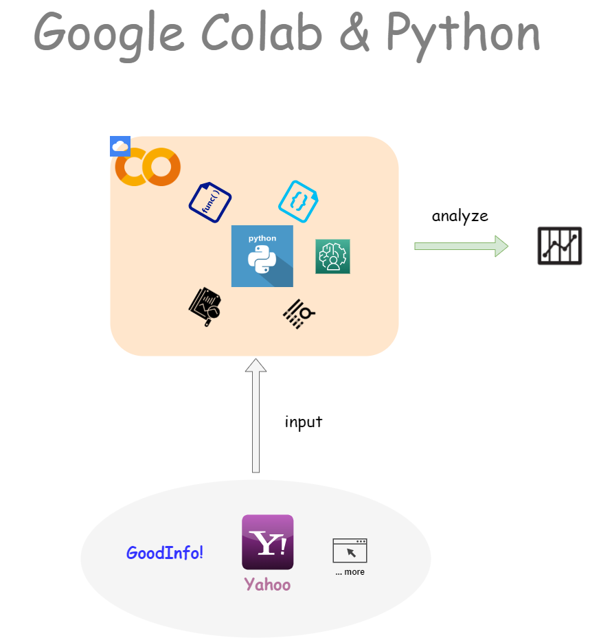
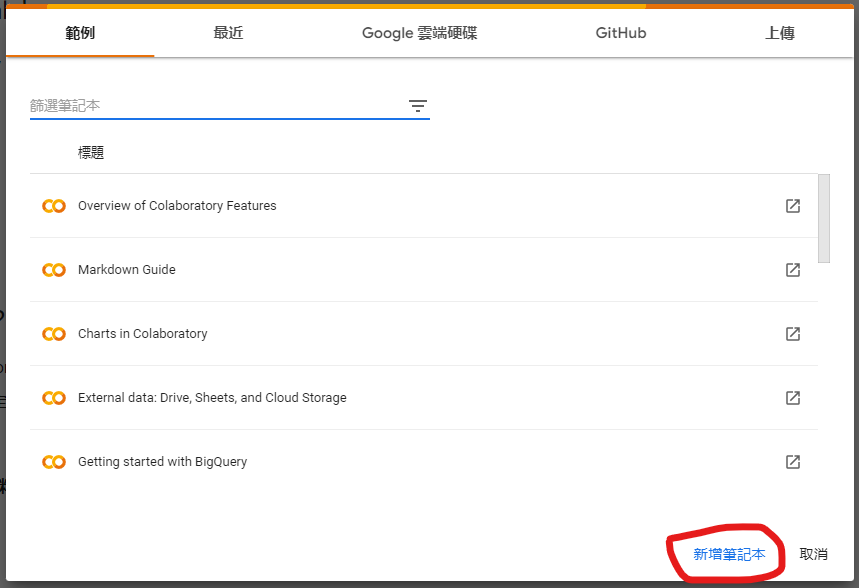
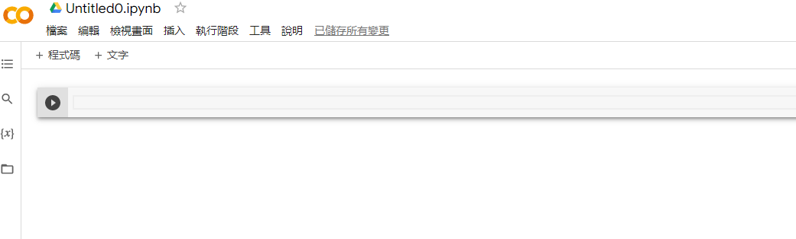
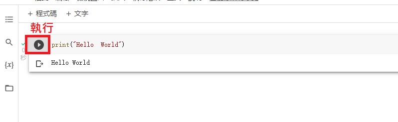
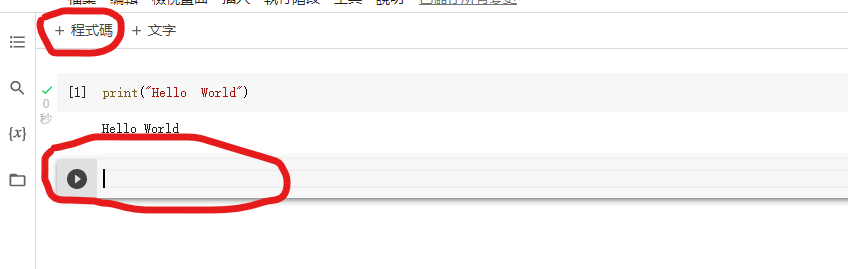
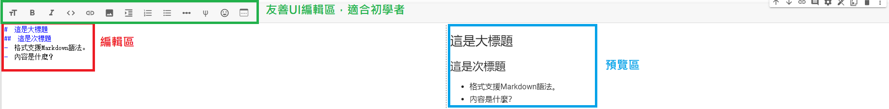
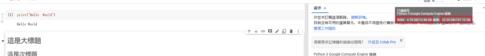
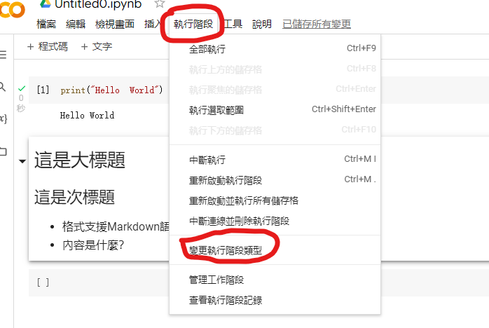
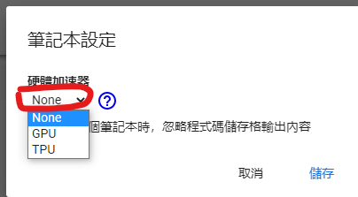

# 【Google Colab Python系列】Colab平台與Python如何擦出火花？

<figure><figcaption><p><a href="https://www.potatomedia.co/s/aNLHZe3S">圖片來源</a></p></figcaption></figure>

這次的主題除了結合平時興趣之一的金融理財之外，亦將本業的軟體程式概念進行結合，透過跨領域的想法激盪出屬於自己的交易策略，過程中也將學習歷程進行筆記，提供給路途中的朋友一個方向，讓我們一起動動手打造出自己的分析程式吧！

多年的軟體開發經驗，過程中也踩過不少雷，因此常常在學習道路上都期望有人能夠將技術經驗進行分享，讓我們能夠少走一些彎路，而作者本身也有這樣的願景在，希望幫助後進者能夠減少阻礙，一同加入未來的趨勢，每一字每一句都是肺腑之言，本身也非常能夠理解初學者的難處在哪，故而在撰寫教材文章的時候，都會由淺入深的循序漸進，幫助一個沒有任何基礎經驗的朋友較無痛的加入，而這次選擇的技術平台就非常適合初學者，相信只要我們努力踏實的踏出每一步，就能夠掌握到寶貴的知識庫。

接下來的教學系列非常精彩，有興趣的朋友歡迎隨時關注與討論，讓我們一起學習成長，創造屬於自己的財富吧！

進入主題之前先來談談為什麼選擇Google Colab這個平台來進行使用呢？ 主要有以下幾個特點。

<figure><figcaption><p><a href="https://www.potatomedia.co/s/aNLHZe3S">圖片來源</a></p></figcaption></figure>

看到以上的特點其實只是冰山一角而已，相信技術同好者們應該都已經熱血沸騰了吧！ 廢話不多說，我們就來實際使用一下Google Colab這套雲端開發軟體，讓我們奠定程式交易的基礎，共創未來財富吧！

### 起手式： 開啟記事本進行第一式

我們先進到Google Colab的首頁：[https://colab.research.google.com/](https://colab.research.google.com/)

一進入首頁如果已經登入Google帳號的朋友，會看到導引列，請我們建立一個筆記本，這就是一個非常簡單的開端，請按下「新增記事本」吧！

<figure><figcaption><p><a href="https://www.potatomedia.co/s/aNLHZe3S">圖片來源</a></p></figcaption></figure>

新增完畢後會被導引到編輯頁面，就如同我們在編輯文章一樣，開始撰寫我們的草稿並準備測試及發佈吧！

<figure><figcaption><p><a href="https://www.potatomedia.co/s/aNLHZe3S">圖片來源</a></p></figcaption></figure>

### 練功蹲馬步： 美好開端穩一步

我們就以程式入門最簡單的Hello World進行示範，讓一段程式碼實際執行並印出結果。

我們用Python語言的內建關鍵字「Print」印出期望資訊如下：

```jsx
Print("Hello World")
```

<figure><figcaption><p><a href="https://www.potatomedia.co/s/aNLHZe3S">圖片來源</a></p></figcaption></figure>

我們可以在程式碼執行區塊下一行看到預期結果，使用Colab最大的好處在於每一段程式碼都可以是一個獨立的區塊，如此一來假設我們每一段都撰寫非常詳細的註解說明，相信對於入門者來說就非常容易的進入到這個領域，也是Google Colab發展的主要宗旨，透過教學共享的方式互相學習創造共贏。

再寫一段程式碼…

<figure><figcaption><p><a href="https://www.potatomedia.co/s/aNLHZe3S">圖片來源</a></p></figcaption></figure>

未來的故事由你來接著創造，請試著動手做看看吧…

### 再來下一步：寫出心法做紀錄

我們除了當下撰寫完成一份程式碼之外，透過良好的紀錄來描述這段語法主要處理的目的、架構、注意事項、參考資源…等資訊，幫助未來的我們可以讀懂自己當時開發的內容，並進行維護、優化及升級，也讓協作的夥伴可以更快的進入狀況，透過團體合作的方式對抗快速變遷的環境。

按下「+文字」來增加一個區塊。

<figure><figcaption><p><a href="https://www.potatomedia.co/s/aNLHZe3S">圖片來源</a></p></figcaption></figure>

增加區塊之後就可以開始撰寫屬於該段程式碼的說明文件囉，對了，這邊使用的編輯格式為[Markdown語法](https://zh.wikipedia.org/zh-tw/Markdown)，雖然是軟體工程常用的註解語法架構，但其實非常的容易學習，一般人也能快速進入狀況，就算不會語法也沒關係，透過列表上的UI點選也可以很容易的寫出漂亮的文件。

<figure><figcaption><p><a href="https://www.potatomedia.co/s/aNLHZe3S">圖片來源</a></p></figcaption></figure>

給自己一個練習，寫出一段大綱來說明你的程式碼，歡迎留言分享學習心得，一起努力成長，加油！

### 資源有限度： 使用起來要有度

由於我們使用的是免費雲端，並不代表無限量的使用，Google會分配給我們一些免費的額度，當玩的越進階時，如果還想使用雲端資源就得付費才能有更好的體驗囉！ 這也是目前雲端廠商的獲利模式，透過訂閱加購的方式來提升獲利能力。

右上角的區塊點擊下去，我們可以看到目前使用了多少資源，還有多少額度可以使用，這也再提醒我們如何在有限度的資源底下寫出一段能夠跑的漂亮的程式碼。

<figure><figcaption><p><a href="https://www.potatomedia.co/s/aNLHZe3S">圖片來源</a></p></figcaption></figure>

### 進階玩家有一步： GPU、TPU任你訓練每一步

Google Colab非常貼心的幫我們準備了GPU與TPU的環境，讓我們可以進行機器學習與類神經網路訓練等複雜的AI模型訓練，但使用這個部分需要注意的是免費配額其實都不敷我們使用，因此通常被拿來做教育訓練，實際上如果要進行更進階的模型訓練僅能進行加購，或者自行架設機器將程式碼搬移到自行架設的主機進行訓練，但成本的估計就自行評估囉！

打開「執行階段」並按下變更「執行階段類型」。

<figure><figcaption><p><a href="https://www.potatomedia.co/s/aNLHZe3S">圖片來源</a></p></figcaption></figure>

這邊可以根據個人需求選擇需要的硬體加速器，提供了GPU與TPU兩個選項，但值得注意的還是老話一句，資源有限！

<figure><figcaption><p><a href="https://www.potatomedia.co/s/aNLHZe3S">圖片來源</a></p></figcaption></figure>

### 結語

這次主要針對Google Colab進行簡單的入門簡介，相信整個操作起來應該不到5分鐘吧！ 5分鐘換到寶貴的開發經驗是非常值得的投資，就怕我們連開始都不願意，只要跨出第一步相信第二步、第三步就越來越快，就好比知識與財富的累積，每天進步一點點，不論是財富還是知識都會拉開一大步，加油！ Keep Going😊。

