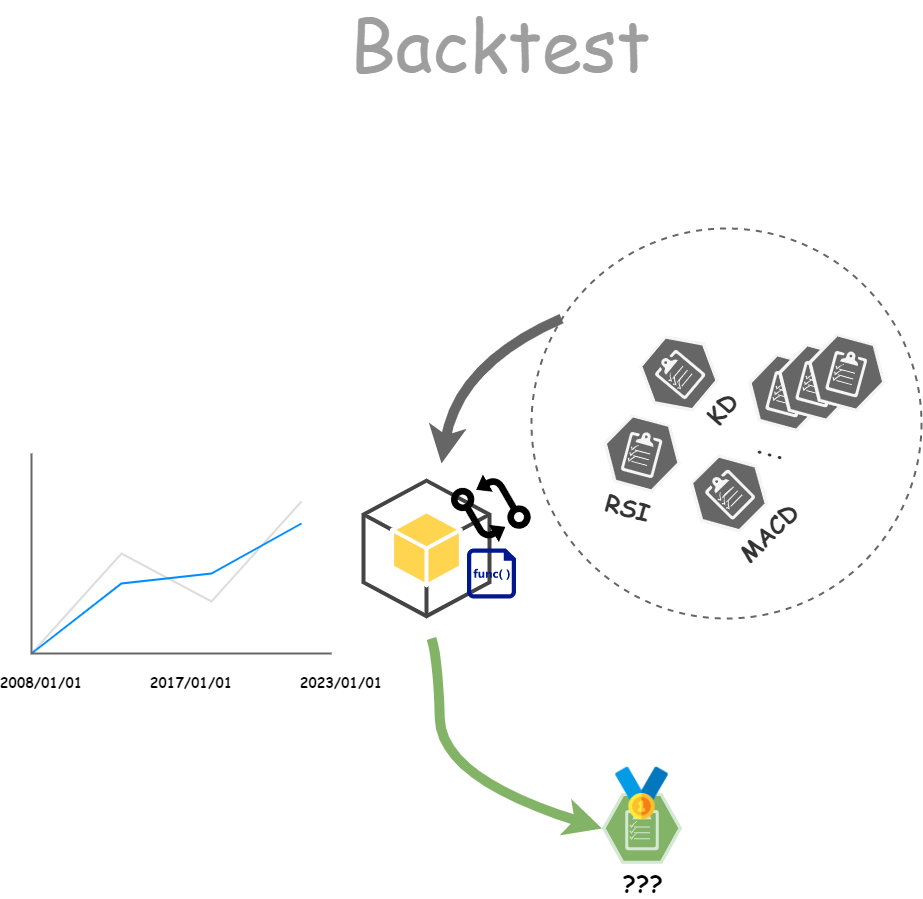
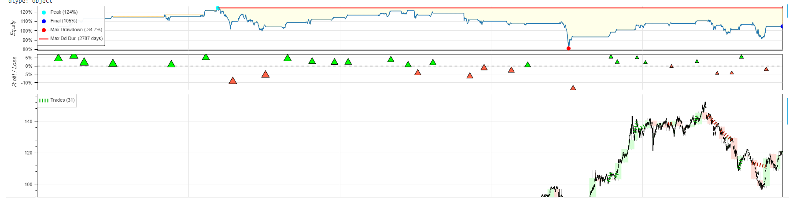

# 【Google Colab Python系列】 技術指標回測 - KD策略

<figure><figcaption><p><a href="https://www.potatomedia.co/s/amYVHGBN">圖片來源</a></p></figcaption></figure>

常常我們在財經節目聽到一堆技術指標都可以成功獲利，但真的如此嗎？ 這麼簡單的技術指標操作就能獲利，早就人人變成有錢人了！ 相信數據會說話，身為軟體工程師就最喜歡用數字來解讀一切了，因此這個篇章將會手把手教你如何使用Python語言來回測你的股票及交易策略。


剛接觸股市時最常聽到的就是KD、RSI、MACD...等，一堆看不懂的技術指標名詞，也常常聽到說什麼K20以下向上與D值黃金交叉時買進的策略，一堆眼花撩亂的字眼已經讓投資的熱情被冷水給澆熄了，但身為科技人的我們怎麼可以退卻呢？ 因此抱著學習的態度來結合程式進行統計與分析，並且藉由專家開發的便利套件來進行驗證，最終得出回測的結果，有了數據之後我們才知道該怎麼做，該怎麼修正，才不會在投資道路上像隻無頭蒼蠅般的亂竄，最終賠了時間又賠了金錢。

## 制定策略

那以下的範例會以常聽到的KD指標進行回測，我們先來擬訂一下回測的目標吧，我們就將買進及賣出切分成以下兩種條件：

* 買進策略：「KD低於20且與D黃金交叉」。
* 賣出策略： 「KD大於80」。


## 開始實作的旅程

### 工欲善其事必先利其器： 來安裝套件吧

* [x] [yfinance](https://pypi.org/project/yfinance/): 獲取Yahoo Finance API的小幫手
* [x] [backtesting](https://kernc.github.io/backtesting.py/): 回測工具
* [x] [ta-lib](https://github.com/TA-Lib/ta-lib-python): 技術指標工具

```python
# 安裝必要套件
!pip install yfinance backtesting

# 安裝Ta-Lib
!wget http://prdownloads.sourceforge.net/ta-lib/ta-lib-0.4.0-src.tar.gz
!tar -xzvf ta-lib-0.4.0-src.tar.gz
%cd ta-lib
!./configure --prefix=/usr
!make
!make install
!pip install Ta-Lib
```

這邊比較特別的是\`Ta-Lib\`這個套件，需要重新Compile，約耗時3分鐘，可以喝個咖啡再回來看結果 😋

### 數據會說話，但...我們要先有數據

我們就透過「yfinance」這個套件來幫我們下載數據吧！

```python
import yfinance as yf
import pandas as pd
from pandas_datareader import data
from datetime import datetime

################################# 請視需求帶入參數 ######################################
# 股票代號
stock_code = '0050.TW'

# 開始時間
start_date = datetime(2013, 1, 1)

# 結束時間
end_date = datetime(2023, 2, 11) 
###########################################################################################

# 獲取股票資料
yf.pdr_override() 

# 從yahoo資料源獲取台股代號的datafram
df = data.get_data_yahoo(stock_code, start_date, end_date) 

df.tail(10)
```

會得出股票的資訊

```
	Open	High	Low	Close	Adj Close	Volume
Date						
2022-07-11	113.650002	113.699997	111.849998	112.250000	112.250000	7572953
2022-07-12	110.949997	110.949997	109.150002	109.550003	109.550003	11133444
2022-07-13	113.000000	113.650002	112.599998	113.449997	113.449997	24824897
2022-07-14	112.699997	114.250000	111.800003	114.000000	114.000000	14750428
2022-07-15	114.599998	115.650002	113.750000	115.500000	115.500000	18555312
2022-07-18	114.650002	114.849998	113.949997	114.199997	114.199997	22207344
2022-07-19	113.949997	114.650002	113.599998	114.300003	114.300003	13251365
2022-07-20	115.849998	116.199997	114.699997	115.050003	115.050003	16836288
2022-07-21	115.400002	116.349998	115.000000	116.349998	116.349998	8803270
2022-07-22	116.599998	117.199997	116.300003	116.800003	116.800003	15614914
```

### 有了數據之後，我們要讓數據會說話！

數據是最有說服力的證據，讓我們實際撰寫一套交易策略來為我們的交易說說話吧！

1. 這邊的範例主要是先利用talib來計算數據的KD值。
2. 設計策略： KD小於20且黃金交叉(K穿越D)時買入，KD大於80且死亡交叉(D穿越K)時買入。
3. 設定金額與手續費之後去跑回測資料。

以上就可以在固定區間中不斷的替換策略，研究出屬於自己的一套最佳化策略去進行股市交易，提高勝率。

```python
from backtesting import Backtest, Strategy 

from backtesting.lib import crossover
from backtesting.test import SMA

from talib import abstract

import pandas as pd


# bypass data in Strategy
def I_bypass(data): 
    return data
# 制定KD交易策略, K < 20買, 
class KDCross(Strategy): 
    lower_bound = 20  
    upper_bound = 80  

    def init(self):
        self.k = self.I(I_bypass, self.data.slowk) 
        self.d = self.I(I_bypass, self.data.slowd)

    def next(self):
        if crossover(self.k, self.d) and self.k<self.lower_bound and self.d<self.lower_bound and not self.position: #long position
            self.buy() 
        elif crossover(self.d, self.k) and self.k>self.upper_bound and self.d>self.upper_bound: 
            if self.position and self.position.is_long:
                self.position.close()

# CSV檔案中若有缺漏，會使用內插法自動補值
df = df.interpolate() 

# 將索引欄資料轉換成pandas的時間格式，backtesting才有辦法排序
df.index = pd.to_datetime(df.index) 

# 使用talib計算KD值
df_tmp = df

# 由於talib僅支援high、low、close這三種欄位名稱，因此進行一次轉換
df_tmp.rename(columns = {'High':'high', 'Low':'low','Adj Close':'close','Close':'<skip>'}, inplace = True) 

# 計算kd
kd = abstract.STOCH(df_tmp)
kd.index=df_tmp.index

# 合併
fnl_df = df_tmp.join(kd).dropna() 

# 一樣將欄位名稱轉回backtest接受的參數名稱
fnl_df.rename(columns = {'high':'High', 'low':'Low','close':'Close'}, inplace = True) 

# 資料來源, 交易策略, 現金, 手續費(%)
test = Backtest(fnl_df, KDCross, cash=10000, commission=.004)


# 執行回測程式並存到result中
result = test.run()

print(result)

test.plot()
```

最後我們來解讀一下結果資訊吧，結果如下：

```
Start                     2013-01-14 00:00:00
End                       2023-02-10 00:00:00
Duration                   3679 days 00:00:00
Exposure Time [%]                   29.922858
Equity Final [$]                 10460.521845
Equity Peak [$]                  12429.626572
Return [%]                           4.605218
Buy & Hold Return [%]              122.018349
Return (Ann.) [%]                    0.461715
Volatility (Ann.) [%]               10.943097
Sharpe Ratio                         0.042192
Sortino Ratio                        0.060318
Calmar Ratio                         0.013289
Max. Drawdown [%]                  -34.743676
Avg. Drawdown [%]                   -3.493335
Max. Drawdown Duration     2786 days 00:00:00
Avg. Drawdown Duration      225 days 00:00:00
# Trades                                   31
Win Rate [%]                        64.516129
Best Trade [%]                       6.143418
Worst Trade [%]                    -13.532682
Avg. Trade [%]                       0.141764
Max. Trade Duration         138 days 00:00:00
Avg. Trade Duration          35 days 00:00:00
Profit Factor                        1.144918
Expectancy [%]                        0.25123
SQN                                  0.161717
```

其中我們只要關注兩項指標：

* Win Rate \[%]： 勝率。
* Return \[%]： 報酬率。

用上述指標就能大概判斷我們的策略是否值得投資，回測出來我們的勝率有64.5%算是過半，但美中不足的是報酬率僅有 4.605218，這是一個令人蠻失望的數字，但我們如果將回測資料往前拉到2008年就會非常可觀囉，不妨動手自己玩玩看！

另外也可以繪製成互動式圖表：

<figure><figcaption><p><a href="https://www.potatomedia.co/s/amYVHGBN">圖片來源</a></p></figcaption></figure>

## 結語

如果報酬率不高但勝率高其實長期下來也只是將手續費送給券商而已，我們的目標應該是制定一套高勝率 + 高報酬率的指標策略，但這並不容易，況且機器無感情，我們人在交易時真的會照表操課嗎？ 這很令人懷疑，因此常常交易策略是好的沒錯，但最終的關鍵仍在於人，因此投資的市場中主要是磨練我們的心性，假若心性不夠堅定，無法有紀律的照著自己的交易策略執行的話，就不太建議踏入市場，或者是直接購買指數型ETF，讓被動投資幫我們累積微幅報酬率即可，專注本業讓資金擴大才是最根本之道。


希望這樣的實戰練習能夠幫助到大家，讓我們不斷學習新知，因應這個變化萬千的世界，讓投資理財道路上減少踩雷的機會，創造出屬於自己的一套完美交易策略。


如果你也撰寫出一套成功的交易策略的話，也歡迎互相分享，一起學習，打怪破關，突飛猛進。


今天的範例都在這裡「[📦 ](../jupyter-examples/goodinfo\_yield.ipynb)****[**kd\_strategy.ipynb**](https://github.com/weihanchen/google-colab-python-learn/blob/main/jupyter-examples/kd\_strategy.ipynb)」歡迎自行取用。

如何使用請參閱「[【Google Colab系列】台股分析預備式： Colab平台與Python如何擦出火花？](https://www.potatomedia.co/s/aNLHZe3S)」。

\------------------------------------------------------------------------------------------------

喜歡撰寫文章的你，不妨來了解一下：

[Web3.0時代下為創作者、閱讀者打造的專屬共贏平台 - 為什麼要加入？](https://www.potatomedia.co/s/2PmFxsq)

歡迎加入一起練習寫作，賺取知識，累積財富！
