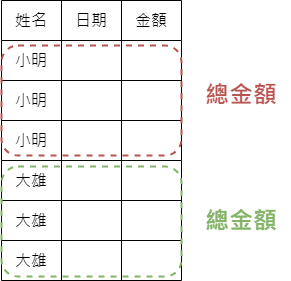
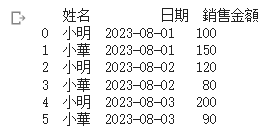
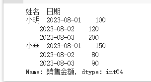
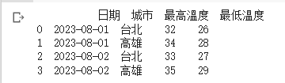
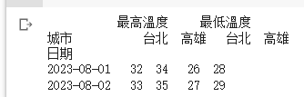
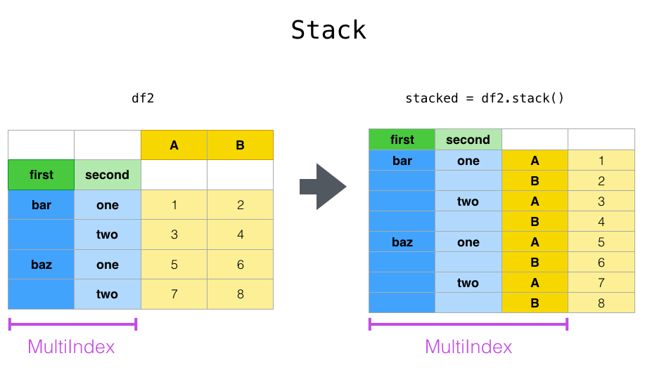
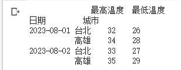
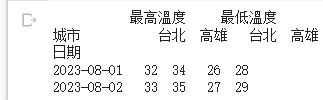

# 【Google Colab Python系列】 資料處理神器 Pandas 分組與重朔之術(Grouping/Reshaping)

過往我們有介紹了「[【Google Colab Python系列】 資料處理神器 Pandas 起手式](https://www.potatomedia.co/s/pYiFElO)」， 相信對於pandas的基本操作具有一定的基礎知識了， 主要著重在基本的操作， 讓我們快速篩選與分析資料， 但真實的世界是有可能具有很多類型的資料集分別儲存， 而不同的資料集又具有一些相似度， 需要進行更進階的分割與合併，讓零散的「資料」變成黃金。

### 分組(Grouping) <a href="#e5-88-86-e7-b5-84-grouping" id="e5-88-86-e7-b5-84-grouping"></a>

分組的用意在於將一大筆原始資料根據相似群組進行分類，進而統計， 最終產生該群組的一組樣本數據資料，嗯...，相信看到這裡心裡難免會說「能不能說點人話？」， 的確，就字面解釋確實不太容易理解，那我們就以一個較貼近生活化的例子來輔助說明看看吧！

假設我們是咖啡廳的老闆，我們有一份銷售表格，記錄著每一位員工每天的銷售額，其中包含員工姓名、銷售日期、銷售金額..


<figure><figcaption><p><a href="https://www.potatomedia.co/s/aJA1iURN">圖片來源</a></p></figcaption></figure>

```python
import pandas as pd

data = {
    '姓名': ['小明', '小華', '小明', '小華', '小明', '小華'],
    '日期': ['2023-08-01', '2023-08-01', '2023-08-02', '2023-08-02', '2023-08-03', '2023-08-03'],
    '銷售金額': [100, 150, 120, 80, 200, 90]
}

df = pd.DataFrame(data)
print(df)

```


<figure><figcaption><p><a href="https://www.potatomedia.co/s/aJA1iURN">圖片來源</a></p></figcaption></figure>

那麼有了這個銷售數據後，身為老闆的我們總會希望統計一下哪位員工的銷售金額比較多，績效比較好，做為評估的依據， 此時我們可以這麼做， 以「姓名」當作群組的分類標的，進而針對銷售金額進行加總， 就可以得出這批資料中，哪位員工銷售的最多...

```python
total = df.groupby('姓名')['銷售金額'].sum()
print(total)

```


<figure><figcaption><p><a href="https://www.potatomedia.co/s/aJA1iURN">圖片來源</a></p></figcaption></figure>

當然我們群組分類的欄位也可以不只一個， 假設我們要統計每個人每天的銷售額多少時就可以這麼做...

```python
total = df.groupby(['姓名', '日期'])['銷售金額'].sum()
print(total)
```


<figure><figcaption><p><a href="https://www.potatomedia.co/s/aJA1iURN">圖片來源</a></p></figcaption></figure>


### 重朔(Reshaping)

這功能主要就像是資料的變形怪一樣，它允許我們重新組織或轉換資料的形狀。

stacking、unstacking、pivot、pivot\_table都是Reshaping能夠轉換的格式與方法， 就讓我們繼續看下去吧！

假設我們有一份樣本資料...

```python
import pandas as pd

data = {
    '日期': ['2023-08-01', '2023-08-01', '2023-08-02', '2023-08-02'],
    '城市': ['台北', '高雄', '台北', '高雄'],
    '最高溫度': [32, 34, 33, 35],
    '最低溫度': [26, 28, 27, 29]
}

df = pd.DataFrame(data)
print(df)

```


<figure><figcaption><p><a href="https://www.potatomedia.co/s/aJA1iURN">圖片來源</a></p></figcaption></figure>

#### 以pivot來實現

將城市作為欄位，日期作為索引，並將最高溫度和最低溫度分別填入對應的欄位中。

這樣的數據格式主要表示每個日期各地區的最高溫度與最低溫度。

```python
reshaped_df = df.pivot(index='日期', columns='城市', values=['最高溫度', '最低溫度'])
print(reshaped_df)

```


<figure><figcaption><p><a href="https://www.potatomedia.co/s/aJA1iURN">圖片來源</a></p></figcaption></figure>


#### 我們可以用stack

讓欄位的值堆疊到日期之處，這樣的數據讓我們較方便從上往下觀察。


<figure><figcaption><p><a href="https://www.potatomedia.co/s/aJA1iURN">圖片來源</a></p></figcaption></figure>

```python
stacked_df = reshaped_df.stack()
print(stacked_df)
```


<figure><figcaption><p><a href="https://www.potatomedia.co/s/aJA1iURN">圖片來源</a></p></figcaption></figure>

#### 當然也可以unstack

```python
unstacked_df = stacked_df.unstack()
print(unstacked_df)
```


<figure><figcaption><p><a href="https://www.potatomedia.co/s/aJA1iURN">圖片來源</a></p></figcaption></figure>

今天的範例都在這裡「[📦 pandas/pandas\_merge.ipynb](https://github.com/weihanchen/google-colab-python-learn/blob/main/jupyter-examples/pandas/pandas\_group\_reshape.ipynb)」歡迎自行取用。

如何使用請參閱「[【Google Colab Python系列】Colab平台與Python如何擦出火花？](https://www.potatomedia.co/s/aNLHZe3S)」。

### 結語

原來數據可以這麼玩，分組、重組不同格式都輕而易舉，靈活彈性的展示數據讓我們訓練AI的過程中更容易抓到方向。

喜歡撰寫文章的你，不妨來了解一下：

[Web3.0時代下為創作者、閱讀者打造的專屬共贏平台 — 為什麼要加入？](https://www.potatomedia.co/s/2PmFxsq)

歡迎加入一起練習寫作，賺取知識


### 更多關於資料處理神器 Pandas 系列文章…

* [【Google Colab Python系列】 資料處理神器 Pandas 起手式](https://vocus.cc/article/64c90f67fd8978000138d9bc)
* [【Google Colab Python系列】 資料處理神器 Pandas 合併之術(join、concat)](https://vocus.cc/article/64ca3fb9fd897800018b230c)
* [【Google Colab Python系列】 資料處理神器 Pandas 分割與重組之術(Grouping/Reshaping)](https://vocus.cc/article/64ca6232fd897800018e734a)
