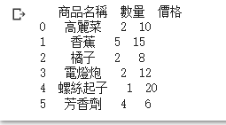
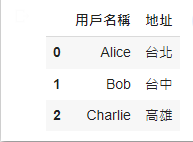
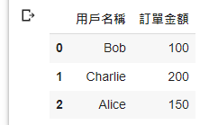
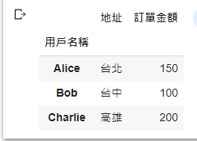

# 【Google Colab Python系列】 資料處理神器 Pandas 合併之術(join、concat)


<figure><figcaption></figcaption></figure>

上一篇我們有介紹了「[【Google Colab Python系列】 資料處理神器 Pandas 起手式](https://www.potatomedia.co/s/pYiFElO)」， 相信對於pandas的基本操作具有一定的基礎知識了， 主要著重在基本的操作， 讓我們快速篩選與分析資料， 但真實的世界是有可能具有很多類型的資料集分別儲存， 而不同的資料集又具有一些相似度， 需要進行共同的群組分類與合併， 這一篇主要就著重在如何處理不同類型的資料集合併。

### 首先是串接

假設小夫的媽媽想要請他根據「蔬果清單」去菜市場購買， 而爸爸也想要請他根據「五金清單」去五金行購買， 那麼這兩個清單雖然是不同的類型， 但聰明的小夫發現可以稍微整理一下比較好採購， 也比較好跟爸媽回報今天總共會花費多少、該請款多少， 那麼共同點就是會有「商品名稱」、「數量」、「價格」， 這時候就需要將兩個清單進行合併…

```python
import pandas as pd

# 菜市場購物清單
wet_market = pd.DataFrame({
    '商品名稱': ['高麗菜', '香蕉', '橘子'],
    '數量': [2, 5, 2],
    '價格': [10, 15, 8]
})

# 五金行購物清單
hardware_store = pd.DataFrame({
    '商品名稱': ['電燈炮', '螺絲起子', '芳香劑'],
    '數量': [2, 1, 4],
    '價格': [12, 20, 6]
})

# 使用 pandas.concat 函數來合併兩張購物清單
combined_shopping_list = pd.concat([wet_market, hardware_store], ignore_index=True)

print(combined_shopping_list)
```

<figure><figcaption></figcaption></figure>

### 再來是合併(Join)

有一天小明在整理客戶資料時發現了兩份清單， 一份為客戶的地址， 另一份為客戶訂單， 而兩張單子的共同點就是用戶名稱， 這時候聰明的小明就告訴自己， 為什麼我不能將這兩張表合併呢？ 明明長的很像但卻分的很開， 聰明的小明就決定進行合併之路...

```python
import pandas as pd

# 客戶的地址
user_data = pd.DataFrame({
    '用戶名稱': ['Alice', 'Bob', 'Charlie'],
    '地址': ['台北', '台中', '高雄']
})

user_data
```


<figure><figcaption></figcaption></figure>

```python
# 客戶訂單
order_data = pd.DataFrame({
    '用戶名稱': ['Bob', 'Charlie', 'Alice'],
    '訂單金額': [100, 200, 150]
})

order_data
```

<figure><figcaption></figcaption></figure>

```python
# 使用 pandas 的 join 合併之術來合併兩張表
joined_data = user_data.set_index('用戶名稱').join(order_data.set_index('用戶名稱'))

joined_data
```


<figure><figcaption></figcaption></figure>

有沒有發現，其實這很像SQL裡面的join概念，將兩張表整併再一起，更容易進行統計與分析。

今天的範例都在這裡「[📦 pandas/pandas\_merge.ipynb](https://github.com/weihanchen/google-colab-python-learn/blob/main/jupyter-examples/pandas/pandas\_merge.ipynb)」歡迎自行取用。

如何使用請參閱「[【Google Colab系列】台股分析預備式： Colab平台與Python如何擦出火花？](https://www.potatomedia.co/s/aNLHZe3S)」。

### 結語

這個章節的主軸在於說明如何對多張不同的表進行整併，並歸納出相同的欄位，以進行後續的處理，接下來我們會說明應該如何進行「群組化(Grouping)」、「重朔(Reshaping)」、「樞紐分析表(Pivot tables)」，讓我們的資料處理能力更進階一個檔次，邁向資料工程師之路…。

喜歡撰寫文章的你，不妨來了解一下：

[Web3.0時代下為創作者、閱讀者打造的專屬共贏平台 — 為什麼要加入？](https://www.potatomedia.co/s/2PmFxsq)

歡迎加入一起練習寫作，賺取知識
