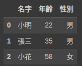

# 【Google Colab Python系列】 資料處理神器 Pandas 起手式


<figure><figcaption><p><a href="https://stablediffusionweb.com/">圖片來源</a></p></figcaption></figure>

我們都知道AI的模型訓練環節中， 最基礎也是最重要的一環就是「資料」了， 而「資料」要怎麼處理成訓練的養分也是一門重要的工程， 正好在Python的世界裡具有這麼一套神兵利器， 名為「[Pandas](https://pandas.pydata.org/)」， 它是一個快速、強大、靈活且易於使用的開源數據分析和操作工具， 就讓我們好好的來認識一番吧！

乍聽之下我們會以為跟「熊貓」具有關聯性， 實際上關聯性並不大， 通常我們最直觀的就是用Excel來整理資料了對吧， 甚至是資料庫系統， 對！ 不管是哪一種， 目的都是在幫我們儲存，But…當我們要取出來用的時候， 或者要對某個欄位值變更時， 對於Excel來說， 光是開起幾百萬筆的資料就快當機了， 是要怎麼改變欄位資料呢？ 那你可能會說， 怎麼不用資料庫？ 是， 資料庫是很好用沒錯， 搜尋、統計都難不倒它…， 但別忘了， 我們在進行模型訓練之前都需要將資料載入到程式之中並整理成符合訓練的資料格式才能順利進行， 而載入到程式要如何處理這龐大的資料呢？ 這就是 Pandas 擅長的地方了， 不僅免費， 功能又豐富， 使用起來也不是說非常困難， 有什麼理由我們不用它呢？

[https://pandas.pydata.org/docs/getting\_started/index.html#getting-started](https://pandas.pydata.org/docs/getting\_started/index.html#getting-started)

### 安裝

```bash
pip install pandas
```

### 表格式呈現

今天我們想要幫三位員工建檔， 分別會知曉名字、年齡、性別三個欄位， 那我們可以這樣做。

```bash
import pandas as pd

df = pd.DataFrame(
    {
        "名字": [
            "小明",
            "張三",
            "小花",
        ],
        "年齡": [22, 35, 58],
        "性別": ["男", "男", "女"],
    }
)

df
```


<figure><figcaption><p><a href="https://www.potatomedia.co/s/pYiFElO">圖片來源</a></p></figcaption></figure>


專注於某一欄

今天我們想列出年齡， 大概觀察一下分佈範圍時可以這樣做。

```python
df['年齡']
```

將得到以下的結果：

```python
0    22
1    35
2    58
Name: 年齡, dtype: int64
```

P.S 如果熟悉操作HashMap或者Dict的朋友相信應該得心應手。

當然我們也可以從頭到尾自行建立。

```python
ages = pd.Series([22, 35, 58], name="年齡")

ages
```

結果也會如同上面。

### 更進階一點的來點統計吧

今天我們想要計算出最大年齡時…

```python
df["年齡"].max()

# 58
```

還有哪些更多的統計方法可以用呢？

```python
df.describe()
```


<figure><figcaption><p><a href="https://www.potatomedia.co/s/pYiFElO">圖片來源</a></p></figcaption></figure>

除了平均、最大最小以外更有中位數…等， 就根據需求取用囉！

今天的範例都在這裡「[📦 pandas/pandas\_quickstart.ipynb](https://github.com/weihanchen/google-colab-python-learn/blob/main/jupyter-examples/pandas/pandas\_quickstart.ipynb)」歡迎自行取用。

如何使用請參閱「[【Google Colab Python系列】Colab平台與Python如何擦出火花？](https://www.potatomedia.co/s/aNLHZe3S)」。

### 結語

透過幾個簡單的步驟認識一下Pandas這套工具能夠怎麼處理我們的數據， 當然它不只有這麼簡單， 合併、分割、亂數、生成…常常用到的功能， 我們在後續的章節也會逐一的來介紹。

喜歡撰寫文章的你，不妨來了解一下：

[Web3.0時代下為創作者、閱讀者打造的專屬共贏平台 — 為什麼要加入？](https://www.potatomedia.co/s/2PmFxsq)

歡迎加入一起練習寫作，賺取知識
