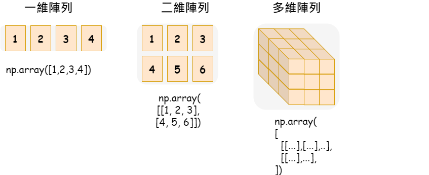
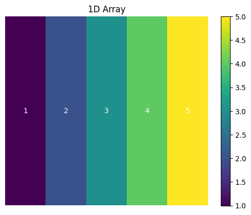
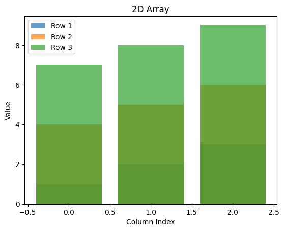
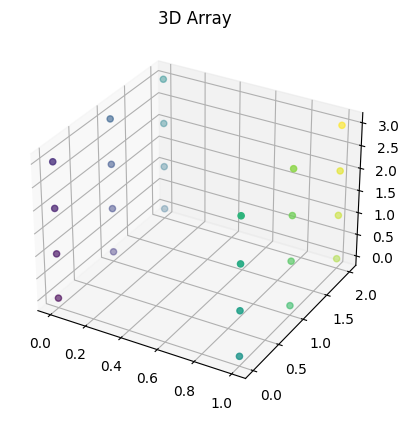
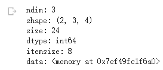

# 【資料處理神器區 - NumPy系列】 奠定資料科學的基礎模組(安裝與認識維度)

學習資料科學的過程中相信最熱門的目前應該是Python程式語言了，而Python的世界裡再進行資料科學時最常用的有「[Pandas](https://www.potatomedia.co/s/pYiFElO)」、「[SciPy](https://scipy.org/)」、「[Scikit-learn](https://scikit-learn.org/stable/)」...等，而這些的基礎幾乎都與「[NumPy](https://numpy.org/)」離不開關係，因為「[NumPy](https://numpy.org/)」就是地基，這些較為高階的套件則是基於地基發展而起。


它除了擁有豐富的數學函式庫之外，數據的索引切片、各式維度資料結構轉換、排序、合併、重朔這些對它來說都是小兒科，究竟有沒有這麼強呢？ 就讓我們用幾個實際例子來說明一下。

### 安裝

使用NumPy之前的首要任務就是安裝拉，安裝通常有以下兩種方式：

#### Conda

至於什麼是Conda呢？ 我們下一次會專門對Conda進行介紹，之後再補充於此...

```python
conda create -n ${環境名稱}
conda activate ${環境名稱}

conda install numpy
```

#### Pip

```python
pip install numpy
```

### 輔助工具: 繪圖

這邊由於會示範二維陣列與多維度，以圖來呈現會更容易理解， 因此我們會使用圖表套件「matplotlib」來進行圖表的呈現， 關於圖表套件是什麼呢？ 歡迎參考：

[【Google Colab Python系列】 視覺化資料Matplotlib 新手村](https://vocus.cc/article/64bef906fd8978000190a953)

```python
!pip install matplotlib
```

### 引入模組

```python
# 引入numpy模組並命名為np
import numpy as np
```

### 基礎概念 - 認識維度陣列

當我們進行資料科學(Data Science)或者機器學習(Machine Learning)時，通常都會將資料轉換成多維度的資料，那麼在NumPy裝載這些資料的容器就是「ndarray」這個名詞我們之後會常常看到，而這個容器裡面又依照數據的複雜度可以裝載一維陣列、二維陣列、多維陣列。


<figure><figcaption><p><a href="https://vocus.cc/article/64cdc41cfd89780001f99a00">圖片來源</a></p></figcaption></figure>

有了概念之後，我們就實際來繪製看看吧！ 如此一來更能加深印象。

#### 一維陣列

```python
import numpy as np
import matplotlib.pyplot as plt

# 生成一維數據
data_1d = np.array([1, 2, 3, 4, 5])

# 以下是為了用圖表進行概念呈現，基本上可以不用看這一段，上面那部分才是真正的資料結構...
dd = data_1d.reshape(1, -1)

plt.imshow(dd, cmap='viridis', aspect='auto')

for y in range(dd.shape[0]):
    for x in range(dd.shape[1]):
        plt.text(x, y, str(dd[y, x]), color='white', ha='center', va='center')

plt.colorbar()
plt.title('1D Array')
plt.axis('off')  # 關閉軸的顯示
plt.show()
```


<figure><figcaption><p><a href="https://vocus.cc/article/64cdc41cfd89780001f99a00">圖片來源</a></p></figcaption></figure>

#### 二維陣列

```python
import numpy as np
import matplotlib.pyplot as plt

# 宣告「二維陣列」
data_2d = np.array([
    [1, 2, 3],
    [4, 5, 6],
    [7, 8, 9]
])

x = np.arange(data_2d.shape[1])
for i, row in enumerate(data_2d):
    plt.bar(x, row, alpha=0.7, label=f'Row {i+1}')
plt.xlabel('Column Index')
plt.ylabel('Value')
plt.title('2D Array')
plt.legend()
plt.show()

```


<figure><figcaption><p><a href="https://vocus.cc/article/64cdc41cfd89780001f99a00">圖片來源</a></p></figcaption></figure>

#### 三維陣列

```python
import numpy as np
import matplotlib.pyplot as plt

# 宣告「三維陣列」
data_3d = np.array([
  [
    [1, 2, 3, 4],
    [5, 6, 7, 8],
    [9, 10, 11, 12]
  ],
  [
    [13, 14, 15, 16],
    [17, 18, 19, 20],
    [21, 22, 23, 24]
  ]
])

x, y, z = data_3d.nonzero()
ax = plt.axes(projection='3d')
ax.scatter3D(x, y, z, c=data_3d[x, y, z], cmap='viridis')
plt.title('3D Array')
plt.show()
```


<figure><figcaption><p><a href="https://vocus.cc/article/64cdc41cfd89780001f99a00">圖片來源</a></p></figcaption></figure>

### 介紹幾個ndarray的一些屬性

這裡可能會有點生硬，請小心服用，雖然藥苦，但對我們的根基是有相當大的幫助，加油，持續學習吧！

```python
# 資料樣本
sample = np.array([
  [
    [1, 2, 3, 4],
    [5, 6, 7, 8],
    [9, 10, 11, 12]
  ],
  [
    [13, 14, 15, 16],
    [17, 18, 19, 20],
    [21, 22, 23, 24]
  ]
])

# ndarray.ndim: 資料的維度，樣本是三維資料，因此預期為「3」
assert(sample.ndim == 3)
print(f'ndim: {sample.ndim}')

# ndarray.shape: 每個維度的大小，預期樣本資料是2 x 3 x 4
assert(sample.shape == (2, 3, 4))
print(f'shape: {sample.shape}')

# ndarray.size: 資料元素的總數，也就是乘積， 預期: 24
assert(sample.size == 24)
print(f'size: {sample.size}')

# ndarray.dtype: 資料元素的型態， 預期為int64
assert(sample.dtype.name == 'int64')
print(f'dtype: {sample.dtype}')

# ndarray.itemsize: 資料中每個元素的大小， 以byte為單位， 而int64=8byte，因此預期為8
assert(sample.itemsize == 8)
print(f'itemsize: {sample.itemsize}')

# ndarray.data: 資料實際元素的緩衝區，通常我們不會直接使用它
print(f'data: {sample.data}')
```

###

<figure><figcaption><p><a href="https://vocus.cc/article/64cdc41cfd89780001f99a00">圖片來源</a></p></figcaption></figure>

今天的範例都在這裡「[📦 ](https://github.com/weihanchen/google-colab-python-learn/blob/main/jupyter-examples/pandas/pandas\_quickstart.ipynb)[numpy/numpy\_quickstart.ipynb](https://github.com/weihanchen/google-colab-python-learn/blob/main/jupyter-examples/numpy/numpy\_quickstart.ipynb)」歡迎自行取用。

如何使用請參閱「[【Google Colab Python系列】Colab平台與Python如何擦出火花？](https://www.potatomedia.co/s/aNLHZe3S)」。

### 結語

這次的主題主要認識一下NumPy的基本概念，先學會安裝、引用，再理解一下陣列元素的不同及基礎的屬性代表什麼含意，對於數組具有一定的認識之後，下一章將帶來一些關於陣列的進階應用，敬請期待...，如果有任何問題也歡迎提出討論。


喜歡撰寫文章的你，不妨來了解一下：

[Web3.0時代下為創作者、閱讀者打造的專屬共贏平台 — 為什麼要加入？](https://www.potatomedia.co/s/2PmFxsq)

歡迎加入一起練習寫作，賺取知識
