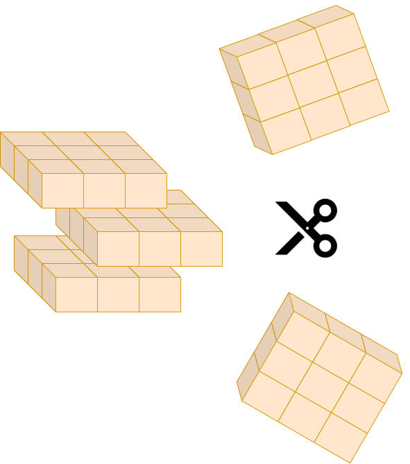
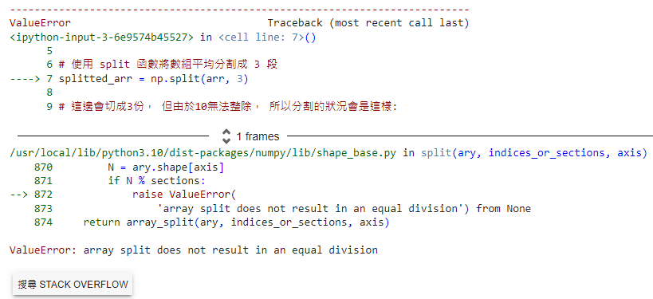

# 【資料處理神器區 - NumPy系列】 分割(Split)的藝術


<figure><figcaption></figcaption></figure>

資料切割對於我們進行平行化運作或者是轉換數據的應用上非常重要， 但如何切呢？ 要怎麼切才切的好呢？ 這些是切割的過程常常會面臨的一些問題， 那就讓我們一步步的來解密吧！

關於分割的方式有下列幾種選擇， 大致了解一下即可， 接下來我們會分別對這幾種分割方式進行詳細說明:

```python
# 用於在指定軸上將數組分割成多個子數組。
# axis, 這參數應該是較不容易理解的一個參數，預設為「0」，相當於底下的水平分割， 而設定為「1」則為垂直分割
# 這邊需要注意的是indices_or_sections與ary的長度必須是能夠整除的關係， 否則會發生錯誤， 簡單來說ary有10個元素， 但要切成3份， 由於無法公平分配， 因此將導致錯誤發生。

numpy.split(ary, indices_or_sections, axis=0)

# 基本上與上述的使用方式一樣...， 唯一不一樣的是這個方式允許「不等量分割」， 也就是假設ary有10個元素， 切成3份是被允許的。
numpy.array_split(ary, indices_or_sections, axis=0)

# 水平分割(以欄進行切割)
numpy.hsplit(ary, indices_or_sections)

# 垂直分割(以列進行切割)
numpy.vsplit(ary, indices_or_sections)

# 用於深度（第三維度軸）分割數組。
# P.S 這個API相對較新， 也是較抽象的部份， 要用心的看下去才能得心應手唷！
numpy.dsplit(ary, indices_or_sections)
```

### numpy.split(ary, indices\_or\_sections, axis=0)

必須等量分割...

⚠️ 這邊會特意製造一個情境讓目標及欲切割的份數無法公平分配， 預期將會發生「array split does not result in an equal division」的錯誤。

```python
import numpy as np

# 創建一個包含 1 到 10 的一維數組
arr = np.arange(1, 11)

# 使用 split 函數將數組平均分割成 3 段
splitted_arr = np.split(arr, 3)

# 這邊會切成3份， 但由於10無法整除， 所以分割的狀況會是這樣:
# 「3, 3, 4」
print(splitted_arr)
```


<figure><figcaption></figcaption></figure>


### numpy.array\_split(ary, indices\_or\_sections, axis=0)

允許不等量分割...

一樣使用上述案例來分割， 但這次就沒有發生錯誤囉！ 雖然不公平， 但仍將10等份切成「4, 3, 3」

```
[array([1, 2, 3, 4]), array([5, 6, 7]), array([ 8,  9, 10])]
```

### numpy.hsplit(ary, indices\_or\_sections)

水平分割(以欄進行切割)， 這邊較難以理解是因為需要搭配圖來看才會清楚:

```
1 2 3 4
5 6 7 8
```

切成2欄後:

```
1 2 | 3 4
5 6 | 7 8
```

以數據結構來說會變成:

```
[array(1, 2, 5, 6), array(3, 4, 7, 8)]
```

```python
import numpy as np

# 創建一個 2x4 的二維數組
arr = np.array([[1, 2, 3, 4],
                [5, 6, 7, 8]])

# 使用 hsplit 函數將數組水平分割成 2 欄
splitted_arr = np.hsplit(arr, 2)

splitted_arr
```

### numpy.vsplit(ary, indices\_or\_sections)

垂直切割(以列進行切割)

```
1 2 3 4
5 6 7 8
```

切成2列後:

```
1 2 3 4
-------
5 6 7 8
```

數據結構:

```
[array(1, 2, 3, 4), array(5, 6, 7, 8)]
```

```python
import numpy as np

# 創建一個 2x4 的二維數組
arr = np.array([[1, 2, 3, 4],
                [5, 6, 7, 8]])

# 使用 vsplit 將數據切割成2列
splitted_arr = np.vsplit(arr, 2)

splitted_arr
```

### numpy.dsplit(ary, indices\_or\_sections)

```python
import numpy as np
import matplotlib.pyplot as plt

# 創建一個 2x2x4 的三維數組
arr = np.array([
    [
      [1, 2, 3, 4]
    ],
    [
      [5, 6, 7, 8]
    ]
])

# 使用 dsplit 將數據切割
splitted_arr = np.dsplit(arr, 2)

splitted_arr
```

今天的範例都在這裡「[📦 numpy\_split.ipynb](https://github.com/weihanchen/google-colab-python-learn/blob/main/jupyter-examples/numpy/numpy\_split.ipynb)」歡迎自行取用。

如何使用請參閱「[【Google Colab Python系列】Colab平台與Python如何擦出火花？](https://www.potatomedia.co/s/aNLHZe3S)」。

### 結語

這次主要介紹切割的技巧， 但需要具有空間的概念才會比較容易理解， 因此實作時會比較不直觀一些， 不過沒關係， 多Try幾次就能夠熟悉這樣的概念了， 有了切割之後， 我們就能夠分別對切割後不同批次的資料進行處理， 下一篇章我們會說明如何去合併這些切割過後的資料。


喜歡撰寫文章的你，不妨來了解一下：

[Web3.0時代下為創作者、閱讀者打造的專屬共贏平台 — 為什麼要加入？](https://www.potatomedia.co/s/2PmFxsq)

歡迎加入一起練習寫作，賺取知識
