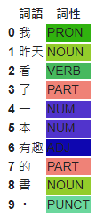

# 【自然語言處理 - 概念篇】 詞性標注POS在NLP的世界扮演什麼樣的角色呢?

Part-of-Speech Tagging, POS是詞性標注的全名, 主要為詞彙標上語言中的語法類別或用途, 再進行後續的分析與處理, 就想像成文件歸檔的動作, 每個文件貼上一個標籤類別, 而透過這些標籤類別進行關聯性的分類歸檔。

一個句子最基本的組成單位是「詞」這在我們之前幾個篇章都有談過，如果還不熟悉的朋友可以複習一下：

* [【自然語言處理 — 概念篇】最基礎的Bag-of-Words模型是什麼呢?](https://vocus.cc/article/646b60adfd89780001aae7f4)
* [【自然語言處理 - 概念篇】 來認識一下詞向量(Word Embedding or Word Vector)吧](https://www.potatomedia.co/s/bsKx5GfV)
* [【自然語言處理 - 概念篇】 探索TF-IDF, 關於詞的統計與索引隱含著什麼奧秘呢？](https://www.potatomedia.co/s/bVIUUxZD)

但上述的基礎知識都是將「詞」進行量化處理， 以統計的方式估算出相鄰的詞彙, 進行組合, 但這樣缺少了我們人類語言學的一些特徵, 因此才需要針對「詞」加入一些我們語言學的元素, 像是「詞性」就是一個例子, 「看」是一個動詞, 那什麼詞性可以去修飾動詞或者相互依賴就是我們下一個篇章「【自然語言處理 - spaCy】 拆解語句組成的規則, 何謂依存句法分析(Dependency Parsing)?」在介紹的部分, 而這邊主要在說明中文詞性標注POS的部分。

### 詞性標注(Part-of-Speech Tagging, POS) 提供了什麼價值?

* 語法分析：詞性標注是進行語法分析的重要步驟之一。通過將詞彙標註為相應的詞性，可以幫助理解句子的結構和句法關係，比如主語、動詞、賓語等，從而更好地理解句子的語法。
* 語義理解：詞性標注有助於理解詞彙的語義。不同的詞性標籤可以指示詞彙在句子中的角色和含義。通過詞性標注，可以更準確地捕捉詞彙的語義信息，進而進行更精確的文本理解和意義提取。
* 上下文分析：詞性標注可以幫助理解詞彙在特定上下文中的含義和用法。同一個詞彙在不同的句子或上下文中可能有不同的詞性，詞性標注可以幫助區分這種差異，從而提供更準確的上下文理解。
* 詞彙處理：詞性標注有助於進行詞彙級別的處理和分析。不同詞性的詞彙在語法結構、語義和用法上可能有所不同，詞性標注可以幫助對詞彙進行分類、聚類和相關性分析，從而進行更深入的詞彙處理。
* 文本分類和信息檢索：詞性標注可以作為文本分類和信息檢索的特徵之一。將詞彙的詞性作為特徵，可以幫助構建更準確的文本分類模型或搜索引擎，從而提升分類和檢索的效果。

總的來說, 中文詞性標注為中文文本分析提供了重要的基礎信息, 可以幫助我們更好地理解語法結構、詞彙語義和上下文含義, 從而支持多種NLP任務, 包括語法分析、語義理解、文本分類。

### 看完基本觀念後, 我們用[spaCy](https://spacy.io/)來玩玩看唄

[spaCy](https://spacy.io/)是一套處理NLP的框架, 讓我們除了學習以外, 還可以進行一些NLP基礎的任務, 除此之外也提供了基礎任務模型的微調甚至再訓練的方式, 提高目標精準度。

#### 安裝套件並載入模型

```python
!pip install spacy

# 下載Transfromer技術的中文語言模型
!python -m spacy download zh_core_web_trf

import spacy

# 載入模型
nlp_zh = spacy.load('zh_core_web_trf')
```

#### 實際來標注一下吧

POS有哪些標籤呢? 請參考「[https://universaldependencies.org/u/pos/](https://universaldependencies.org/u/pos/)」

```python
import spacy
import random
import pandas as pd
from IPython.display import display, HTML


sentence = '我昨天看了一本有趣的書。'

doc = nlp_zh(sentence)

# 建立空的資料框架
data = {"詞語": [], "詞性": []}

# 建立詞性與顏色的對應字典
pos_colors = {}

for token in doc:
    # 詞性標籤
    pos_tag = token.pos_
    
    # 將詞語和詞性加入資料框架
    data["詞語"].append(token.text)
    data["詞性"].append(pos_tag)

    # 如果詞性標籤尚未有對應的顏色，則賦予一個隨機顏色
    if pos_tag not in pos_colors:
        color = "#%06x" % random.randint(0, 0xFFFFFF)
        pos_colors[pos_tag] = color

df = pd.DataFrame(data)

# 定義自訂函式來設定詞性欄位的顏色
def set_pos_color(pos):
    color = pos_colors.get(pos, "#000000")  # 若詞性未在字典中，則預設為黑色
    return f"background-color: {color}"

styles = df.style.applymap(lambda x: set_pos_color(x), subset=["詞性"])

html = styles.to_html(index=False)

display(HTML(html))

```

<figure><figcaption><p><a href="https://www.potatomedia.co/s/xsujA4r">圖片來源</a></p></figcaption></figure>

今天的範例都在這裡「[📦 ](https://github.com/weihanchen/google-colab-python-learn/blob/main/jupyter-examples/spacy\_0.ipynb)[spacy\_pos.ipynb](https://github.com/weihanchen/google-colab-python-learn/blob/main/jupyter-examples/nlp/spacy\_pos.ipynb)」歡迎自行取用。

如何使用請參閱「[【Google Colab Python系列】Colab平台與Python如何擦出火花？](https://www.potatomedia.co/s/aNLHZe3S)」。

### 結語

透過上述的基礎處理, 我們可以知道一段話由哪些詞所組成, 這些詞的詞性又是被標注上哪些呢? 有了這些資訊我們就可以進行下一章的「[【自然語言處理 - spaCy】 拆解語句組成的規則, 何謂依存句法分析(Dependency Parsing)?](https://www.potatomedia.co/s/xsujA4r)」。

我們在後續的章節也會針對如何訓練出POS的模型進行解說, 就讓我們一步步地把玩NLP吧。


\------------------------------------------------------------------------------------------------

喜歡撰寫文章的你，不妨來了解一下：

[Web3.0時代下為創作者、閱讀者打造的專屬共贏平台 - 為什麼要加入？](https://www.potatomedia.co/s/2PmFxsq)

歡迎加入一起練習寫作，賺取知識！
